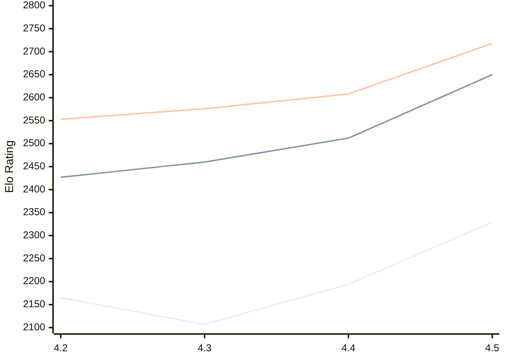

# Engine: Eubos

Author: Chris Bolt

Home: https://github.com/cjbolt/EubosChess

## Elo Ratings E1 (Ultra 7 265T (1.50 GHz) - E-Core)

| Version | Published | STC 8.0+0.08s  | LTC 60.0+0.60s | VLTC 2m24s+1.12s | Comment |
| --- | --- | --- | --- | --- | --- |
| 4.5 | 2026-06-09 | 2392 | 2660 | 2758 |  |
 | | | cElo (∆ prev) | cElo (∆ prev) | cElo (∆ prev) | 

## Elo Ratings P1 (Ultra 7 265T (1.50 GHz) - P-Core)

| Version | Published | STC 8.0+0.08s  | LTC 60.0+0.60s | VLTC 2m24s+1.12s | Comment |
| --- | --- | --- | --- | --- | --- |
| 4.5 | 2026-06-09 | 2614 | 2643 | 2835 |  |
 | | | cElo (∆ prev) | cElo (∆ prev) | cElo (∆ prev) | 

## Elo Ratings T1 (i5-7500T 2.70GHz)

| Version | Published | STC 8.0+0.08s  | LTC 60.0+0.60s | VLTC 2m24s+1.12s | Comment |
| --- | --- | --- | --- | --- | --- |
| 4.5 | 2026-06-09 | 2329(+135) | 2650(+138) | 2718(+110) |  |
| 4.4 | 2026-05-06 | 2194(+87) | 2512(+52) | 2608(+32) |  |
| 4.3 | 2026-01-29 | 2107(-58) | 2460(+33) | 2576(+23) |  |
| 4.2 | 2025-10-16 | 2165 | 2427 | 2553 |  |
 | | | cElo (∆ prev) | cElo (∆ prev) | cElo (∆ prev) | 

<a href="https://github.com/computer-chess-index/cci/issues/new?template=submit-version.yml&title=[VERSION]+Eubos+<version>&body=###%20Engine%20name%0AEubos%0A%0A###%20Version%0A4.5" target="_blank">Submit new version</a>

 Test Conditions:

GUI/CLI: <a href=https://github.com/cutechess/cutechess target="_blank">Cute-Chess</a> 
Elo Calculation: <a href=https://www.remi-coulom.fr/Bayesian-Elo/ target="_blank">Bayesian-Elo</a> 
CPU for P1: Intel(R) Core(TM) Ultra 7 265T (1.50 GHz) - P-Core 
CPU for E1: Intel(R) Core(TM) Ultra 7 265T (1.50 GHz) - E-Core 
CPU for T1: Intel(R) Core(TM) i5-7500T 2.70GHz 
Opening book: 8_moves_v3 
\* STC: 8.0+0.08s, LTC: 60.0+0.60s, VLTC: 2m24s+1.12s

 Lists:
Ratings: <a href=https://github.com/computer-chess-index/cci/blob/main/lists/CCIRatings.csv target="_blank">Complete list</a>

Generated: 2026-10-22 04:38:30

## Ratings Verlauf T1

```mermaid
%%{init: {"theme":"base","themeVariables":{"seriesColors:['#a3a3a3','#222221','#faa371']}}}%%
xychart-beta
  x-axis ["4.2", "4.3", "4.4", "4.5"]
  y-axis "Elo Rating" 2100 --> 2800
  line "T1: STC (8.0+0.08s)" [2165, 2107, 2194, 2329]
  line "T1: LTC (60.0+0.60s)" [2427, 2460, 2512, 2650]
  line "T1: VLTC (2m24s+1.12s)" [2553, 2576, 2608, 2718]
```

## Detailed Evaluation Results

| Version | Time Control | Variant | Elo  | Range +/- | Matches | Score | Average Opponent Elo | Draws |
| --- | --- |--- | --- | --- | --- | --- | --- | --- |
| 4.5 | VLTC (2m24s+1.12s) | T1 | 2718 | 29 | 378 | 50% | 2719 | 35% |
|  |  | P1 | 2835 | 36 | 272 | 58% | 2715 | 33% |
|  |  | E1 | 2758 | 32 | 336 | 49% | 2772 | 28% |
|  | LTC (60.0+0.60s) | T1 | 2650 | 29 | 408 | 50% | 2654 | 27% |
|  |  | P1 | 2643 | 42 | 184 | 44% | 2697 | 30% |
|  |  | E1 | 2660 | 36 | 268 | 48% | 2677 | 26% |
|  | STC (8.0+0.08s) | T1 | 2329 | 29 | 428 | 48% | 2360 | 23% |
|  |  | P1 | 2614 | 77 | 60 | 45% | 2664 | 17% |
|  |  | E1 | 2392 | 47 | 178 | 57% | 2179 | 20% |
| --- | --- |--- | --- | --- | --- | --- | --- | --- |
| 4.4 | VLTC (2m24s+1.12s) | T1 | 2608 | 32 | 320 | 48% | 2627 | 30% |
|  | LTC (60.0+0.60s) | T1 | 2512 | 32 | 334 | 49% | 2515 | 27% |
|  | STC (8.0+0.08s) | T1 | 2194 | 32 | 344 | 50% | 2188 | 23% |
| --- | --- |--- | --- | --- | --- | --- | --- | --- |
| 4.3 | VLTC (2m24s+1.12s) | T1 | 2576 | 30 | 388 | 50% | 2565 | 27% |
|  | LTC (60.0+0.60s) | T1 | 2460 | 31 | 368 | 49% | 2465 | 24% |
|  | STC (8.0+0.08s) | T1 | 2107 | 28 | 452 | 50% | 2093 | 21% |
| --- | --- |--- | --- | --- | --- | --- | --- | --- |
| 4.2 | VLTC (2m24s+1.12s) | T1 | 2553 | 36 | 266 | 52% | 2535 | 24% |
|  | LTC (60.0+0.60s) | T1 | 2427 | 35 | 272 | 50% | 2423 | 26% |
|  | STC (8.0+0.08s) | T1 | 2165 | 34 | 310 | 52% | 2138 | 22% |