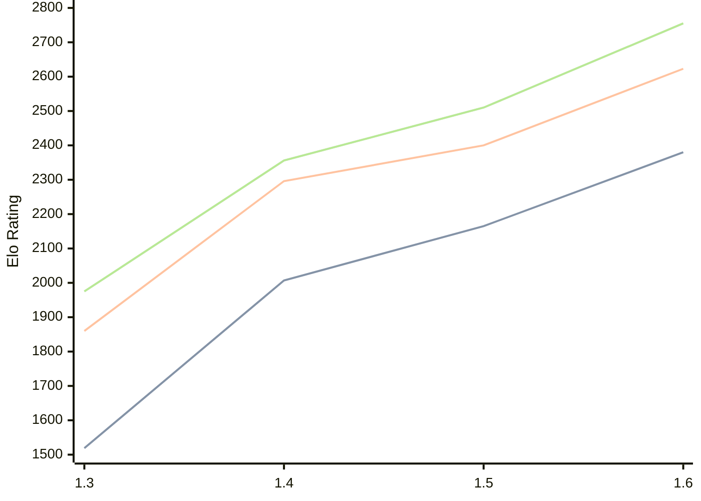

# Engine: Facon

Author: Carlos M. Canavessi

Home: https://github.com/CMCanavessi/facon

## Elo Ratings

| Version | Published | STC 8.0+0.08s  | LTC 60.0+0.60s | VLTC 2m24s+1.12s | Comment |
| --- | --- | --- | --- | --- | --- |
| 1.6 | 2026-06-11 | 2380(+215) | 2623(+223) | 2755(+245) |  |
| 1.5 | 2026-05-26 | 2165(+158) | 2400(+104) | 2510(+154) |  |
| 1.4 | 2026-04-25 | 2007(+488) | 2296(+436) | 2356(+381) |  |
| 1.3 | 2026-04-11 | 1519(+new) | 1860(+new) | 1975(+new) |  |
| 1.2 | 2026-03-24 |  |  |  |  |
 | | | cElo (∆ prev) | cElo (∆ prev) | cElo (∆ prev) | 

<a href="https://github.com/computer-chess-index/cci/issues/new?template=submit-version.yml&title=[VERSION]+Facon+<version>&body=###%20Engine%20name%0AFacon%0A%0A###%20Version%0A1.6" target="_blank">Submit new version</a>

 Test Conditions:

GUI/CLI: <a href=https://github.com/cutechess/cutechess target="_blank">Cute-Chess</a> 
Elo Calculation: <a href=https://www.remi-coulom.fr/Bayesian-Elo/ target="_blank">Bayesian-Elo</a> 
CPU: Intel(R) Core(TM) i5-7500T 2.70GHz 
Opening book: 8_moves_v3 
\* STC: 8.0+0.08s, LTC: 60.0+0.60s, VLTC: 2m24s+1.12s

 Lists:
Ratings: <a href=https://github.com/computer-chess-index/cci/blob/main/lists/CCIRatings.csv target="_blank">Complete list</a>

Generated: 2026-09-24 04:38:08

## Ratings Verlauf

## Detailed Evaluation Results

| Version | Time Control | Elo  | Range +/- | Matches | Score | Average Opponent Elo | Draws |
| --- | --- | --- | --- | --- | --- | --- | --- |
| 1.6 | VLTC (2m24s+1.12s) | 2755 | 32 | 314 | 46% | 2784 | 37% |
| 1.6 | LTC (60.0+0.60s) | 2623 | 34 | 280 | 51% | 2608 | 35% |
| 1.6 | STC (8.0+0.08s) | 2380 | 36 | 256 | 53% | 2353 | 30% |
| --- | --- | --- | --- | --- | --- | --- | --- |
| 1.5 | VLTC (2m24s+1.12s) | 2510 | 32 | 330 | 50% | 2508 | 26% |
| 1.5 | LTC (60.0+0.60s) | 2400 | 35 | 258 | 51% | 2395 | 34% |
| 1.5 | STC (8.0+0.08s) | 2165 | 31 | 370 | 52% | 2144 | 22% |
| --- | --- | --- | --- | --- | --- | --- | --- |
| 1.4 | VLTC (2m24s+1.12s) | 2356 | 29 | 420 | 51% | 2342 | 20% |
| 1.4 | LTC (60.0+0.60s) | 2296 | 31 | 380 | 53% | 2263 | 17% |
| 1.4 | STC (8.0+0.08s) | 2007 | 30 | 406 | 51% | 1989 | 19% |
| --- | --- | --- | --- | --- | --- | --- | --- |
| 1.3 | VLTC (2m24s+1.12s) | 1975 | 34 | 324 | 48% | 1991 | 19% |
| 1.3 | LTC (60.0+0.60s) | 1860 | 32 | 364 | 50% | 1856 | 18% |
| 1.3 | STC (8.0+0.08s) | 1519 | 32 | 378 | 50% | 1512 | 19% |
| --- | --- | --- | --- | --- | --- | --- | --- |