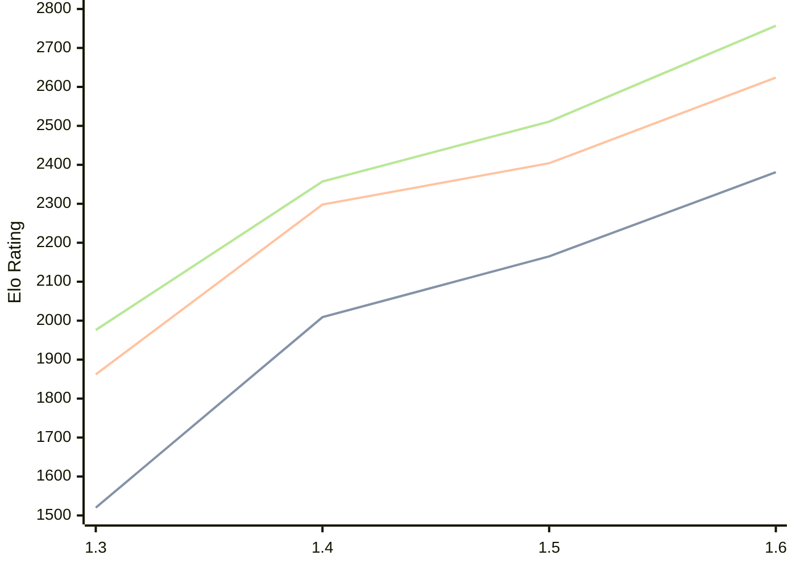

# Engine: Facon

Author: Carlos M. Canavessi

Home: https://github.com/CMCanavessi/facon

## Elo Ratings E1

| Version | Published | STC 8.0+0.08s  | LTC 60.0+0.60s | VLTC 2m24s+1.12s | Comment |
| --- | --- | --- | --- | --- | --- |
| 1.5 | 2026-05-26 | 2009 | 2284 | 2361 |  |
 | | | cElo (∆ prev) | cElo (∆ prev) | cElo (∆ prev) | 

## Elo Ratings P1

| Version | Published | STC 8.0+0.08s  | LTC 60.0+0.60s | VLTC 2m24s+1.12s | Comment |
| --- | --- | --- | --- | --- | --- |
| 1.5 | 2026-05-26 | 2233 | 2519 | 2547 |  |
 | | | cElo (∆ prev) | cElo (∆ prev) | cElo (∆ prev) | 

## Elo Ratings T1

| Version | Published | STC 8.0+0.08s  | LTC 60.0+0.60s | VLTC 2m24s+1.12s | Comment |
| --- | --- | --- | --- | --- | --- |
| 1.6 | 2026-06-11 | 2381(+216) | 2624(+220) | 2757(+246) |  |
| 1.5 | 2026-05-26 | 2165(+156) | 2404(+106) | 2511(+154) |  |
| 1.4 | 2026-04-25 | 2009(+489) | 2298(+436) | 2357(+381) |  |
| 1.3 | 2026-04-11 | 1520 | 1862 | 1976 |  |
 | | | cElo (∆ prev) | cElo (∆ prev) | cElo (∆ prev) | 

<a href="https://github.com/computer-chess-index/cci/issues/new?template=submit-version.yml&title=[VERSION]+Facon+<version>&body=###%20Engine%20name%0AFacon%0A%0A###%20Version%0A1.6" target="_blank">Submit new version</a>

 Test Conditions:

GUI/CLI: <a href=https://github.com/cutechess/cutechess target="_blank">Cute-Chess</a> 
Elo Calculation: <a href=https://www.remi-coulom.fr/Bayesian-Elo/ target="_blank">Bayesian-Elo</a> 
CPU for P1: Intel(R) Core(TM) Ultra 7 265T (1.50 GHz) - P-Core 
CPU for E1: Intel(R) Core(TM) Ultra 7 265T (1.50 GHz) - E-Core 
CPU for T1: Intel(R) Core(TM) i5-7500T 2.70GHz 
Opening book: 8_moves_v3 
\* STC: 8.0+0.08s, LTC: 60.0+0.60s, VLTC: 2m24s+1.12s

 Lists:
Ratings: <a href=https://github.com/computer-chess-index/cci/blob/main/lists/CCIRatings.csv target="_blank">Complete list</a>

Generated: 2026-10-09 14:11:28

## Ratings Verlauf

```mermaid
%%{init: {"theme":"base","themeVariables":{"seriesColors:['#a3a3a3','#222221','#faa371']}}}%%
xychart-beta
  x-axis ["1.3", "1.4", "1.5", "1.6"]
  y-axis "Elo Rating" 1500 --> 2800
  line "" [1520, 2009, 2165, 2381]
  line "STC (8.0+0.08s)" [1520, 2009, 2165, 2381]
  line "LTC (60.0+0.60s)" [1862, 2298, 2404, 2624]
  line "" [1976, 2357, 2511, 2757]
  line "VLTC (2m24s+1.12s)" [1976, 2357, 2511, 2757]
```

## Detailed Evaluation Results

| Version | Time Control | Elo  | Range +/- | Matches | Score | Average Opponent Elo | Draws |
| --- | --- | --- | --- | --- | --- | --- | --- |
| 1.6 | VLTC (2m24s+1.12s) | 2757 | 32 | 314 | 46% | 2785 | 37% |
| 1.6 | LTC (60.0+0.60s) | 2624 | 34 | 280 | 51% | 2610 | 35% |
| 1.6 | STC (8.0+0.08s) | 2381 | 36 | 256 | 53% | 2354 | 30% |
| --- | --- | --- | --- | --- | --- | --- | --- |
| 1.5 | VLTC (2m24s+1.12s) | 2511 | 32 | 330 | 50% | 2510 | 26% |
| 1.5 | VLTC (2m24s+1.12s) | 2547 | 52 | 128 | 48% | 2570 | 24% |
| 1.5 | VLTC (2m24s+1.12s) | 2361 | 43 | 184 | 50% | 2367 | 27% |
| 1.5 | LTC (60.0+0.60s) | 2404 | 35 | 262 | 51% | 2396 | 34% |
| 1.5 | LTC (60.0+0.60s) | 2519 | 48 | 146 | 42% | 2614 | 32% |
| 1.5 | LTC (60.0+0.60s) | 2284 | 47 | 168 | 44% | 2379 | 23% |
| 1.5 | STC (8.0+0.08s) | 2165 | 31 | 374 | 52% | 2145 | 22% |
| --- | --- | --- | --- | --- | --- | --- | --- |
| 1.5 | STC (8.0+0.08s) | 2233 | 51 | 140 | 49% | 2245 | 19% |
| --- | --- | --- | --- | --- | --- | --- | --- |
| 1.5 | STC (8.0+0.08s) | 2009 | 36 | 282 | 49% | 1999 | 20% |
| --- | --- | --- | --- | --- | --- | --- | --- |
| 1.4 | VLTC (2m24s+1.12s) | 2357 | 29 | 420 | 51% | 2345 | 20% |
| 1.4 | LTC (60.0+0.60s) | 2298 | 31 | 380 | 53% | 2264 | 17% |
| 1.4 | STC (8.0+0.08s) | 2009 | 30 | 406 | 51% | 1991 | 19% |
| --- | --- | --- | --- | --- | --- | --- | --- |
| 1.3 | VLTC (2m24s+1.12s) | 1976 | 34 | 324 | 48% | 1993 | 19% |
| 1.3 | LTC (60.0+0.60s) | 1862 | 32 | 364 | 50% | 1859 | 18% |
| 1.3 | STC (8.0+0.08s) | 1520 | 32 | 378 | 50% | 1515 | 19% |
| --- | --- | --- | --- | --- | --- | --- | --- |