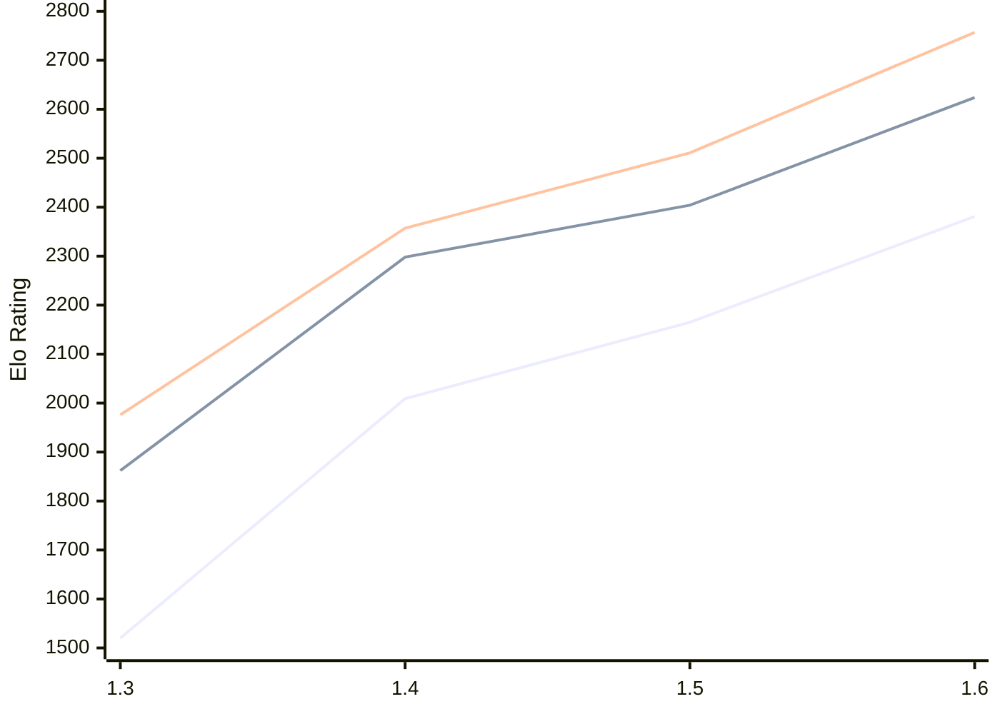

# Engine: Facon

Author: Carlos M. Canavessi

Home: https://github.com/CMCanavessi/facon

## Elo Ratings E1 (Ultra 7 265T (1.50 GHz) - E-Core)

| Version | Published | STC 8.0+0.08s  | LTC 60.0+0.60s | VLTC 2m24s+1.12s | Comment |
| --- | --- | --- | --- | --- | --- |
| 1.8 | 2026-11-03 | 2680(+320) | 3002(+271) | 3043(+204) |  |
| 1.7 | 2026-10-04 | 2360(+273) | 2731(+375) | 2839(+401) |  |
| 1.5 | 2026-05-26 | 2087 | 2356 | 2438 |  |
 | | | cElo (∆ prev) | cElo (∆ prev) | cElo (∆ prev) | 

## Elo Ratings P1 (Ultra 7 265T (1.50 GHz) - P-Core)

| Version | Published | STC 8.0+0.08s  | LTC 60.0+0.60s | VLTC 2m24s+1.12s | Comment |
| --- | --- | --- | --- | --- | --- |
| 1.8 | 2026-11-03 | 2647(+372) | 2934(+246) | 3075(+286) |  |
| 1.7 | 2026-10-04 | 2275(+200) | 2688(+336) | 2789(+426) |  |
| 1.5 | 2026-05-26 | 2075 | 2352 | 2363 |  |
 | | | cElo (∆ prev) | cElo (∆ prev) | cElo (∆ prev) | 

## Elo Ratings T1 (i5-7500T 2.70GHz)

| Version | Published | STC 8.0+0.08s  | LTC 60.0+0.60s | VLTC 2m24s+1.12s | Comment |
| --- | --- | --- | --- | --- | --- |
| 1.6 | 2026-06-11 | 2381(+216) | 2624(+220) | 2757(+246) |  |
| 1.5 | 2026-05-26 | 2165(+156) | 2404(+106) | 2511(+154) |  |
| 1.4 | 2026-04-25 | 2009(+489) | 2298(+436) | 2357(+381) |  |
| 1.3 | 2026-04-11 | 1520 | 1862 | 1976 |  |
 | | | cElo (∆ prev) | cElo (∆ prev) | cElo (∆ prev) | 

<a href="https://github.com/computer-chess-index/cci/issues/new?template=submit-version.yml&title=[VERSION]+Facon+<version>&body=###%20Engine%20name%0AFacon%0A%0A###%20Version%0A1.6" target="_blank">Submit new version</a>

 Test Conditions:

GUI/CLI: <a href=https://github.com/cutechess/cutechess target="_blank">Cute-Chess</a> 
Elo Calculation: <a href=https://www.remi-coulom.fr/Bayesian-Elo/ target="_blank">Bayesian-Elo</a> 
CPU for P1: Intel(R) Core(TM) Ultra 7 265T (1.50 GHz) - P-Core 
CPU for E1: Intel(R) Core(TM) Ultra 7 265T (1.50 GHz) - E-Core 
CPU for T1: Intel(R) Core(TM) i5-7500T 2.70GHz 
Opening book: 8_moves_v3 
\* STC: 8.0+0.08s, LTC: 60.0+0.60s, VLTC: 2m24s+1.12s

 Lists:
Ratings: <a href=https://github.com/computer-chess-index/cci/blob/main/lists/CCIRatings.csv target="_blank">Complete list</a>

Generated: 2026-11-13 05:38:21

## Ratings Verlauf E1 / P1

```mermaid
%%{init: {"theme":"base","themeVariables":{"seriesColors:['#a3a3a3','#222221','#faa371']}}}%%
xychart-beta
  x-axis ["1.5", "1.7", "1.8"]
  y-axis "Elo Rating" 2000 --> 3100
  line "E1: STC (8.0+0.08s)" [2087, 2360, 2680]
  line "E1: LTC (60.0+0.60s)" [2356, 2731, 3002]
  line "E1: VLTC (2m24s+1.12s)" [2438, 2839, 3043]
  line "P1: STC (8.0+0.08s)" [2075, 2275, 2647]
  line "P1: LTC (60.0+0.60s)" [2352, 2688, 2934]
  line "P1: VLTC (2m24s+1.12s)" [2363, 2789, 3075]
```

## Ratings Verlauf T1

```mermaid
%%{init: {"theme":"base","themeVariables":{"seriesColors:['#a3a3a3','#222221','#faa371']}}}%%
xychart-beta
  x-axis ["1.3", "1.4", "1.5", "1.6"]
  y-axis "Elo Rating" 1500 --> 2800
  line "T1: STC (8.0+0.08s)" [1520, 2009, 2165, 2381]
  line "T1: LTC (60.0+0.60s)" [1862, 2298, 2404, 2624]
  line "T1: VLTC (2m24s+1.12s)" [1976, 2357, 2511, 2757]
```

## Detailed Evaluation Results

| Version | Time Control | Variant | Elo  | Range +/- | Matches | Score | Average Opponent Elo | Draws |
| --- | --- |--- | --- | --- | --- | --- | --- | --- |
| 1.8 | VLTC (2m24s+1.12s) | P1 | 3075 | 40 | 184 | 48% | 3096 | 45% |
|  |  | E1 | 3043 | 31 | 294 | 52% | 3029 | 48% |
|  | LTC (60.0+0.60s) | P1 | 2934 | 44 | 150 | 53% | 2909 | 46% |
|  |  | E1 | 3002 | 33 | 294 | 51% | 2989 | 36% |
|  | STC (8.0+0.08s) | P1 | 2647 | 44 | 164 | 50% | 2643 | 37% |
|  |  | E1 | 2680 | 35 | 252 | 56% | 2628 | 39% |
| --- | --- |--- | --- | --- | --- | --- | --- | --- |
| 1.7 | VLTC (2m24s+1.12s) | E1 | 2839 | 34 | 282 | 50% | 2827 | 32% |
|  |  | P1 | 2789 | 39 | 210 | 50% | 2788 | 37% |
|  | LTC (60.0+0.60s) | P1 | 2688 | 37 | 240 | 55% | 2616 | 36% |
|  |  | E1 | 2731 | 35 | 278 | 49% | 2739 | 28% |
|  | STC (8.0+0.08s) | P1 | 2275 | 40 | 212 | 55% | 2226 | 29% |
|  |  | E1 | 2360 | 34 | 300 | 53% | 2338 | 28% |
| --- | --- |--- | --- | --- | --- | --- | --- | --- |
| 1.6 | VLTC (2m24s+1.12s) | T1 | 2757 | 32 | 314 | 46% | 2785 | 37% |
|  | LTC (60.0+0.60s) | T1 | 2624 | 34 | 280 | 51% | 2610 | 35% |
|  | STC (8.0+0.08s) | T1 | 2381 | 36 | 256 | 53% | 2354 | 30% |
| --- | --- |--- | --- | --- | --- | --- | --- | --- |
| 1.5 | VLTC (2m24s+1.12s) | T1 | 2511 | 32 | 330 | 50% | 2510 | 26% |
|  |  | P1 | 2363 | 49 | 144 | 48% | 2390 | 24% |
|  |  | E1 | 2438 | 41 | 208 | 51% | 2434 | 25% |
|  | LTC (60.0+0.60s) | T1 | 2404 | 35 | 262 | 51% | 2396 | 34% |
|  |  | P1 | 2352 | 47 | 154 | 44% | 2434 | 31% |
|  |  | E1 | 2356 | 46 | 172 | 44% | 2445 | 23% |
|  | STC (8.0+0.08s) | T1 | 2165 | 31 | 374 | 52% | 2145 | 22% |
|  |  | P1 | 2075 | 50 | 144 | 48% | 2097 | 19% |
|  |  | E1 | 2087 | 36 | 286 | 49% | 2079 | 20% |
| --- | --- |--- | --- | --- | --- | --- | --- | --- |
| 1.4 | VLTC (2m24s+1.12s) | T1 | 2357 | 29 | 420 | 51% | 2345 | 20% |
|  | LTC (60.0+0.60s) | T1 | 2298 | 31 | 380 | 53% | 2264 | 17% |
|  | STC (8.0+0.08s) | T1 | 2009 | 30 | 406 | 51% | 1991 | 19% |
| --- | --- |--- | --- | --- | --- | --- | --- | --- |
| 1.3 | VLTC (2m24s+1.12s) | T1 | 1976 | 34 | 324 | 48% | 1993 | 19% |
|  | LTC (60.0+0.60s) | T1 | 1862 | 32 | 364 | 50% | 1859 | 18% |
|  | STC (8.0+0.08s) | T1 | 1520 | 32 | 378 | 50% | 1515 | 19% |