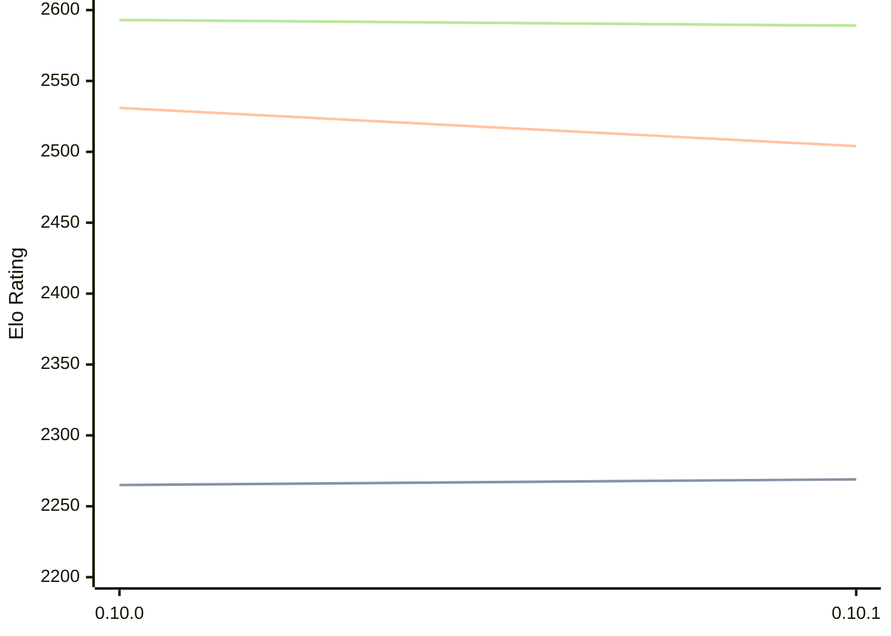

# Engine: Fatalii

Author: Patrick Heck

Home: https://github.com/FitzOReilly/fatalii

## Elo Ratings

| Version | Published | STC 8.0+0.08s  | LTC 60.0+0.60s | VLTC 2m24s+1.12s | Comment |
| --- | --- | --- | --- | --- | --- |
| 0.10.1 | 2026-05-11 | 2269(+4) | 2504(-27) | 2589(-4) |  |
| 0.10.0 | 2026-03-09 | 2265(+new) | 2531(+new) | 2593(+new) |  |
| 0.9.0 | 2025-02-08 |  |  |  |  |
| 0.8.0 | 2024-10-17 |  |  |  |  |
| 0.7.0 | 2024-05-06 |  |  |  |  |
| 0.6.1 | 2024-04-05 |  |  |  |  |
| 0.6.0 | 2024-01-10 |  |  |  |  |
| 0.5.0 | 2023-10-11 |  |  |  |  |
| 0.4.0 | 2023-03-06 |  |  |  |  |
| 0.3.1 | 2022-10-05 |  |  |  |  |
| 0.3.0 | 2022-09-10 |  |  |  |  |
| 0.2.1 | 2022-09-03 |  |  |  |  |
| 0.2.0 | 2022-05-15 |  |  |  |  |
| 0.1.2 | 2022-04-16 |  |  |  |  |
| 0.1.1 | 2022-02-21 |  |  |  |  |
| 0.1.0 | 2022-02-12 |  |  |  |  |
 | | | cElo (∆ prev) | cElo (∆ prev) | cElo (∆ prev) | 

<a href="https://github.com/computer-chess-index/cci/issues/new?template=submit-version.yml&title=[VERSION]+Fatalii+<version>&body=###%20Engine%20name%0AFatalii%0A%0A###%20Version%0A0.10.1" target="_blank">Submit new version</a>

 Test Conditions:

GUI/CLI: <a href=https://github.com/cutechess/cutechess target="_blank">Cute-Chess</a> 
Elo Calculation: <a href=https://www.remi-coulom.fr/Bayesian-Elo/ target="_blank">Bayesian-Elo</a> 
CPU: Intel(R) Core(TM) i5-7500T 2.70GHz 
Opening book: 8_moves_v3 
\* STC: 8.0+0.08s, LTC: 60.0+0.60s, VLTC: 2m24s+1.12s

 Lists:
Ratings: <a href=https://github.com/computer-chess-index/cci/blob/main/lists/CCIRatings.csv target="_blank">Complete list</a>

Generated: 2026-07-30 06:24:58

## Ratings Verlauf

⬛ STC (8.0+0.08s) &nbsp;&nbsp; 🟧 LTC (60.0+0.60s) &nbsp;&nbsp; 🟩 VLTC (2m24s+1.12s)

dark mode: 🟩STC (8.0+0.08s) 🟧LTC (60.0+0.60s) ⬜VLTC (2m24s+1.12s)

## Detailed Evaluation Results

| Version | Time Control | Elo  | Range +/- | Matches | Score | Average Opponent Elo | Draws |
| --- | --- | --- | --- | --- | --- | --- | --- |
| 0.10.1 | VLTC (2m24s+1.12s) | 2589 | 29 | 414 | 50% | 2591 | 27% |
| 0.10.1 | LTC (60.0+0.60s) | 2504 | 29 | 392 | 50% | 2504 | 31% |
| 0.10.1 | STC (8.0+0.08s) | 2269 | 30 | 378 | 49% | 2279 | 27% |
| --- | --- | --- | --- | --- | --- | --- | --- |
| 0.10.0 | VLTC (2m24s+1.12s) | 2593 | 29 | 424 | 48% | 2618 | 25% |
| 0.10.0 | LTC (60.0+0.60s) | 2531 | 28 | 454 | 51% | 2527 | 25% |
| 0.10.0 | STC (8.0+0.08s) | 2265 | 27 | 464 | 52% | 2241 | 25% |
| --- | --- | --- | --- | --- | --- | --- | --- |