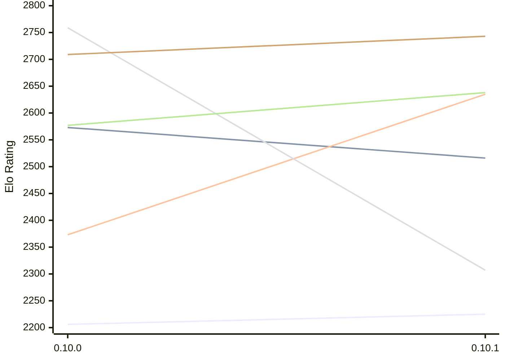
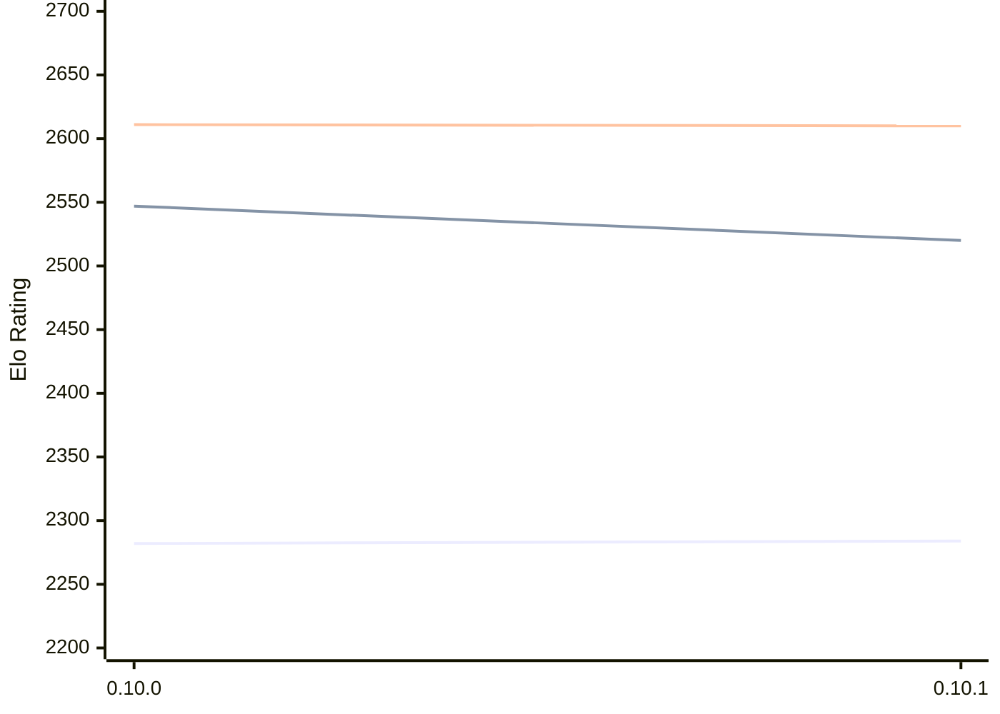

# Engine: Fatalii

Author: Patrick Heck

Home: https://github.com/FitzOReilly/fatalii

## Elo Ratings E1 (Ultra 7 265T (1.50 GHz) - E-Core)

| Version | Published | STC 8.0+0.08s  | LTC 60.0+0.60s | VLTC 2m24s+1.12s | Comment |
| --- | --- | --- | --- | --- | --- |
| 0.10.1 | 2026-05-11 | 2225(+19) | 2516(-57) | 2635(+262) |  |
| 0.10.0 | 2026-03-09 | 2206 | 2573 | 2373 |  |
 | | | cElo (∆ prev) | cElo (∆ prev) | cElo (∆ prev) | 

## Elo Ratings P1 (Ultra 7 265T (1.50 GHz) - P-Core)

| Version | Published | STC 8.0+0.08s  | LTC 60.0+0.60s | VLTC 2m24s+1.12s | Comment |
| --- | --- | --- | --- | --- | --- |
| 0.10.1 | 2026-05-11 | 2307(-452) | 2638(+61) | 2743(+34) |  |
| 0.10.0 | 2026-03-09 | 2759 | 2577 | 2709 |  |
 | | | cElo (∆ prev) | cElo (∆ prev) | cElo (∆ prev) | 

## Elo Ratings T1 (i5-7500T 2.70GHz)

| Version | Published | STC 8.0+0.08s  | LTC 60.0+0.60s | VLTC 2m24s+1.12s | Comment |
| --- | --- | --- | --- | --- | --- |
| 0.10.1 | 2026-05-11 | 2284(+2) | 2520(-27) | 2610(-1) |  |
| 0.10.0 | 2026-03-09 | 2282 | 2547 | 2611 |  |
 | | | cElo (∆ prev) | cElo (∆ prev) | cElo (∆ prev) | 

<a href="https://github.com/computer-chess-index/cci/issues/new?template=submit-version.yml&title=[VERSION]+Fatalii+<version>&body=###%20Engine%20name%0AFatalii%0A%0A###%20Version%0A0.10.1" target="_blank">Submit new version</a>

 Test Conditions:

GUI/CLI: <a href=https://github.com/cutechess/cutechess target="_blank">Cute-Chess</a> 
Elo Calculation: <a href=https://www.remi-coulom.fr/Bayesian-Elo/ target="_blank">Bayesian-Elo</a> 
CPU for P1: Intel(R) Core(TM) Ultra 7 265T (1.50 GHz) - P-Core 
CPU for E1: Intel(R) Core(TM) Ultra 7 265T (1.50 GHz) - E-Core 
CPU for T1: Intel(R) Core(TM) i5-7500T 2.70GHz 
Opening book: 8_moves_v3 
\* STC: 8.0+0.08s, LTC: 60.0+0.60s, VLTC: 2m24s+1.12s

 Lists:
Ratings: <a href=https://github.com/computer-chess-index/cci/blob/main/lists/CCIRatings.csv target="_blank">Complete list</a>

Generated: 2026-11-12 05:38:11

## Ratings Verlauf E1 / P1

```mermaid
%%{init: {"theme":"base","themeVariables":{"seriesColors:['#a3a3a3','#222221','#faa371']}}}%%
xychart-beta
  x-axis ["0.10.0", "0.10.1"]
  y-axis "Elo Rating" 2200 --> 2800
  line "E1: STC (8.0+0.08s)" [2206, 2225]
  line "E1: LTC (60.0+0.60s)" [2573, 2516]
  line "E1: VLTC (2m24s+1.12s)" [2373, 2635]
  line "P1: STC (8.0+0.08s)" [2759, 2307]
  line "P1: LTC (60.0+0.60s)" [2577, 2638]
  line "P1: VLTC (2m24s+1.12s)" [2709, 2743]
```

## Ratings Verlauf T1

```mermaid
%%{init: {"theme":"base","themeVariables":{"seriesColors:['#a3a3a3','#222221','#faa371']}}}%%
xychart-beta
  x-axis ["0.10.0", "0.10.1"]
  y-axis "Elo Rating" 2200 --> 2700
  line "T1: STC (8.0+0.08s)" [2282, 2284]
  line "T1: LTC (60.0+0.60s)" [2547, 2520]
  line "T1: VLTC (2m24s+1.12s)" [2611, 2610]
```

## Detailed Evaluation Results

| Version | Time Control | Variant | Elo  | Range +/- | Matches | Score | Average Opponent Elo | Draws |
| --- | --- |--- | --- | --- | --- | --- | --- | --- |
| 0.10.1 | VLTC (2m24s+1.12s) | T1 | 2610 | 26 | 490 | 50% | 2610 | 27% |
|  |  | P1 | 2743 | 38 | 236 | 52% | 2722 | 28% |
|  |  | E1 | 2635 | 33 | 350 | 51% | 2592 | 23% |
|  | LTC (60.0+0.60s) | T1 | 2520 | 27 | 448 | 50% | 2523 | 31% |
|  |  | P1 | 2638 | 39 | 232 | 48% | 2685 | 28% |
|  |  | E1 | 2516 | 33 | 336 | 56% | 2444 | 26% |
|  | STC (8.0+0.08s) | T1 | 2284 | 28 | 438 | 49% | 2294 | 27% |
|  |  | P1 | 2307 | 38 | 236 | 47% | 2357 | 27% |
|  |  | E1 | 2225 | 32 | 334 | 49% | 2229 | 24% |
| --- | --- |--- | --- | --- | --- | --- | --- | --- |
| 0.10.0 | VLTC (2m24s+1.12s) | P1 | 2709 | 208 | 8 | 50% | 2709 | 0% |
|  |  | E1 | 2373 | 246 | 8 | 0% | 2817 | 0% |
|  |  | T1 | 2611 | 29 | 424 | 48% | 2635 | 25% |
|  | LTC (60.0+0.60s) | P1 | 2577 | 262 | 4 | 0% | 2890 | 0% |
|  |  | E1 | 2573 | 181 | 8 | 75% | 2398 | 25% |
|  |  | T1 | 2547 | 28 | 454 | 51% | 2543 | 25% |
|  | STC (8.0+0.08s) | P1 | 2759 | 182 | 8 | 44% | 2755 | 13% |
|  |  | E1 | 2206 | 156 | 16 | 41% | 2300 | 19% |
|  |  | T1 | 2282 | 27 | 464 | 52% | 2257 | 25% |