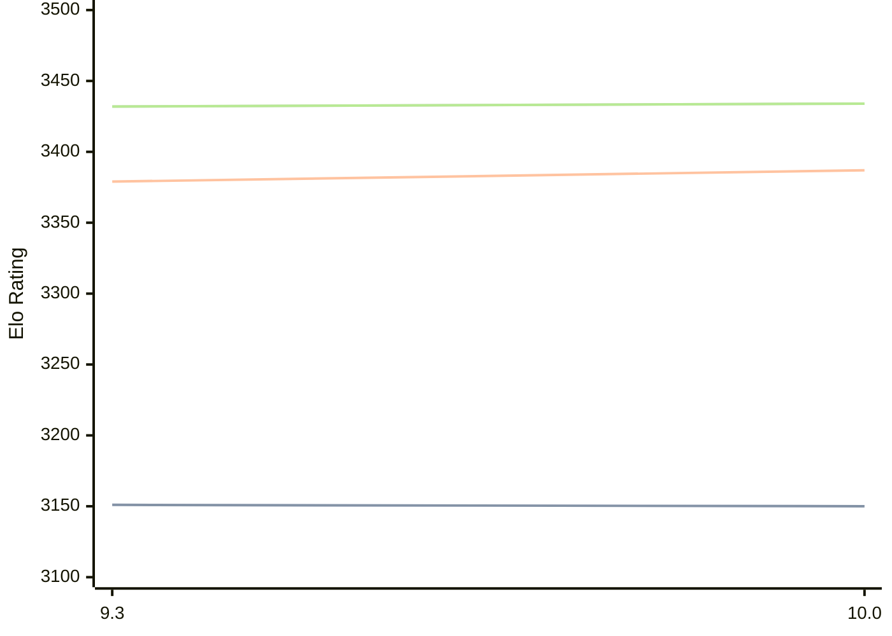

# Engine: Fire

Author: Norman Schmidt

Home: https://github.com/Firefather/fire

## Elo Ratings

| Version | Published | STC 8.0+0.08s  | LTC 60.0+0.60s | VLTC 2m24s+1.12s | Comment |
| --- | --- | --- | --- | --- | --- |
| 10.0 | 2025-08-09 | 3150(-1) | 3387(+8) | 3434(+2) |  |
| 9.3 | 2024-03-10 | 3151 | 3379 | 3432 |  |
 | | | cElo (∆ prev) | cElo (∆ prev) | cElo (∆ prev) | 

<a href="https://github.com/computer-chess-index/cci/issues/new?template=submit-version.yml&title=[VERSION]+Fire+<version>&body=###%20Engine%20name%0AFire%0A%0A###%20Version%0A10.0" target="_blank">Submit new version</a>

 Test Conditions:

GUI/CLI: <a href=https://github.com/cutechess/cutechess target="_blank">Cute-Chess</a> 
Elo Calculation: <a href=https://www.remi-coulom.fr/Bayesian-Elo/ target="_blank">Bayesian-Elo</a> 
CPU: Intel(R) Core(TM) i5-7500T 2.70GHz 
Opening book: 8_moves_v3 
\* STC: 8.0+0.08s, LTC: 60.0+0.60s, VLTC: 2m24s+1.12s

 Lists:
Ratings: <a href=https://github.com/computer-chess-index/cci/blob/main/lists/CCIRatings.csv target="_blank">Complete list</a>

Generated: 2026-09-14 04:38:05

## Ratings Verlauf

## Detailed Evaluation Results

| Version | Time Control | Elo  | Range +/- | Matches | Score | Average Opponent Elo | Draws |
| --- | --- | --- | --- | --- | --- | --- | --- |
| 10.0 | VLTC (2m24s+1.12s) | 3434 | 18 | 732 | 49% | 3438 | 75% |
| 10.0 | LTC (60.0+0.60s) | 3387 | 18 | 740 | 50% | 3386 | 71% |
| 10.0 | STC (8.0+0.08s) | 3150 | 17 | 944 | 51% | 3143 | 60% |
| --- | --- | --- | --- | --- | --- | --- | --- |
| 9.3 | VLTC (2m24s+1.12s) | 3432 | 13 | 1520 | 49% | 3433 | 75% |
| 9.3 | LTC (60.0+0.60s) | 3379 | 13 | 1496 | 50% | 3378 | 73% |
| 9.3 | STC (8.0+0.08s) | 3151 | 14 | 1428 | 51% | 3128 | 57% |
| --- | --- | --- | --- | --- | --- | --- | --- |