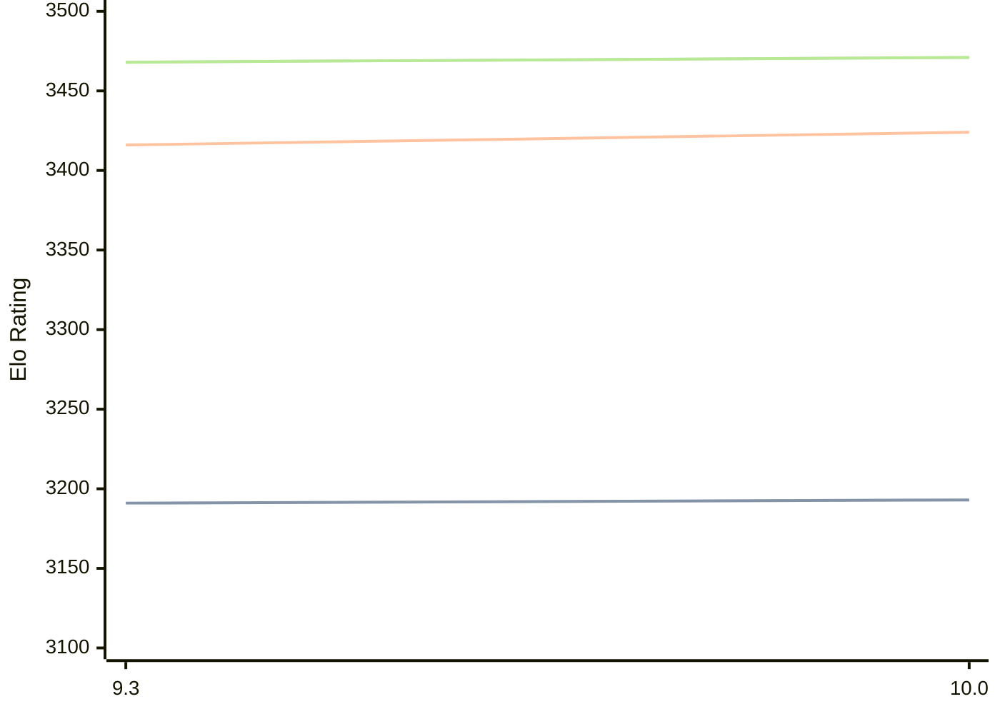

# Engine: Fire

Author: Norman Schmidt

Home: https://github.com/Firefather/fire

## Ratings nach Version

| Version | Published | STC 8.0+0.08s  | LTC 60.0+0.60s | VLTC 2m24s+1.12s | Comment |
| --- | --- | --- | --- | --- | --- |
| 10.0 | 2025-08-09 | 3193(+2) | 3424(+8) | 3471(+3) |  |
| 9.3 | 2024-03-10 | 3191(+new) | 3416(+new) | 3468(+new) |  |
| 9.2 | 2023-11-12 |  |  |  |  |
| 9.1 | 2023-11-08 |  |  |  |  |
| 9.0 | 2023-06-05 |  |  |  |  |
| 05192023 | 2023-05-20 |  |  |  |  |
| 05172023 | 2023-05-17 |  |  |  |  |
| 10262022 | 2022-10-26 |  |  |  |  |
| 10072022 | 2022-10-07 |  |  |  |  |
| 09282022 | 2022-09-28 |  |  |  |  |
| 09202022 | 2022-09-20 |  |  |  |  |
| 09112022 | 2022-09-11 |  |  |  |  |
| 09022022 | 2022-09-02 |  |  |  |  |
| 08222022 | 2022-08-23 |  |  |  |  |
| 08132022 | 2022-08-14 |  |  |  |  |
| 08072022 | 2022-08-10 |  |  |  |  |
| 08032022 | 2022-08-04 |  |  |  |  |
 | | | cElo (∆ prev) | cElo (∆ prev) | cElo (∆ prev) | 

 Test Conditions:

GUI/CLI: <a href=https://github.com/cutechess/cutechess target="_blank">Cute-Chess</a> 
Elo Calculation: <a href=https://www.remi-coulom.fr/Bayesian-Elo/ target="_blank">Bayesian-Elo</a> 
CPU: Intel(R) Core(TM) i5-7500T 2.70GHz 
Opening book: 8_moves_v3 
\* STC: 8.0+0.08s, LTC: 60.0+0.60s, VLTC: 2m24s+1.12s

 Lists:
Ratings: <a href=https://github.com/computer-chess-index/cci/blob/main/lists/CCIRatings.csv target="_blank">Complete list</a>

Generated: 2026-03-05 06:23:23

## Ratings Verlauf

⬛ STC (8.0+0.08s) &nbsp;&nbsp; 🟧 LTC (60.0+0.60s) &nbsp;&nbsp; 🟩 VLTC (2m24s+1.12s)

