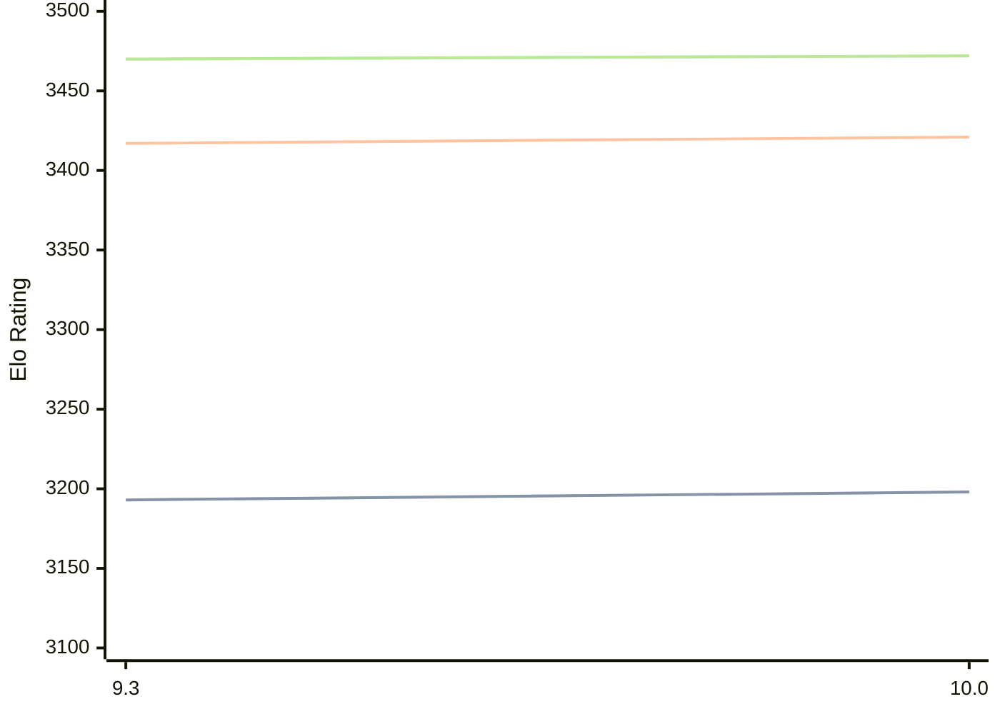

# Engine: Fire

Author: Norman Schmidt

Home: https://github.com/Firefather/fire

## Elo Ratings

| Version | Published | STC 8.0+0.08s  | LTC 60.0+0.60s | VLTC 2m24s+1.12s | Comment |
| --- | --- | --- | --- | --- | --- |
| 10.0 | 2025-08-09 | 3198(+5) | 3421(+4) | 3472(+2) |  |
| 9.3 | 2024-03-10 | 3193(+new) | 3417(+new) | 3470(+new) |  |
| 9.2 | 2023-11-12 |  |  |  |  |
| 9.1 | 2023-11-08 |  |  |  |  |
| 9.0 | 2023-06-05 |  |  |  |  |
| 05192023 | 2023-05-20 |  |  |  |  |
| 05172023 | 2023-05-17 |  |  |  |  |
| 10262022 | 2022-10-26 |  |  |  |  |
| 10072022 | 2022-10-07 |  |  |  |  |
| 09282022 | 2022-09-28 |  |  |  |  |
| 09202022 | 2022-09-20 |  |  |  |  |
| 09112022 | 2022-09-11 |  |  |  |  |
| 09022022 | 2022-09-02 |  |  |  |  |
| 08222022 | 2022-08-23 |  |  |  |  |
| 08132022 | 2022-08-14 |  |  |  |  |
| 08072022 | 2022-08-10 |  |  |  |  |
| 08032022 | 2022-08-04 |  |  |  |  |
 | | | cElo (∆ prev) | cElo (∆ prev) | cElo (∆ prev) | 

<a href="https://github.com/computer-chess-index/cci/issues/new?template=submit-version.yml&title=[VERSION]+Fire+<version>&body=###%20Engine%20name%0AFire%0A%0A###%20Version%0A10.0" target="_blank">Submit new version</a>

 Test Conditions:

GUI/CLI: <a href=https://github.com/cutechess/cutechess target="_blank">Cute-Chess</a> 
Elo Calculation: <a href=https://www.remi-coulom.fr/Bayesian-Elo/ target="_blank">Bayesian-Elo</a> 
CPU: Intel(R) Core(TM) i5-7500T 2.70GHz 
Opening book: 8_moves_v3 
\* STC: 8.0+0.08s, LTC: 60.0+0.60s, VLTC: 2m24s+1.12s

 Lists:
Ratings: <a href=https://github.com/computer-chess-index/cci/blob/main/lists/CCIRatings.csv target="_blank">Complete list</a>

Generated: 2026-05-03 07:38:16

## Ratings Verlauf

⬛ STC (8.0+0.08s) &nbsp;&nbsp; 🟧 LTC (60.0+0.60s) &nbsp;&nbsp; 🟩 VLTC (2m24s+1.12s)

dark mode: 🟩STC (8.0+0.08s) 🟧LTC (60.0+0.60s) ⬜VLTC (2m24s+1.12s)

## Detailed Evaluation Results

| Version | Time Control | Elo  | Range +/- | Matches | Score | Average Opponent Elo | Draws |
| --- | --- | --- | --- | --- | --- | --- | --- |
| 10.0 | VLTC (2m24s+1.12s) | 3472 | 20 | 644 | 49% | 3476 | 75% |
| 10.0 | D10 | 2846 | 22 | 642 | 49% | 2854 | 43% |
| 10.0 | D11 | 2982 | 20 | 696 | 50% | 2982 | 51% |
| 10.0 | D12 | 3136 | 20 | 680 | 51% | 3121 | 55% |
| 10.0 | D13 | 3216 | 20 | 676 | 48% | 3231 | 59% |
| 10.0 | D2 | 1075 | 25 | 528 | 50% | 1075 | 29% |
| 10.0 | D3 | 1123 | 26 | 512 | 47% | 1156 | 29% |
| 10.0 | D4 | 1332 | 26 | 518 | 50% | 1324 | 26% |
| 10.0 | D5 | 1473 | 25 | 546 | 52% | 1446 | 24% |
| 10.0 | D6 | 1673 | 25 | 552 | 49% | 1681 | 25% |
| 10.0 | D7 | 2030 | 23 | 644 | 52% | 2010 | 25% |
| 10.0 | D8 | 2425 | 21 | 756 | 47% | 2444 | 27% |
| 10.0 | D9 | 2685 | 22 | 662 | 49% | 2682 | 35% |
| 10.0 | S10 | 3213 | 20 | 640 | 50% | 3212 | 60% |
| 10.0 | S40 | 3376 | 21 | 594 | 49% | 3383 | 71% |
| 10.0 | LTC (60.0+0.60s) | 3421 | 20 | 648 | 50% | 3425 | 71% |
| 10.0 | STC (8.0+0.08s) | 3198 | 18 | 808 | 52% | 3185 | 60% |
| --- | --- | --- | --- | --- | --- | --- | --- |
| 9.3 | VLTC (2m24s+1.12s) | 3470 | 13 | 1520 | 49% | 3471 | 75% |
| 9.3 | D1 | 871 | 19 | 856 | 49% | 879 | 45% |
| 9.3 | D10 | 2840 | 12 | 2028 | 48% | 2853 | 44% |
| 9.3 | D11 | 2990 | 12 | 2132 | 50% | 2993 | 50% |
| 9.3 | D12 | 3117 | 17 | 904 | 50% | 3117 | 57% |
| 9.3 | D13 | 3185 | 21 | 596 | 51% | 3175 | 61% |
| 9.3 | D14 | 3263 | 34 | 240 | 60% | 3189 | 58% |
| 9.3 | D2 | 1061 | 12 | 2245 | 48% | 1077 | 28% |
| 9.3 | D3 | 1149 | 13 | 2180 | 49% | 1157 | 26% |
| 9.3 | D4 | 1289 | 13 | 2044 | 49% | 1301 | 26% |
| 9.3 | D5 | 1453 | 12 | 2228 | 49% | 1459 | 28% |
| 9.3 | D6 | 1631 | 13 | 2080 | 47% | 1661 | 22% |
| 9.3 | D7 | 1991 | 13 | 2096 | 51% | 1983 | 24% |
| 9.3 | D8 | 2421 | 13 | 2106 | 49% | 2434 | 31% |
| 9.3 | D9 | 2651 | 12 | 2072 | 49% | 2658 | 40% |
| 9.3 | S10 | 3227 | 14 | 1396 | 50% | 3228 | 61% |
| 9.3 | S40 | 3391 | 13 | 1428 | 50% | 3391 | 70% |
| 9.3 | LTC (60.0+0.60s) | 3417 | 13 | 1496 | 50% | 3417 | 73% |
| 9.3 | STC (8.0+0.08s) | 3193 | 14 | 1428 | 51% | 3170 | 57% |
| --- | --- | --- | --- | --- | --- | --- | --- |
| 9.2 |  |  |  |  |  |  |  |
| 9.1 |  |  |  |  |  |  |  |
| 9.0 |  |  |  |  |  |  |  |
| 05192023 |  |  |  |  |  |  |  |
| 05172023 |  |  |  |  |  |  |  |
| 10262022 |  |  |  |  |  |  |  |
| 10072022 |  |  |  |  |  |  |  |
| 09282022 |  |  |  |  |  |  |  |
| 09202022 |  |  |  |  |  |  |  |
| 09112022 |  |  |  |  |  |  |  |
| 09022022 |  |  |  |  |  |  |  |
| 08222022 |  |  |  |  |  |  |  |
| 08132022 |  |  |  |  |  |  |  |
| 08072022 |  |  |  |  |  |  |  |
| 08032022 |  |  |  |  |  |  |  |