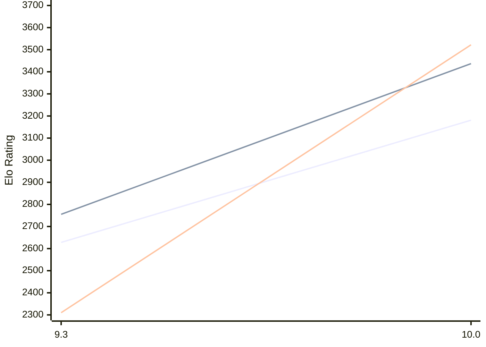
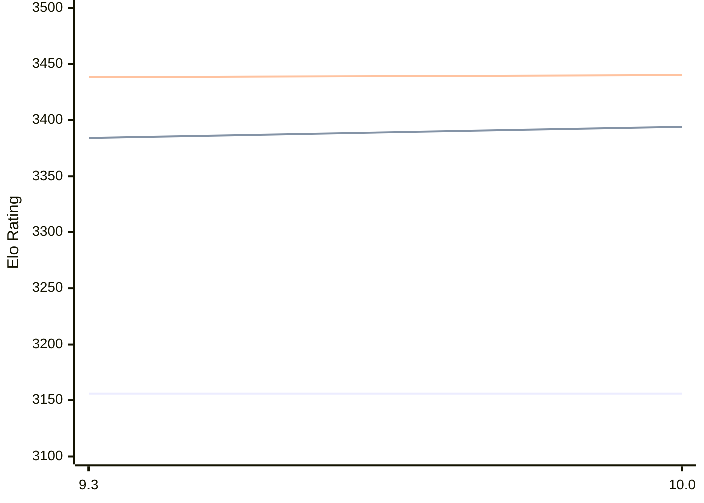

# Engine: Fire

Author: Norman Schmidt

Home: https://github.com/Firefather/fire

## Elo Ratings E1 (Ultra 7 265T (1.50 GHz) - E-Core)

| Version | Published | STC 8.0+0.08s  | LTC 60.0+0.60s | VLTC 2m24s+1.12s | Comment |
| --- | --- | --- | --- | --- | --- |
| 10.0 | 2025-08-09 | 3181(+553) | 3437(+682) | 3522(+1212) |  |
| 9.3 | 2024-03-10 | 2628 | 2755 | 2310 |  |
 | | | cElo (∆ prev) | cElo (∆ prev) | cElo (∆ prev) | 

## Elo Ratings P1 (Ultra 7 265T (1.50 GHz) - P-Core)

| Version | Published | STC 8.0+0.08s  | LTC 60.0+0.60s | VLTC 2m24s+1.12s | Comment |
| --- | --- | --- | --- | --- | --- |
| 10.0 | 2025-08-09 | 3347(+new) | 3578(+681) | 3619(+563) |  |
| 9.3 | 2024-03-10 |  | 2897 | 3056 |  |
 | | | cElo (∆ prev) | cElo (∆ prev) | cElo (∆ prev) | 

## Elo Ratings T1 (i5-7500T 2.70GHz)

| Version | Published | STC 8.0+0.08s  | LTC 60.0+0.60s | VLTC 2m24s+1.12s | Comment |
| --- | --- | --- | --- | --- | --- |
| 10.0 | 2025-08-09 | 3156(0) | 3394(+10) | 3440(+2) |  |
| 9.3 | 2024-03-10 | 3156 | 3384 | 3438 |  |
 | | | cElo (∆ prev) | cElo (∆ prev) | cElo (∆ prev) | 

<a href="https://github.com/computer-chess-index/cci/issues/new?template=submit-version.yml&title=[VERSION]+Fire+<version>&body=###%20Engine%20name%0AFire%0A%0A###%20Version%0A10.0" target="_blank">Submit new version</a>

 Test Conditions:

GUI/CLI: <a href=https://github.com/cutechess/cutechess target="_blank">Cute-Chess</a> 
Elo Calculation: <a href=https://www.remi-coulom.fr/Bayesian-Elo/ target="_blank">Bayesian-Elo</a> 
CPU for P1: Intel(R) Core(TM) Ultra 7 265T (1.50 GHz) - P-Core 
CPU for E1: Intel(R) Core(TM) Ultra 7 265T (1.50 GHz) - E-Core 
CPU for T1: Intel(R) Core(TM) i5-7500T 2.70GHz 
Opening book: 8_moves_v3 
\* STC: 8.0+0.08s, LTC: 60.0+0.60s, VLTC: 2m24s+1.12s

 Lists:
Ratings: <a href=https://github.com/computer-chess-index/cci/blob/main/lists/CCIRatings.csv target="_blank">Complete list</a>

Generated: 2026-11-12 05:38:13

## Ratings Verlauf E1 / P1

```mermaid
%%{init: {"theme":"base","themeVariables":{"seriesColors:['#a3a3a3','#222221','#faa371']}}}%%
xychart-beta
  x-axis ["9.3", "10.0"]
  y-axis "Elo Rating" 2300 --> 3700
  line "E1: STC (8.0+0.08s)" [2628, 3181]
  line "E1: LTC (60.0+0.60s)" [2755, 3437]
  line "E1: VLTC (2m24s+1.12s)" [2310, 3522]
  line "P1: STC (8.0+0.08s)" [3347]
  line "P1: LTC (60.0+0.60s)" [3578]
  line "P1: VLTC (2m24s+1.12s)" [3619]
```

## Ratings Verlauf T1

```mermaid
%%{init: {"theme":"base","themeVariables":{"seriesColors:['#a3a3a3','#222221','#faa371']}}}%%
xychart-beta
  x-axis ["9.3", "10.0"]
  y-axis "Elo Rating" 3100 --> 3500
  line "T1: STC (8.0+0.08s)" [3156, 3156]
  line "T1: LTC (60.0+0.60s)" [3384, 3394]
  line "T1: VLTC (2m24s+1.12s)" [3438, 3440]
```

## Detailed Evaluation Results

| Version | Time Control | Variant | Elo  | Range +/- | Matches | Score | Average Opponent Elo | Draws |
| --- | --- |--- | --- | --- | --- | --- | --- | --- |
| 10.0 | VLTC (2m24s+1.12s) | E1 | 3522 | 30 | 276 | 50% | 3526 | 73% |
|  |  | P1 | 3619 | 33 | 224 | 49% | 3630 | 72% |
|  |  | T1 | 3440 | 18 | 736 | 49% | 3444 | 75% |
|  | LTC (60.0+0.60s) | T1 | 3394 | 18 | 748 | 50% | 3393 | 71% |
|  |  | E1 | 3437 | 26 | 396 | 53% | 3407 | 66% |
|  |  | P1 | 3578 | 27 | 348 | 52% | 3565 | 68% |
|  | STC (8.0+0.08s) | T1 | 3156 | 17 | 948 | 51% | 3148 | 60% |
|  |  | E1 | 3181 | 27 | 374 | 49% | 3191 | 53% |
|  |  | P1 | 3347 | 32 | 274 | 49% | 3352 | 55% |
| --- | --- |--- | --- | --- | --- | --- | --- | --- |
| 9.3 | VLTC (2m24s+1.12s) | T1 | 3438 | 13 | 1520 | 49% | 3440 | 75% |
|  |  | E1 | 2310 | 209 | 4 | 38% | 2365 | 75% |
|  |  | P1 | 3056 | 294 | 4 | 100% | 2691 | 0% |
|  | LTC (60.0+0.60s) | T1 | 3384 | 13 | 1496 | 50% | 3384 | 73% |
|  |  | P1 | 2897 | 209 | 4 | 63% | 2842 | 75% |
|  |  | E1 | 2755 | 208 | 4 | 63% | 2691 | 75% |
|  | STC (8.0+0.08s) | T1 | 3156 | 14 | 1428 | 51% | 3133 | 57% |
|  |  | E1 | 2628 | 171 | 8 | 25% | 2795 | 50% |