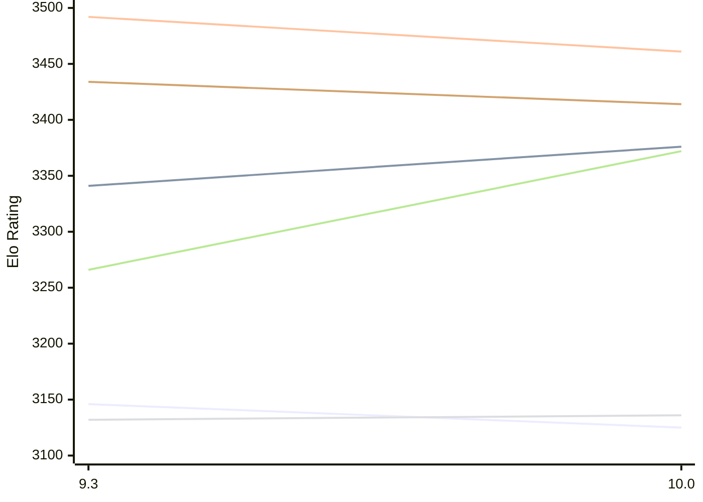
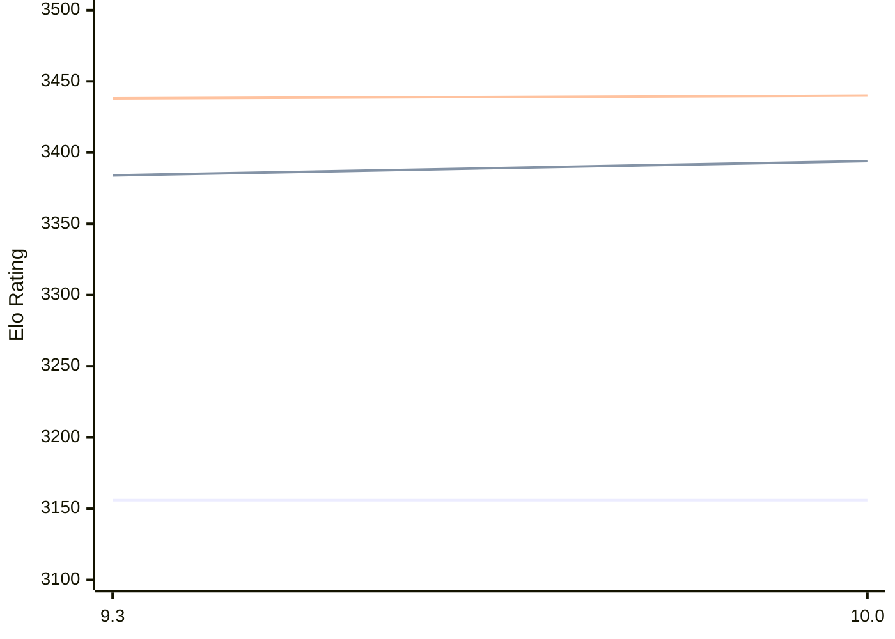

# Engine: Fire

Author: Norman Schmidt

Home: https://github.com/Firefather/fire

## Elo Ratings E1 (Ultra 7 265T (1.50 GHz) - E-Core)

| Version | Published | STC 8.0+0.08s  | LTC 60.0+0.60s | VLTC 2m24s+1.12s | Comment |
| --- | --- | --- | --- | --- | --- |
| 10.0 | 2025-08-09 | 3125(-21) | 3376(+35) | 3461(-31) |  |
| 9.3 | 2024-03-10 | 3146 | 3341 | 3492 |  |
 | | | cElo (∆ prev) | cElo (∆ prev) | cElo (∆ prev) | 

## Elo Ratings P1 (Ultra 7 265T (1.50 GHz) - P-Core)

| Version | Published | STC 8.0+0.08s  | LTC 60.0+0.60s | VLTC 2m24s+1.12s | Comment |
| --- | --- | --- | --- | --- | --- |
| 10.0 | 2025-08-09 | 3136(+4) | 3372(+106) | 3414(-20) |  |
| 9.3 | 2024-03-10 | 3132 | 3266 | 3434 |  |
 | | | cElo (∆ prev) | cElo (∆ prev) | cElo (∆ prev) | 

## Elo Ratings T1 (i5-7500T 2.70GHz)

| Version | Published | STC 8.0+0.08s  | LTC 60.0+0.60s | VLTC 2m24s+1.12s | Comment |
| --- | --- | --- | --- | --- | --- |
| 10.0 | 2025-08-09 | 3156(0) | 3394(+10) | 3440(+2) |  |
| 9.3 | 2024-03-10 | 3156 | 3384 | 3438 |  |
 | | | cElo (∆ prev) | cElo (∆ prev) | cElo (∆ prev) | 

<a href="https://github.com/computer-chess-index/cci/issues/new?template=submit-version.yml&title=[VERSION]+Fire+<version>&body=###%20Engine%20name%0AFire%0A%0A###%20Version%0A10.0" target="_blank">Submit new version</a>

 Test Conditions:

GUI/CLI: <a href=https://github.com/cutechess/cutechess target="_blank">Cute-Chess</a> 
Elo Calculation: <a href=https://www.remi-coulom.fr/Bayesian-Elo/ target="_blank">Bayesian-Elo</a> 
CPU for P1: Intel(R) Core(TM) Ultra 7 265T (1.50 GHz) - P-Core 
CPU for E1: Intel(R) Core(TM) Ultra 7 265T (1.50 GHz) - E-Core 
CPU for T1: Intel(R) Core(TM) i5-7500T 2.70GHz 
Opening book: 8_moves_v3 
\* STC: 8.0+0.08s, LTC: 60.0+0.60s, VLTC: 2m24s+1.12s

 Lists:
Ratings: <a href=https://github.com/computer-chess-index/cci/blob/main/lists/CCIRatings.csv target="_blank">Complete list</a>

Generated: 2026-11-14 05:38:14

## Ratings Verlauf E1 / P1

```mermaid
%%{init: {"theme":"base","themeVariables":{"seriesColors:['#a3a3a3','#222221','#faa371']}}}%%
xychart-beta
  x-axis ["9.3", "10.0"]
  y-axis "Elo Rating" 3100 --> 3500
  line "E1: STC (8.0+0.08s)" [3146, 3125]
  line "E1: LTC (60.0+0.60s)" [3341, 3376]
  line "E1: VLTC (2m24s+1.12s)" [3492, 3461]
  line "P1: STC (8.0+0.08s)" [3132, 3136]
  line "P1: LTC (60.0+0.60s)" [3266, 3372]
  line "P1: VLTC (2m24s+1.12s)" [3434, 3414]
```

## Ratings Verlauf T1

```mermaid
%%{init: {"theme":"base","themeVariables":{"seriesColors:['#a3a3a3','#222221','#faa371']}}}%%
xychart-beta
  x-axis ["9.3", "10.0"]
  y-axis "Elo Rating" 3100 --> 3500
  line "T1: STC (8.0+0.08s)" [3156, 3156]
  line "T1: LTC (60.0+0.60s)" [3384, 3394]
  line "T1: VLTC (2m24s+1.12s)" [3438, 3440]
```

## Detailed Evaluation Results

| Version | Time Control | Variant | Elo  | Range +/- | Matches | Score | Average Opponent Elo | Draws |
| --- | --- |--- | --- | --- | --- | --- | --- | --- |
| 10.0 | VLTC (2m24s+1.12s) | E1 | 3461 | 30 | 280 | 50% | 3465 | 74% |
|  |  | P1 | 3414 | 33 | 224 | 49% | 3425 | 72% |
|  |  | T1 | 3440 | 18 | 736 | 49% | 3444 | 75% |
|  | LTC (60.0+0.60s) | T1 | 3394 | 18 | 748 | 50% | 3393 | 71% |
|  |  | E1 | 3376 | 25 | 404 | 53% | 3348 | 67% |
|  |  | P1 | 3372 | 27 | 348 | 52% | 3360 | 68% |
|  | STC (8.0+0.08s) | T1 | 3156 | 17 | 948 | 51% | 3148 | 60% |
|  |  | E1 | 3125 | 27 | 374 | 49% | 3136 | 53% |
|  |  | P1 | 3136 | 31 | 282 | 48% | 3152 | 54% |
| --- | --- |--- | --- | --- | --- | --- | --- | --- |
| 9.3 | VLTC (2m24s+1.12s) | E1 | 3492 | 127 | 28 | 71% | 3042 | 29% |
|  |  | P1 | 3434 | 313 | 8 | 100% | 2878 | 0% |
|  |  | T1 | 3438 | 13 | 1520 | 49% | 3440 | 75% |
|  | LTC (60.0+0.60s) | T1 | 3384 | 13 | 1496 | 50% | 3384 | 73% |
|  |  | E1 | 3341 | 83 | 36 | 54% | 3306 | 69% |
|  |  | P1 | 3266 | 126 | 20 | 68% | 3082 | 45% |
|  | STC (8.0+0.08s) | T1 | 3156 | 14 | 1428 | 51% | 3133 | 57% |
|  |  | E1 | 3146 | 82 | 48 | 57% | 3055 | 40% |
|  |  | P1 | 3132 | 157 | 24 | 83% | 2514 | 17% |