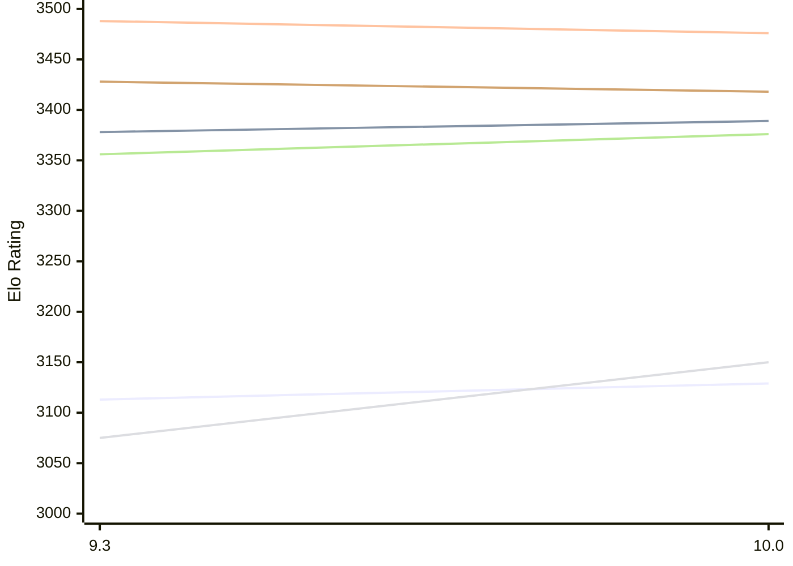
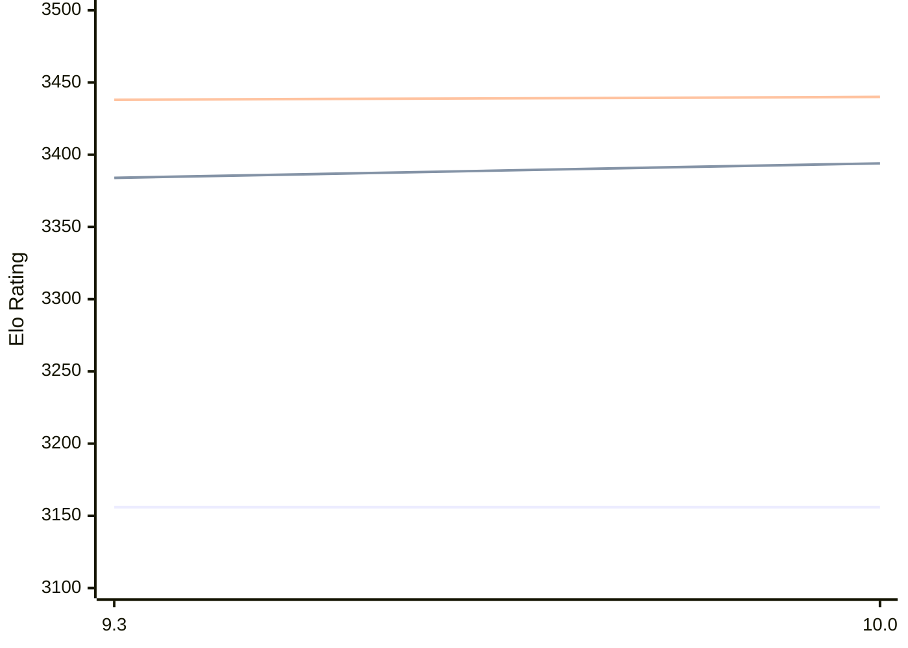

# Engine: Fire

Author: Norman Schmidt

Home: https://github.com/Firefather/fire

## Elo Ratings E1 (Ultra 7 265T (1.50 GHz) - E-Core)

| Version | Published | STC 8.0+0.08s  | LTC 60.0+0.60s | VLTC 2m24s+1.12s | Comment |
| --- | --- | --- | --- | --- | --- |
| 10.0 | 2025-08-09 | 3129(+16) | 3389(+11) | 3476(-12) |  |
| 9.3 | 2024-03-10 | 3113 | 3378 | 3488 |  |
 | | | cElo (∆ prev) | cElo (∆ prev) | cElo (∆ prev) | 

## Elo Ratings P1 (Ultra 7 265T (1.50 GHz) - P-Core)

| Version | Published | STC 8.0+0.08s  | LTC 60.0+0.60s | VLTC 2m24s+1.12s | Comment |
| --- | --- | --- | --- | --- | --- |
| 10.0 | 2025-08-09 | 3150(+75) | 3376(+20) | 3418(-10) |  |
| 9.3 | 2024-03-10 | 3075 | 3356 | 3428 |  |
 | | | cElo (∆ prev) | cElo (∆ prev) | cElo (∆ prev) | 

## Elo Ratings T1 (i5-7500T 2.70GHz)

| Version | Published | STC 8.0+0.08s  | LTC 60.0+0.60s | VLTC 2m24s+1.12s | Comment |
| --- | --- | --- | --- | --- | --- |
| 10.0 | 2025-08-09 | 3156(0) | 3394(+10) | 3440(+2) |  |
| 9.3 | 2024-03-10 | 3156 | 3384 | 3438 |  |
 | | | cElo (∆ prev) | cElo (∆ prev) | cElo (∆ prev) | 

<a href="https://github.com/computer-chess-index/cci/issues/new?template=submit-version.yml&title=[VERSION]+Fire+<version>&body=###%20Engine%20name%0AFire%0A%0A###%20Version%0A10.0" target="_blank">Submit new version</a>

 Test Conditions:

GUI/CLI: <a href=https://github.com/cutechess/cutechess target="_blank">Cute-Chess</a> 
Elo Calculation: <a href=https://www.remi-coulom.fr/Bayesian-Elo/ target="_blank">Bayesian-Elo</a> 
CPU for P1: Intel(R) Core(TM) Ultra 7 265T (1.50 GHz) - P-Core 
CPU for E1: Intel(R) Core(TM) Ultra 7 265T (1.50 GHz) - E-Core 
CPU for T1: Intel(R) Core(TM) i5-7500T 2.70GHz 
Opening book: 8_moves_v3 
\* STC: 8.0+0.08s, LTC: 60.0+0.60s, VLTC: 2m24s+1.12s

 Lists:
Ratings: <a href=https://github.com/computer-chess-index/cci/blob/main/lists/CCIRatings.csv target="_blank">Complete list</a>

Generated: 2026-11-23 05:38:28

## Ratings Verlauf E1 / P1

```mermaid
%%{init: {"theme":"base","themeVariables":{"seriesColors:['#a3a3a3','#222221','#faa371']}}}%%
xychart-beta
  x-axis ["9.3", "10.0"]
  y-axis "Elo Rating" 3000 --> 3500
  line "E1: STC (8.0+0.08s)" [3113, 3129]
  line "E1: LTC (60.0+0.60s)" [3378, 3389]
  line "E1: VLTC (2m24s+1.12s)" [3488, 3476]
  line "P1: STC (8.0+0.08s)" [3075, 3150]
  line "P1: LTC (60.0+0.60s)" [3356, 3376]
  line "P1: VLTC (2m24s+1.12s)" [3428, 3418]
```

## Ratings Verlauf T1

```mermaid
%%{init: {"theme":"base","themeVariables":{"seriesColors:['#a3a3a3','#222221','#faa371']}}}%%
xychart-beta
  x-axis ["9.3", "10.0"]
  y-axis "Elo Rating" 3100 --> 3500
  line "T1: STC (8.0+0.08s)" [3156, 3156]
  line "T1: LTC (60.0+0.60s)" [3384, 3394]
  line "T1: VLTC (2m24s+1.12s)" [3438, 3440]
```

## Detailed Evaluation Results

| Version | Time Control | Variant | Elo  | Range +/- | Matches | Score | Average Opponent Elo | Draws |
| --- | --- |--- | --- | --- | --- | --- | --- | --- |
| 10.0 | VLTC (2m24s+1.12s) | E1 | 3476 | 28 | 308 | 50% | 3476 | 73% |
|  |  | P1 | 3418 | 33 | 232 | 48% | 3430 | 73% |
|  |  | T1 | 3440 | 18 | 736 | 49% | 3444 | 75% |
|  | LTC (60.0+0.60s) | T1 | 3394 | 18 | 748 | 50% | 3393 | 71% |
|  |  | E1 | 3389 | 25 | 428 | 53% | 3360 | 67% |
|  |  | P1 | 3376 | 27 | 356 | 52% | 3364 | 68% |
|  | STC (8.0+0.08s) | P1 | 3150 | 30 | 306 | 48% | 3167 | 55% |
|  |  | T1 | 3156 | 17 | 948 | 51% | 3148 | 60% |
|  |  | E1 | 3129 | 27 | 390 | 48% | 3143 | 54% |
| --- | --- |--- | --- | --- | --- | --- | --- | --- |
| 9.3 | VLTC (2m24s+1.12s) | T1 | 3438 | 13 | 1520 | 49% | 3440 | 75% |
|  |  | E1 | 3488 | 64 | 72 | 58% | 3316 | 60% |
|  |  | P1 | 3428 | 90 | 36 | 51% | 3364 | 53% |
|  | LTC (60.0+0.60s) | E1 | 3378 | 58 | 80 | 54% | 3343 | 59% |
|  |  | P1 | 3356 | 80 | 48 | 59% | 3258 | 48% |
|  |  | T1 | 3384 | 13 | 1496 | 50% | 3384 | 73% |
|  | STC (8.0+0.08s) | E1 | 3113 | 58 | 92 | 51% | 3092 | 42% |
|  |  | P1 | 3075 | 68 | 68 | 57% | 2909 | 49% |
|  |  | T1 | 3156 | 14 | 1428 | 51% | 3133 | 57% |