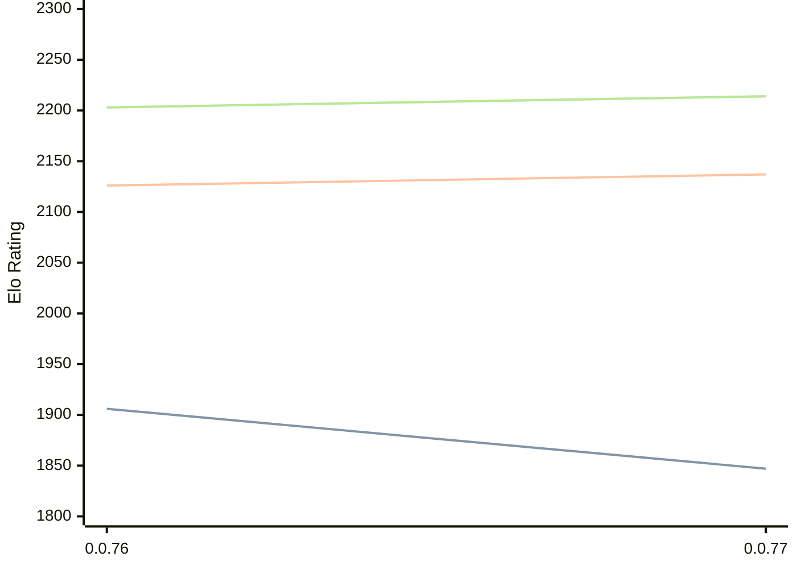

# Engine: Fktb

Author: Landon Peng

Home: https://github.com/lunbun/fktb

## Elo Ratings

| Version | Published | STC 8.0+0.08s  | LTC 60.0+0.60s | VLTC 2m24s+1.12s | Comment |
| --- | --- | --- | --- | --- | --- |
| 0.0.77 | 2026-01-18 | 1847(-59) | 2137(+11) | 2214(+11) |  |
| 0.0.76 | 2026-01-05 | 1906 | 2126 | 2203 |  |
 | | | cElo (∆ prev) | cElo (∆ prev) | cElo (∆ prev) | 

<a href="https://github.com/computer-chess-index/cci/issues/new?template=submit-version.yml&title=[VERSION]+Fktb+<version>&body=###%20Engine%20name%0AFktb%0A%0A###%20Version%0A0.0.77" target="_blank">Submit new version</a>

 Test Conditions:

GUI/CLI: <a href=https://github.com/cutechess/cutechess target="_blank">Cute-Chess</a> 
Elo Calculation: <a href=https://www.remi-coulom.fr/Bayesian-Elo/ target="_blank">Bayesian-Elo</a> 
CPU: Intel(R) Core(TM) i5-7500T 2.70GHz 
Opening book: 8_moves_v3 
\* STC: 8.0+0.08s, LTC: 60.0+0.60s, VLTC: 2m24s+1.12s

 Lists:
Ratings: <a href=https://github.com/computer-chess-index/cci/blob/main/lists/CCIRatings.csv target="_blank">Complete list</a>

Generated: 2026-07-12 06:25:22

## Ratings Verlauf

## Ratings Verlauf

⬛ STC (8.0+0.08s) &nbsp;&nbsp; 🟧 LTC (60.0+0.60s) &nbsp;&nbsp; 🟩 VLTC (2m24s+1.12s)

dark mode: 🟩STC (8.0+0.08s) 🟧LTC (60.0+0.60s) ⬜VLTC (2m24s+1.12s)

## Detailed Evaluation Results

| Version | Time Control | Elo  | Range +/- | Matches | Score | Average Opponent Elo | Draws |
| --- | --- | --- | --- | --- | --- | --- | --- |
| 0.0.77 | VLTC (2m24s+1.12s) | 2214 | 25 | 512 | 52% | 2198 | 31% |
| 0.0.77 | LTC (60.0+0.60s) | 2137 | 26 | 476 | 50% | 2138 | 29% |
| 0.0.77 | STC (8.0+0.08s) | 1847 | 23 | 632 | 49% | 1855 | 27% |
| --- | --- | --- | --- | --- | --- | --- | --- |
| 0.0.76 | VLTC (2m24s+1.12s) | 2203 | 52 | 132 | 48% | 2232 | 22% |
| 0.0.76 | LTC (60.0+0.60s) | 2126 | 45 | 172 | 49% | 2137 | 23% |
| 0.0.76 | STC (8.0+0.08s) | 1906 | 49 | 140 | 48% | 1924 | 27% |
| --- | --- | --- | --- | --- | --- | --- | --- |