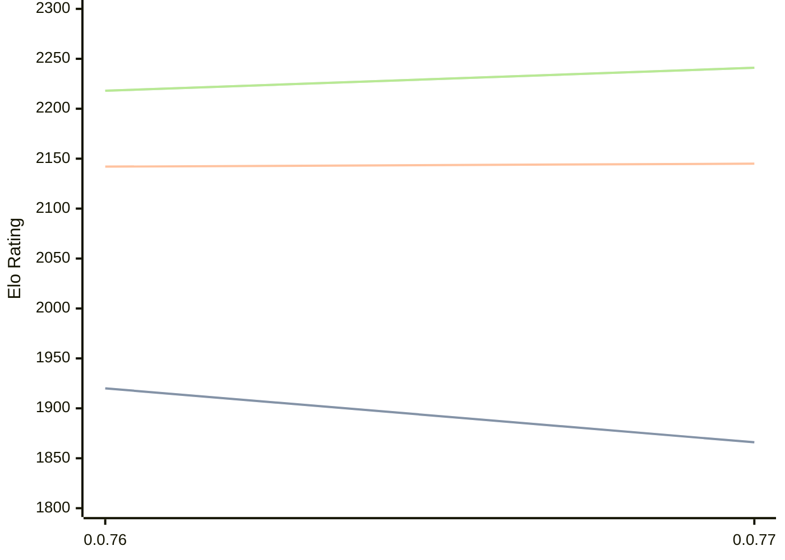

# Engine: Fktb

Author: Landon Peng

Home: https://github.com/lunbun/fktb

## Elo Ratings E1

| Version | Published | STC 8.0+0.08s  | LTC 60.0+0.60s | VLTC 2m24s+1.12s | Comment |
| --- | --- | --- | --- | --- | --- |
| 0.0.77 | 2026-01-18 | 1674 | 1925 | 2055 |  |
 | | | cElo (∆ prev) | cElo (∆ prev) | cElo (∆ prev) | 

## Elo Ratings P1

| Version | Published | STC 8.0+0.08s  | LTC 60.0+0.60s | VLTC 2m24s+1.12s | Comment |
| --- | --- | --- | --- | --- | --- |
| 0.0.77 | 2026-01-18 | 1933 | 2233 | 2284 |  |
 | | | cElo (∆ prev) | cElo (∆ prev) | cElo (∆ prev) | 

## Elo Ratings T1

| Version | Published | STC 8.0+0.08s  | LTC 60.0+0.60s | VLTC 2m24s+1.12s | Comment |
| --- | --- | --- | --- | --- | --- |
| 0.0.77 | 2026-01-18 | 1866(-54) | 2145(+3) | 2241(+23) |  |
| 0.0.76 | 2026-01-05 | 1920 | 2142 | 2218 |  |
 | | | cElo (∆ prev) | cElo (∆ prev) | cElo (∆ prev) | 

<a href="https://github.com/computer-chess-index/cci/issues/new?template=submit-version.yml&title=[VERSION]+Fktb+<version>&body=###%20Engine%20name%0AFktb%0A%0A###%20Version%0A0.0.77" target="_blank">Submit new version</a>

 Test Conditions:

GUI/CLI: <a href=https://github.com/cutechess/cutechess target="_blank">Cute-Chess</a> 
Elo Calculation: <a href=https://www.remi-coulom.fr/Bayesian-Elo/ target="_blank">Bayesian-Elo</a> 
CPU for P1: Intel(R) Core(TM) Ultra 7 265T (1.50 GHz) - P-Core 
CPU for E1: Intel(R) Core(TM) Ultra 7 265T (1.50 GHz) - E-Core 
CPU for T1: Intel(R) Core(TM) i5-7500T 2.70GHz 
Opening book: 8_moves_v3 
\* STC: 8.0+0.08s, LTC: 60.0+0.60s, VLTC: 2m24s+1.12s

 Lists:
Ratings: <a href=https://github.com/computer-chess-index/cci/blob/main/lists/CCIRatings.csv target="_blank">Complete list</a>

Generated: 2026-10-10 04:38:32

## Ratings Verlauf

```mermaid
%%{init: {"theme":"base","themeVariables":{"seriesColors:['#a3a3a3','#222221','#faa371']}}}%%
xychart-beta
  x-axis ["0.0.76", "0.0.77"]
  y-axis "Elo Rating" 1800 --> 2300
  line "" [1920, 1866]
  line "STC (8.0+0.08s)" [1920, 1866]
  line "LTC (60.0+0.60s)" [2142, 2145]
  line "" [2218, 2241]
  line "VLTC (2m24s+1.12s)" [2218, 2241]
```

## Detailed Evaluation Results

| Version | Time Control | Elo  | Range +/- | Matches | Score | Average Opponent Elo | Draws |
| --- | --- | --- | --- | --- | --- | --- | --- |
| 0.0.77 | VLTC (2m24s+1.12s) | 2055 | 41 | 214 | 50% | 2072 | 27% |
| 0.0.77 | VLTC (2m24s+1.12s) | 2241 | 24 | 580 | 52% | 2221 | 31% |
| 0.0.77 | VLTC (2m24s+1.12s) | 2284 | 53 | 124 | 47% | 2329 | 31% |
| 0.0.77 | LTC (60.0+0.60s) | 1925 | 47 | 166 | 50% | 1975 | 25% |
| 0.0.77 | LTC (60.0+0.60s) | 2145 | 25 | 536 | 49% | 2153 | 29% |
| 0.0.77 | LTC (60.0+0.60s) | 2233 | 51 | 144 | 40% | 2391 | 28% |
| 0.0.77 | STC (8.0+0.08s) | 1674 | 37 | 238 | 45% | 1717 | 29% |
| --- | --- | --- | --- | --- | --- | --- | --- |
| 0.0.77 | STC (8.0+0.08s) | 1866 | 22 | 740 | 50% | 1856 | 27% |
| --- | --- | --- | --- | --- | --- | --- | --- |
| 0.0.77 | STC (8.0+0.08s) | 1933 | 47 | 156 | 52% | 1918 | 28% |
| --- | --- | --- | --- | --- | --- | --- | --- |
| 0.0.76 | VLTC (2m24s+1.12s) | 2218 | 52 | 132 | 48% | 2245 | 22% |
| 0.0.76 | LTC (60.0+0.60s) | 2142 | 45 | 172 | 49% | 2152 | 23% |
| 0.0.76 | STC (8.0+0.08s) | 1920 | 49 | 140 | 48% | 1939 | 27% |
| --- | --- | --- | --- | --- | --- | --- | --- |