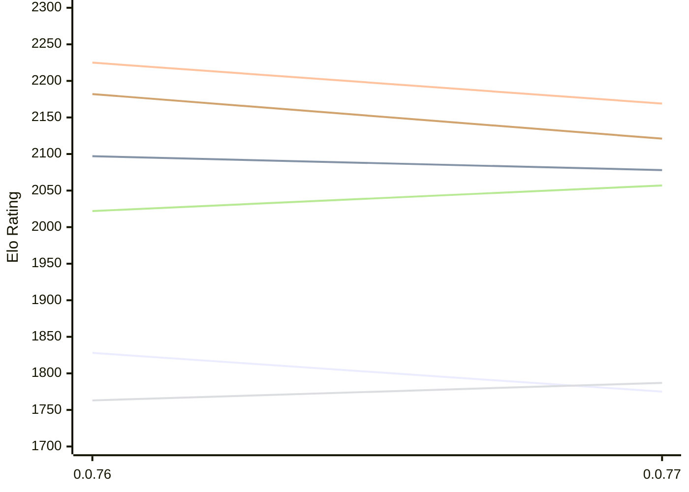
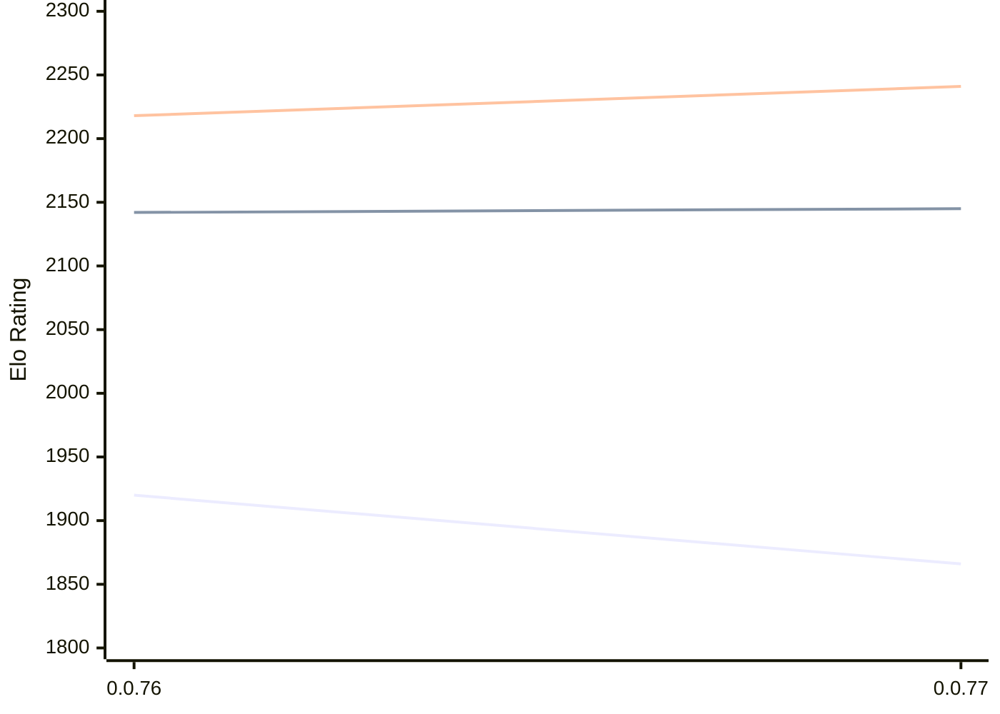

# Engine: Fktb

Author: Landon Peng

Home: https://github.com/lunbun/fktb

## Elo Ratings E1 (Ultra 7 265T (1.50 GHz) - E-Core)

| Version | Published | STC 8.0+0.08s  | LTC 60.0+0.60s | VLTC 2m24s+1.12s | Comment |
| --- | --- | --- | --- | --- | --- |
| 0.0.77 | 2026-01-18 | 1775(-53) | 2078(-19) | 2169(-56) |  |
| 0.0.76 | 2026-01-05 | 1828 | 2097 | 2225 |  |
 | | | cElo (∆ prev) | cElo (∆ prev) | cElo (∆ prev) | 

## Elo Ratings P1 (Ultra 7 265T (1.50 GHz) - P-Core)

| Version | Published | STC 8.0+0.08s  | LTC 60.0+0.60s | VLTC 2m24s+1.12s | Comment |
| --- | --- | --- | --- | --- | --- |
| 0.0.77 | 2026-01-18 | 1787(+24) | 2057(+35) | 2121(-61) |  |
| 0.0.76 | 2026-01-05 | 1763 | 2022 | 2182 |  |
 | | | cElo (∆ prev) | cElo (∆ prev) | cElo (∆ prev) | 

## Elo Ratings T1 (i5-7500T 2.70GHz)

| Version | Published | STC 8.0+0.08s  | LTC 60.0+0.60s | VLTC 2m24s+1.12s | Comment |
| --- | --- | --- | --- | --- | --- |
| 0.0.77 | 2026-01-18 | 1866(-54) | 2145(+3) | 2241(+23) |  |
| 0.0.76 | 2026-01-05 | 1920 | 2142 | 2218 |  |
 | | | cElo (∆ prev) | cElo (∆ prev) | cElo (∆ prev) | 

<a href="https://github.com/computer-chess-index/cci/issues/new?template=submit-version.yml&title=[VERSION]+Fktb+<version>&body=###%20Engine%20name%0AFktb%0A%0A###%20Version%0A0.0.77" target="_blank">Submit new version</a>

 Test Conditions:

GUI/CLI: <a href=https://github.com/cutechess/cutechess target="_blank">Cute-Chess</a> 
Elo Calculation: <a href=https://www.remi-coulom.fr/Bayesian-Elo/ target="_blank">Bayesian-Elo</a> 
CPU for P1: Intel(R) Core(TM) Ultra 7 265T (1.50 GHz) - P-Core 
CPU for E1: Intel(R) Core(TM) Ultra 7 265T (1.50 GHz) - E-Core 
CPU for T1: Intel(R) Core(TM) i5-7500T 2.70GHz 
Opening book: 8_moves_v3 
\* STC: 8.0+0.08s, LTC: 60.0+0.60s, VLTC: 2m24s+1.12s

 Lists:
Ratings: <a href=https://github.com/computer-chess-index/cci/blob/main/lists/CCIRatings.csv target="_blank">Complete list</a>

Generated: 2026-11-14 05:38:16

## Ratings Verlauf E1 / P1

```mermaid
%%{init: {"theme":"base","themeVariables":{"seriesColors:['#a3a3a3','#222221','#faa371']}}}%%
xychart-beta
  x-axis ["0.0.76", "0.0.77"]
  y-axis "Elo Rating" 1700 --> 2300
  line "E1: STC (8.0+0.08s)" [1828, 1775]
  line "E1: LTC (60.0+0.60s)" [2097, 2078]
  line "E1: VLTC (2m24s+1.12s)" [2225, 2169]
  line "P1: STC (8.0+0.08s)" [1763, 1787]
  line "P1: LTC (60.0+0.60s)" [2022, 2057]
  line "P1: VLTC (2m24s+1.12s)" [2182, 2121]
```

## Ratings Verlauf T1

```mermaid
%%{init: {"theme":"base","themeVariables":{"seriesColors:['#a3a3a3','#222221','#faa371']}}}%%
xychart-beta
  x-axis ["0.0.76", "0.0.77"]
  y-axis "Elo Rating" 1800 --> 2300
  line "T1: STC (8.0+0.08s)" [1920, 1866]
  line "T1: LTC (60.0+0.60s)" [2142, 2145]
  line "T1: VLTC (2m24s+1.12s)" [2218, 2241]
```

## Detailed Evaluation Results

| Version | Time Control | Variant | Elo  | Range +/- | Matches | Score | Average Opponent Elo | Draws |
| --- | --- |--- | --- | --- | --- | --- | --- | --- |
| 0.0.77 | VLTC (2m24s+1.12s) | T1 | 2241 | 24 | 580 | 52% | 2221 | 31% |
|  |  | P1 | 2121 | 42 | 190 | 47% | 2159 | 31% |
|  |  | E1 | 2169 | 31 | 366 | 52% | 2163 | 26% |
|  | LTC (60.0+0.60s) | T1 | 2145 | 25 | 536 | 49% | 2153 | 29% |
|  |  | P1 | 2057 | 43 | 208 | 41% | 2174 | 25% |
|  |  | E1 | 2078 | 29 | 426 | 52% | 2071 | 29% |
|  | STC (8.0+0.08s) | T1 | 1866 | 22 | 740 | 50% | 1856 | 27% |
|  |  | P1 | 1787 | 42 | 200 | 50% | 1801 | 25% |
|  |  | E1 | 1775 | 30 | 372 | 47% | 1809 | 28% |
| --- | --- |--- | --- | --- | --- | --- | --- | --- |
| 0.0.76 | VLTC (2m24s+1.12s) | T1 | 2218 | 52 | 132 | 48% | 2245 | 22% |
|  |  | P1 | 2182 | 122 | 24 | 46% | 2269 | 25% |
|  |  | E1 | 2225 | 88 | 50 | 31% | 2498 | 26% |
|  | LTC (60.0+0.60s) | P1 | 2022 | 139 | 26 | 40% | 2151 | 19% |
|  |  | E1 | 2097 | 74 | 72 | 53% | 2105 | 25% |
|  |  | T1 | 2142 | 45 | 172 | 49% | 2152 | 23% |
|  | STC (8.0+0.08s) | P1 | 1763 | 89 | 52 | 36% | 1986 | 21% |
|  |  | E1 | 1828 | 67 | 80 | 43% | 1905 | 23% |
|  |  | T1 | 1920 | 49 | 140 | 48% | 1939 | 27% |