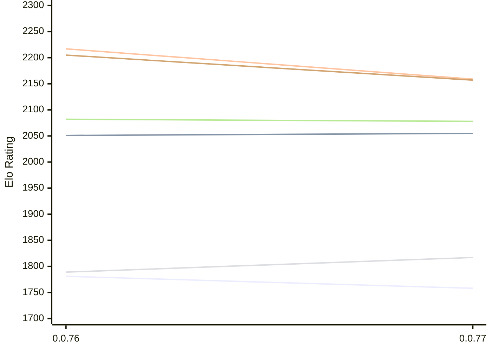
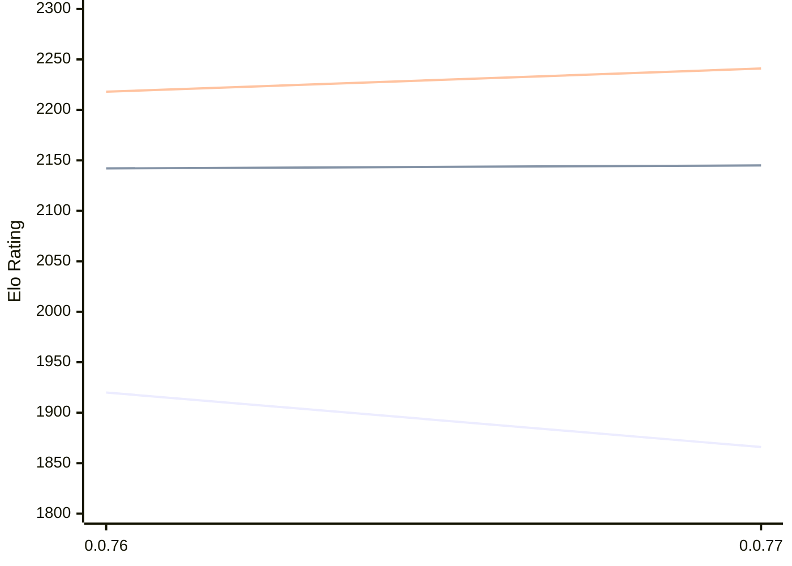

# Engine: Fktb

Author: Landon Peng

Home: https://github.com/lunbun/fktb

## Elo Ratings E1 (Ultra 7 265T (1.50 GHz) - E-Core)

| Version | Published | STC 8.0+0.08s  | LTC 60.0+0.60s | VLTC 2m24s+1.12s | Comment |
| --- | --- | --- | --- | --- | --- |
| 0.0.77 | 2026-01-18 | 1758(-23) | 2055(+4) | 2159(-58) |  |
| 0.0.76 | 2026-01-05 | 1781 | 2051 | 2217 |  |
 | | | cElo (∆ prev) | cElo (∆ prev) | cElo (∆ prev) | 

## Elo Ratings P1 (Ultra 7 265T (1.50 GHz) - P-Core)

| Version | Published | STC 8.0+0.08s  | LTC 60.0+0.60s | VLTC 2m24s+1.12s | Comment |
| --- | --- | --- | --- | --- | --- |
| 0.0.77 | 2026-01-18 | 1817(+28) | 2078(-4) | 2157(-48) |  |
| 0.0.76 | 2026-01-05 | 1789 | 2082 | 2205 |  |
 | | | cElo (∆ prev) | cElo (∆ prev) | cElo (∆ prev) | 

## Elo Ratings T1 (i5-7500T 2.70GHz)

| Version | Published | STC 8.0+0.08s  | LTC 60.0+0.60s | VLTC 2m24s+1.12s | Comment |
| --- | --- | --- | --- | --- | --- |
| 0.0.77 | 2026-01-18 | 1866(-54) | 2145(+3) | 2241(+23) |  |
| 0.0.76 | 2026-01-05 | 1920 | 2142 | 2218 |  |
 | | | cElo (∆ prev) | cElo (∆ prev) | cElo (∆ prev) | 

<a href="https://github.com/computer-chess-index/cci/issues/new?template=submit-version.yml&title=[VERSION]+Fktb+<version>&body=###%20Engine%20name%0AFktb%0A%0A###%20Version%0A0.0.77" target="_blank">Submit new version</a>

 Test Conditions:

GUI/CLI: <a href=https://github.com/cutechess/cutechess target="_blank">Cute-Chess</a> 
Elo Calculation: <a href=https://www.remi-coulom.fr/Bayesian-Elo/ target="_blank">Bayesian-Elo</a> 
CPU for P1: Intel(R) Core(TM) Ultra 7 265T (1.50 GHz) - P-Core 
CPU for E1: Intel(R) Core(TM) Ultra 7 265T (1.50 GHz) - E-Core 
CPU for T1: Intel(R) Core(TM) i5-7500T 2.70GHz 
Opening book: 8_moves_v3 
\* STC: 8.0+0.08s, LTC: 60.0+0.60s, VLTC: 2m24s+1.12s

 Lists:
Ratings: <a href=https://github.com/computer-chess-index/cci/blob/main/lists/CCIRatings.csv target="_blank">Complete list</a>

Generated: 2026-11-26 05:38:41

## Ratings Verlauf E1 / P1

```mermaid
%%{init: {"theme":"base","themeVariables":{"seriesColors:['#a3a3a3','#222221','#faa371']}}}%%
xychart-beta
  x-axis ["0.0.76", "0.0.77"]
  y-axis "Elo Rating" 1700 --> 2300
  line "E1: STC (8.0+0.08s)" [1781, 1758]
  line "E1: LTC (60.0+0.60s)" [2051, 2055]
  line "E1: VLTC (2m24s+1.12s)" [2217, 2159]
  line "P1: STC (8.0+0.08s)" [1789, 1817]
  line "P1: LTC (60.0+0.60s)" [2082, 2078]
  line "P1: VLTC (2m24s+1.12s)" [2205, 2157]
```

## Ratings Verlauf T1

```mermaid
%%{init: {"theme":"base","themeVariables":{"seriesColors:['#a3a3a3','#222221','#faa371']}}}%%
xychart-beta
  x-axis ["0.0.76", "0.0.77"]
  y-axis "Elo Rating" 1800 --> 2300
  line "T1: STC (8.0+0.08s)" [1920, 1866]
  line "T1: LTC (60.0+0.60s)" [2142, 2145]
  line "T1: VLTC (2m24s+1.12s)" [2218, 2241]
```

## Detailed Evaluation Results

| Version | Time Control | Variant | Elo  | Range +/- | Matches | Score | Average Opponent Elo | Draws |
| --- | --- |--- | --- | --- | --- | --- | --- | --- |
| 0.0.77 | VLTC (2m24s+1.12s) | T1 | 2241 | 24 | 580 | 52% | 2221 | 31% |
|  |  | P1 | 2157 | 39 | 226 | 49% | 2178 | 29% |
|  |  | E1 | 2159 | 29 | 414 | 51% | 2156 | 27% |
|  | LTC (60.0+0.60s) | T1 | 2145 | 25 | 536 | 49% | 2153 | 29% |
|  |  | P1 | 2078 | 38 | 260 | 42% | 2178 | 27% |
|  |  | E1 | 2055 | 27 | 480 | 51% | 2060 | 28% |
|  | STC (8.0+0.08s) | T1 | 1866 | 22 | 740 | 50% | 1856 | 27% |
|  |  | P1 | 1817 | 40 | 220 | 50% | 1827 | 25% |
|  |  | E1 | 1758 | 29 | 408 | 47% | 1786 | 28% |
| --- | --- |--- | --- | --- | --- | --- | --- | --- |
| 0.0.76 | VLTC (2m24s+1.12s) | E1 | 2217 | 50 | 142 | 42% | 2327 | 30% |
|  |  | T1 | 2218 | 52 | 132 | 48% | 2245 | 22% |
|  |  | P1 | 2205 | 68 | 76 | 46% | 2255 | 24% |
|  | LTC (60.0+0.60s) | E1 | 2051 | 48 | 156 | 50% | 2072 | 26% |
|  |  | T1 | 2142 | 45 | 172 | 49% | 2152 | 23% |
|  |  | P1 | 2082 | 58 | 108 | 47% | 2138 | 32% |
|  | STC (8.0+0.08s) | E1 | 1781 | 48 | 154 | 44% | 1841 | 26% |
|  |  | T1 | 1920 | 49 | 140 | 48% | 1939 | 27% |
|  |  | P1 | 1789 | 54 | 126 | 43% | 1889 | 25% |