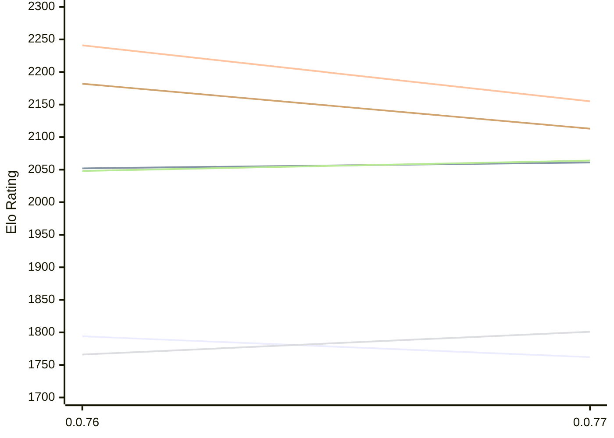
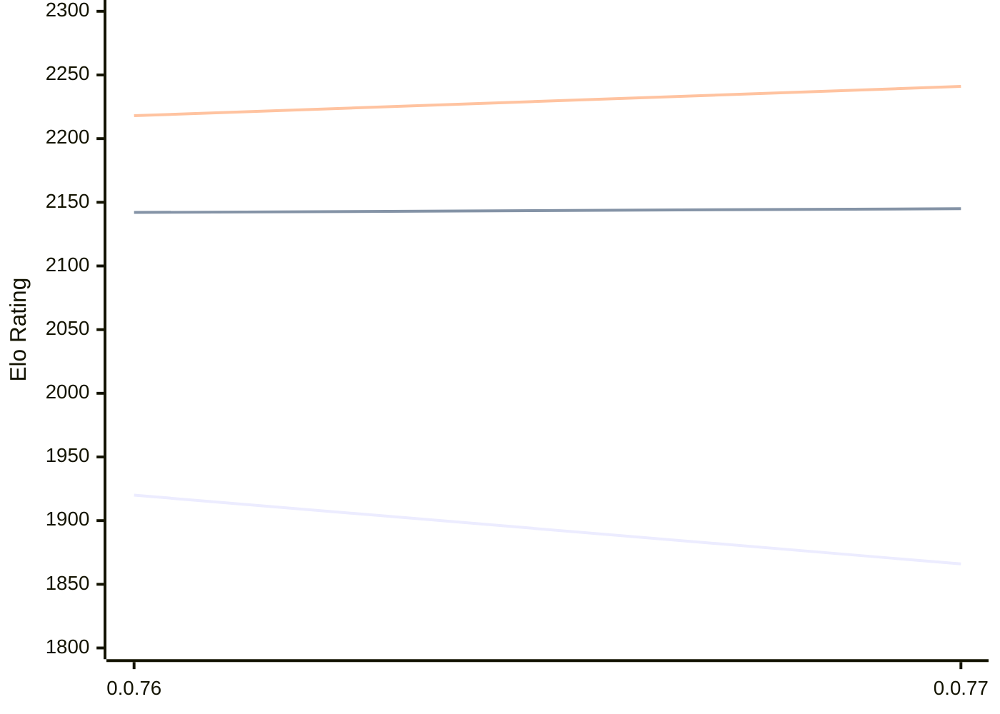

# Engine: Fktb

Author: Landon Peng

Home: https://github.com/lunbun/fktb

## Elo Ratings E1 (Ultra 7 265T (1.50 GHz) - E-Core)

| Version | Published | STC 8.0+0.08s  | LTC 60.0+0.60s | VLTC 2m24s+1.12s | Comment |
| --- | --- | --- | --- | --- | --- |
| 0.0.77 | 2026-01-18 | 1762(-32) | 2061(+9) | 2155(-86) |  |
| 0.0.76 | 2026-01-05 | 1794 | 2052 | 2241 |  |
 | | | cElo (∆ prev) | cElo (∆ prev) | cElo (∆ prev) | 

## Elo Ratings P1 (Ultra 7 265T (1.50 GHz) - P-Core)

| Version | Published | STC 8.0+0.08s  | LTC 60.0+0.60s | VLTC 2m24s+1.12s | Comment |
| --- | --- | --- | --- | --- | --- |
| 0.0.77 | 2026-01-18 | 1801(+35) | 2064(+16) | 2113(-69) |  |
| 0.0.76 | 2026-01-05 | 1766 | 2048 | 2182 |  |
 | | | cElo (∆ prev) | cElo (∆ prev) | cElo (∆ prev) | 

## Elo Ratings T1 (i5-7500T 2.70GHz)

| Version | Published | STC 8.0+0.08s  | LTC 60.0+0.60s | VLTC 2m24s+1.12s | Comment |
| --- | --- | --- | --- | --- | --- |
| 0.0.77 | 2026-01-18 | 1866(-54) | 2145(+3) | 2241(+23) |  |
| 0.0.76 | 2026-01-05 | 1920 | 2142 | 2218 |  |
 | | | cElo (∆ prev) | cElo (∆ prev) | cElo (∆ prev) | 

<a href="https://github.com/computer-chess-index/cci/issues/new?template=submit-version.yml&title=[VERSION]+Fktb+<version>&body=###%20Engine%20name%0AFktb%0A%0A###%20Version%0A0.0.77" target="_blank">Submit new version</a>

 Test Conditions:

GUI/CLI: <a href=https://github.com/cutechess/cutechess target="_blank">Cute-Chess</a> 
Elo Calculation: <a href=https://www.remi-coulom.fr/Bayesian-Elo/ target="_blank">Bayesian-Elo</a> 
CPU for P1: Intel(R) Core(TM) Ultra 7 265T (1.50 GHz) - P-Core 
CPU for E1: Intel(R) Core(TM) Ultra 7 265T (1.50 GHz) - E-Core 
CPU for T1: Intel(R) Core(TM) i5-7500T 2.70GHz 
Opening book: 8_moves_v3 
\* STC: 8.0+0.08s, LTC: 60.0+0.60s, VLTC: 2m24s+1.12s

 Lists:
Ratings: <a href=https://github.com/computer-chess-index/cci/blob/main/lists/CCIRatings.csv target="_blank">Complete list</a>

Generated: 2026-11-15 05:38:26

## Ratings Verlauf E1 / P1

```mermaid
%%{init: {"theme":"base","themeVariables":{"seriesColors:['#a3a3a3','#222221','#faa371']}}}%%
xychart-beta
  x-axis ["0.0.76", "0.0.77"]
  y-axis "Elo Rating" 1700 --> 2300
  line "E1: STC (8.0+0.08s)" [1794, 1762]
  line "E1: LTC (60.0+0.60s)" [2052, 2061]
  line "E1: VLTC (2m24s+1.12s)" [2241, 2155]
  line "P1: STC (8.0+0.08s)" [1766, 1801]
  line "P1: LTC (60.0+0.60s)" [2048, 2064]
  line "P1: VLTC (2m24s+1.12s)" [2182, 2113]
```

## Ratings Verlauf T1

```mermaid
%%{init: {"theme":"base","themeVariables":{"seriesColors:['#a3a3a3','#222221','#faa371']}}}%%
xychart-beta
  x-axis ["0.0.76", "0.0.77"]
  y-axis "Elo Rating" 1800 --> 2300
  line "T1: STC (8.0+0.08s)" [1920, 1866]
  line "T1: LTC (60.0+0.60s)" [2142, 2145]
  line "T1: VLTC (2m24s+1.12s)" [2218, 2241]
```

## Detailed Evaluation Results

| Version | Time Control | Variant | Elo  | Range +/- | Matches | Score | Average Opponent Elo | Draws |
| --- | --- |--- | --- | --- | --- | --- | --- | --- |
| 0.0.77 | VLTC (2m24s+1.12s) | T1 | 2241 | 24 | 580 | 52% | 2221 | 31% |
|  |  | P1 | 2113 | 41 | 206 | 47% | 2156 | 30% |
|  |  | E1 | 2155 | 31 | 366 | 52% | 2149 | 26% |
|  | LTC (60.0+0.60s) | T1 | 2145 | 25 | 536 | 49% | 2153 | 29% |
|  |  | P1 | 2064 | 42 | 212 | 42% | 2171 | 25% |
|  |  | E1 | 2061 | 28 | 434 | 52% | 2057 | 29% |
|  | STC (8.0+0.08s) | T1 | 1866 | 22 | 740 | 50% | 1856 | 27% |
|  |  | P1 | 1801 | 41 | 208 | 51% | 1804 | 25% |
|  |  | E1 | 1762 | 30 | 376 | 47% | 1796 | 28% |
| --- | --- |--- | --- | --- | --- | --- | --- | --- |
| 0.0.76 | VLTC (2m24s+1.12s) | E1 | 2241 | 66 | 82 | 41% | 2381 | 27% |
|  |  | T1 | 2218 | 52 | 132 | 48% | 2245 | 22% |
|  |  | P1 | 2182 | 87 | 48 | 44% | 2260 | 21% |
|  | LTC (60.0+0.60s) | E1 | 2052 | 62 | 100 | 50% | 2082 | 24% |
|  |  | T1 | 2142 | 45 | 172 | 49% | 2152 | 23% |
|  |  | P1 | 2048 | 89 | 50 | 47% | 2088 | 26% |
|  | STC (8.0+0.08s) | E1 | 1794 | 59 | 100 | 42% | 1875 | 28% |
|  |  | T1 | 1920 | 49 | 140 | 48% | 1939 | 27% |
|  |  | P1 | 1766 | 68 | 82 | 40% | 1913 | 22% |