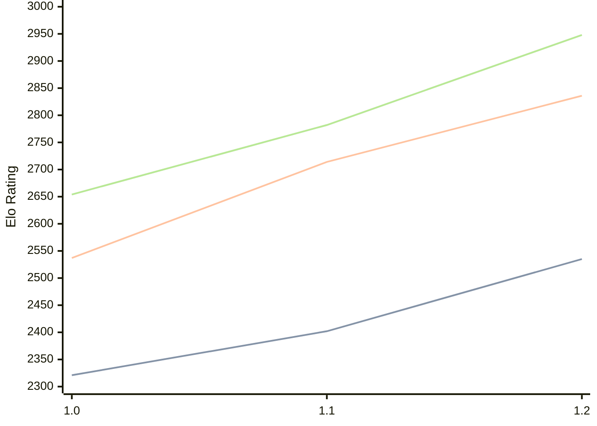

# Engine: FoxChess

Author: Nathan Faltermeier

Home: https://github.com/nfaltermeier/fox-chess

## Elo Ratings

| Version | Published | STC 8.0+0.08s  | LTC 60.0+0.60s | VLTC 2m24s+1.12s | Comment |
| --- | --- | --- | --- | --- | --- |
| 1.2 | 2026-06-20 | 2535(+133) | 2836(+122) | 2948(+166) |  |
| 1.1 | 2026-04-18 | 2402(+81) | 2714(+177) | 2782(+128) |  |
| 1.0 | 2025-12-27 | 2321 | 2537 | 2654 |  |
 | | | cElo (∆ prev) | cElo (∆ prev) | cElo (∆ prev) | 

<a href="https://github.com/computer-chess-index/cci/issues/new?template=submit-version.yml&title=[VERSION]+FoxChess+<version>&body=###%20Engine%20name%0AFoxChess%0A%0A###%20Version%0A1.2" target="_blank">Submit new version</a>

 Test Conditions:

GUI/CLI: <a href=https://github.com/cutechess/cutechess target="_blank">Cute-Chess</a> 
Elo Calculation: <a href=https://www.remi-coulom.fr/Bayesian-Elo/ target="_blank">Bayesian-Elo</a> 
CPU: Intel(R) Core(TM) i5-7500T 2.70GHz 
Opening book: 8_moves_v3 
\* STC: 8.0+0.08s, LTC: 60.0+0.60s, VLTC: 2m24s+1.12s

 Lists:
Ratings: <a href=https://github.com/computer-chess-index/cci/blob/main/lists/CCIRatings.csv target="_blank">Complete list</a>

Generated: 2026-10-01 04:38:39

## Ratings Verlauf

```mermaid
%%{init: {"theme":"base","themeVariables":{"seriesColors:['#a3a3a3','#222221','#faa371']}}}%%
xychart-beta
  x-axis ["1.0", "1.1", "1.2"]
  y-axis "Elo Rating" 2300 --> 3000
  line "" [2321, 2402, 2535]
  line "STC (8.0+0.08s)" [2321, 2402, 2535]
  line "LTC (60.0+0.60s)" [2537, 2714, 2836]
  line "" [2654, 2782, 2948]
  line "VLTC (2m24s+1.12s)" [2654, 2782, 2948]
```

## Detailed Evaluation Results

| Version | Time Control | Elo  | Range +/- | Matches | Score | Average Opponent Elo | Draws |
| --- | --- | --- | --- | --- | --- | --- | --- |
| 1.2 | VLTC (2m24s+1.12s) | 2948 | 30 | 322 | 51% | 2940 | 48% |
| 1.2 | LTC (60.0+0.60s) | 2836 | 31 | 330 | 49% | 2847 | 35% |
| 1.2 | STC (8.0+0.08s) | 2535 | 31 | 360 | 50% | 2534 | 29% |
| --- | --- | --- | --- | --- | --- | --- | --- |
| 1.1 | VLTC (2m24s+1.12s) | 2782 | 28 | 392 | 49% | 2788 | 36% |
| 1.1 | LTC (60.0+0.60s) | 2714 | 28 | 418 | 50% | 2708 | 34% |
| 1.1 | STC (8.0+0.08s) | 2402 | 29 | 408 | 50% | 2398 | 26% |
| --- | --- | --- | --- | --- | --- | --- | --- |
| 1.0 | VLTC (2m24s+1.12s) | 2654 | 28 | 396 | 49% | 2660 | 40% |
| 1.0 | LTC (60.0+0.60s) | 2537 | 31 | 328 | 52% | 2518 | 37% |
| 1.0 | STC (8.0+0.08s) | 2321 | 27 | 480 | 50% | 2318 | 25% |
| --- | --- | --- | --- | --- | --- | --- | --- |