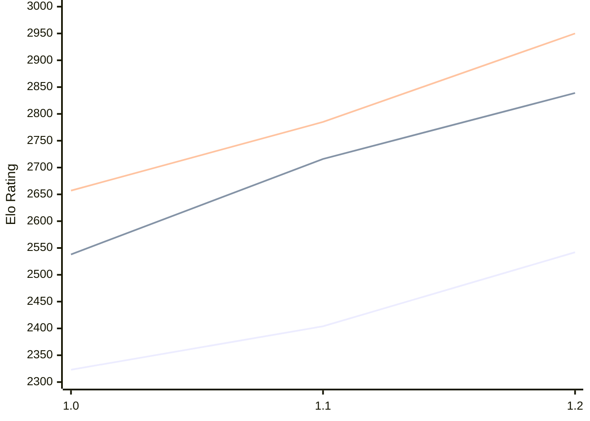

# Engine: FoxChess

Author: Nathan Faltermeier

Home: https://github.com/nfaltermeier/fox-chess

## Elo Ratings E1 (Ultra 7 265T (1.50 GHz) - E-Core)

| Version | Published | STC 8.0+0.08s  | LTC 60.0+0.60s | VLTC 2m24s+1.12s | Comment |
| --- | --- | --- | --- | --- | --- |
| 1.2 | 2026-06-20 | 2445 | 2811 | 2893 |  |
 | | | cElo (∆ prev) | cElo (∆ prev) | cElo (∆ prev) | 

## Elo Ratings P1 (Ultra 7 265T (1.50 GHz) - P-Core)

| Version | Published | STC 8.0+0.08s  | LTC 60.0+0.60s | VLTC 2m24s+1.12s | Comment |
| --- | --- | --- | --- | --- | --- |
| 1.2 | 2026-06-20 | 2518 | 2873 | 2959 |  |
 | | | cElo (∆ prev) | cElo (∆ prev) | cElo (∆ prev) | 

## Elo Ratings T1 (i5-7500T 2.70GHz)

| Version | Published | STC 8.0+0.08s  | LTC 60.0+0.60s | VLTC 2m24s+1.12s | Comment |
| --- | --- | --- | --- | --- | --- |
| 1.2 | 2026-06-20 | 2542(+138) | 2839(+123) | 2950(+165) |  |
| 1.1 | 2026-04-18 | 2404(+81) | 2716(+178) | 2785(+128) |  |
| 1.0 | 2025-12-27 | 2323 | 2538 | 2657 |  |
 | | | cElo (∆ prev) | cElo (∆ prev) | cElo (∆ prev) | 

<a href="https://github.com/computer-chess-index/cci/issues/new?template=submit-version.yml&title=[VERSION]+FoxChess+<version>&body=###%20Engine%20name%0AFoxChess%0A%0A###%20Version%0A1.2" target="_blank">Submit new version</a>

 Test Conditions:

GUI/CLI: <a href=https://github.com/cutechess/cutechess target="_blank">Cute-Chess</a> 
Elo Calculation: <a href=https://www.remi-coulom.fr/Bayesian-Elo/ target="_blank">Bayesian-Elo</a> 
CPU for P1: Intel(R) Core(TM) Ultra 7 265T (1.50 GHz) - P-Core 
CPU for E1: Intel(R) Core(TM) Ultra 7 265T (1.50 GHz) - E-Core 
CPU for T1: Intel(R) Core(TM) i5-7500T 2.70GHz 
Opening book: 8_moves_v3 
\* STC: 8.0+0.08s, LTC: 60.0+0.60s, VLTC: 2m24s+1.12s

 Lists:
Ratings: <a href=https://github.com/computer-chess-index/cci/blob/main/lists/CCIRatings.csv target="_blank">Complete list</a>

Generated: 2026-10-19 04:38:41

## Ratings Verlauf T1

```mermaid
%%{init: {"theme":"base","themeVariables":{"seriesColors:['#a3a3a3','#222221','#faa371']}}}%%
xychart-beta
  x-axis ["1.0", "1.1", "1.2"]
  y-axis "Elo Rating" 2300 --> 3000
  line "T1: STC (8.0+0.08s)" [2323, 2404, 2542]
  line "T1: LTC (60.0+0.60s)" [2538, 2716, 2839]
  line "T1: VLTC (2m24s+1.12s)" [2657, 2785, 2950]
```

## Detailed Evaluation Results

| Version | Time Control | Variant | Elo  | Range +/- | Matches | Score | Average Opponent Elo | Draws |
| --- | --- |--- | --- | --- | --- | --- | --- | --- |
| 1.2 | VLTC (2m24s+1.12s) | T1 | 2950 | 30 | 326 | 51% | 2942 | 48% |
|  |  | P1 | 2959 | 43 | 182 | 53% | 2894 | 35% |
|  |  | E1 | 2893 | 34 | 282 | 49% | 2901 | 36% |
|  | LTC (60.0+0.60s) | T1 | 2839 | 31 | 330 | 49% | 2850 | 35% |
|  |  | P1 | 2873 | 42 | 184 | 52% | 2855 | 38% |
|  |  | E1 | 2811 | 35 | 274 | 54% | 2761 | 33% |
|  | STC (8.0+0.08s) | T1 | 2542 | 30 | 364 | 51% | 2537 | 29% |
|  |  | P1 | 2518 | 45 | 160 | 49% | 2531 | 35% |
|  |  | E1 | 2445 | 33 | 312 | 47% | 2469 | 29% |
| --- | --- |--- | --- | --- | --- | --- | --- | --- |
| 1.1 | VLTC (2m24s+1.12s) | T1 | 2785 | 28 | 392 | 49% | 2790 | 36% |
|  | LTC (60.0+0.60s) | T1 | 2716 | 28 | 418 | 50% | 2711 | 34% |
|  | STC (8.0+0.08s) | T1 | 2404 | 29 | 408 | 50% | 2400 | 26% |
| --- | --- |--- | --- | --- | --- | --- | --- | --- |
| 1.0 | VLTC (2m24s+1.12s) | T1 | 2657 | 28 | 396 | 49% | 2661 | 40% |
|  | LTC (60.0+0.60s) | T1 | 2538 | 31 | 328 | 52% | 2520 | 37% |
|  | STC (8.0+0.08s) | T1 | 2323 | 27 | 480 | 50% | 2321 | 25% |