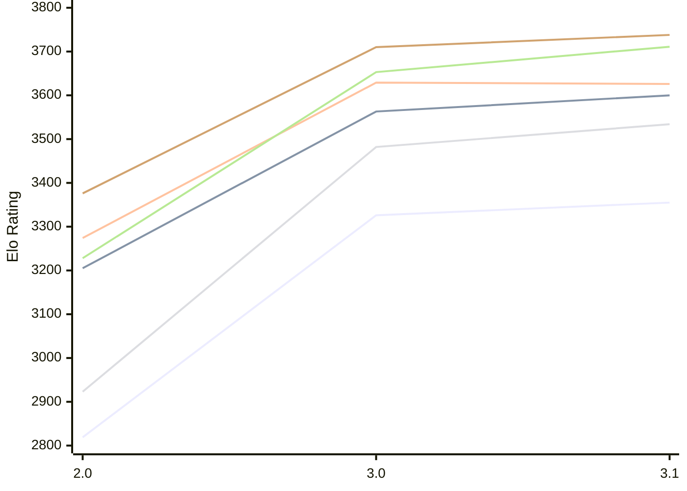

# Engine: Funcomp

Author: James Coit

Home: https://github.com/Moxnar/FunComp

## Elo Ratings E1 (Ultra 7 265T (1.50 GHz) - E-Core)

| Version | Published | STC 8.0+0.08s  | LTC 60.0+0.60s | VLTC 2m24s+1.12s | Comment |
| --- | --- | --- | --- | --- | --- |
| 3.1 | 2026-10-30 | 3355(+29) | 3600(+37) | 3626(-3) |  |
| 3.0 | 2026-10-20 | 3326(+507) | 3563(+358) | 3629(+355) |  |
| 2.0 | 2026-10-03 | 2819 | 3205 | 3274 |  |
 | | | cElo (∆ prev) | cElo (∆ prev) | cElo (∆ prev) | 

## Elo Ratings P1 (Ultra 7 265T (1.50 GHz) - P-Core)

| Version | Published | STC 8.0+0.08s  | LTC 60.0+0.60s | VLTC 2m24s+1.12s | Comment |
| --- | --- | --- | --- | --- | --- |
| 3.1 | 2026-10-30 | 3534(+52) | 3711(+58) | 3738(+28) |  |
| 3.0 | 2026-10-20 | 3482(+559) | 3653(+425) | 3710(+334) |  |
| 2.0 | 2026-10-03 | 2923 | 3228 | 3376 |  |
 | | | cElo (∆ prev) | cElo (∆ prev) | cElo (∆ prev) | 

## Elo Ratings T1 (i5-7500T 2.70GHz)

| Version | Published | STC 8.0+0.08s  | LTC 60.0+0.60s | VLTC 2m24s+1.12s | Comment |
| --- | --- | --- | --- | --- | --- |
| 1.0 | 2026-09-28 | 2576 | 2809 | 2966 |  |
 | | | cElo (∆ prev) | cElo (∆ prev) | cElo (∆ prev) | 

<a href="https://github.com/computer-chess-index/cci/issues/new?template=submit-version.yml&title=[VERSION]+Funcomp+<version>&body=###%20Engine%20name%0AFuncomp%0A%0A###%20Version%0A1.0" target="_blank">Submit new version</a>

 Test Conditions:

GUI/CLI: <a href=https://github.com/cutechess/cutechess target="_blank">Cute-Chess</a> 
Elo Calculation: <a href=https://www.remi-coulom.fr/Bayesian-Elo/ target="_blank">Bayesian-Elo</a> 
CPU for P1: Intel(R) Core(TM) Ultra 7 265T (1.50 GHz) - P-Core 
CPU for E1: Intel(R) Core(TM) Ultra 7 265T (1.50 GHz) - E-Core 
CPU for T1: Intel(R) Core(TM) i5-7500T 2.70GHz 
Opening book: 8_moves_v3 
\* STC: 8.0+0.08s, LTC: 60.0+0.60s, VLTC: 2m24s+1.12s

 Lists:
Ratings: <a href=https://github.com/computer-chess-index/cci/blob/main/lists/CCIRatings.csv target="_blank">Complete list</a>

Generated: 2026-11-07 05:38:19

## Ratings Verlauf E1 / P1

```mermaid
%%{init: {"theme":"base","themeVariables":{"seriesColors:['#a3a3a3','#222221','#faa371']}}}%%
xychart-beta
  x-axis ["2.0", "3.0", "3.1"]
  y-axis "Elo Rating" 2800 --> 3800
  line "E1: STC (8.0+0.08s)" [2819, 3326, 3355]
  line "E1: LTC (60.0+0.60s)" [3205, 3563, 3600]
  line "E1: VLTC (2m24s+1.12s)" [3274, 3629, 3626]
  line "P1: STC (8.0+0.08s)" [2923, 3482, 3534]
  line "P1: LTC (60.0+0.60s)" [3228, 3653, 3711]
  line "P1: VLTC (2m24s+1.12s)" [3376, 3710, 3738]
```

## Detailed Evaluation Results

| Version | Time Control | Variant | Elo  | Range +/- | Matches | Score | Average Opponent Elo | Draws |
| --- | --- |--- | --- | --- | --- | --- | --- | --- |
| 3.1 | VLTC (2m24s+1.12s) | E1 | 3626 | 36 | 182 | 49% | 3629 | 85% |
|  |  | P1 | 3738 | 47 | 104 | 50% | 3735 | 86% |
|  | LTC (60.0+0.60s) | E1 | 3600 | 32 | 236 | 52% | 3587 | 75% |
|  |  | P1 | 3711 | 38 | 180 | 53% | 3690 | 68% |
|  | STC (8.0+0.08s) | P1 | 3534 | 43 | 136 | 50% | 3532 | 67% |
|  |  | E1 | 3355 | 37 | 188 | 51% | 3349 | 63% |
| --- | --- |--- | --- | --- | --- | --- | --- | --- |
| 3.0 | VLTC (2m24s+1.12s) | P1 | 3710 | 40 | 154 | 57% | 3652 | 75% |
|  |  | E1 | 3629 | 36 | 192 | 53% | 3599 | 71% |
|  | LTC (60.0+0.60s) | P1 | 3653 | 45 | 128 | 57% | 3587 | 69% |
|  |  | E1 | 3563 | 36 | 196 | 55% | 3522 | 69% |
|  | STC (8.0+0.08s) | P1 | 3482 | 54 | 96 | 57% | 3393 | 61% |
|  |  | E1 | 3326 | 33 | 260 | 54% | 3285 | 55% |
| --- | --- |--- | --- | --- | --- | --- | --- | --- |
| 2.0 | VLTC (2m24s+1.12s) | P1 | 3376 | 40 | 192 | 57% | 3282 | 46% |
|  |  | E1 | 3274 | 34 | 272 | 54% | 3205 | 42% |
|  | LTC (60.0+0.60s) | P1 | 3228 | 40 | 212 | 61% | 3009 | 43% |
|  |  | E1 | 3205 | 35 | 262 | 53% | 3123 | 39% |
|  | STC (8.0+0.08s) | P1 | 2923 | 45 | 168 | 51% | 2896 | 28% |
|  |  | E1 | 2819 | 34 | 302 | 57% | 2696 | 30% |
| --- | --- |--- | --- | --- | --- | --- | --- | --- |
| 1.0 | VLTC (2m24s+1.12s) | T1 | 2966 | 38 | 230 | 54% | 2924 | 36% |
|  | LTC (60.0+0.60s) | T1 | 2809 | 41 | 204 | 57% | 2719 | 34% |
|  | STC (8.0+0.08s) | T1 | 2576 | 43 | 196 | 56% | 2510 | 25% |