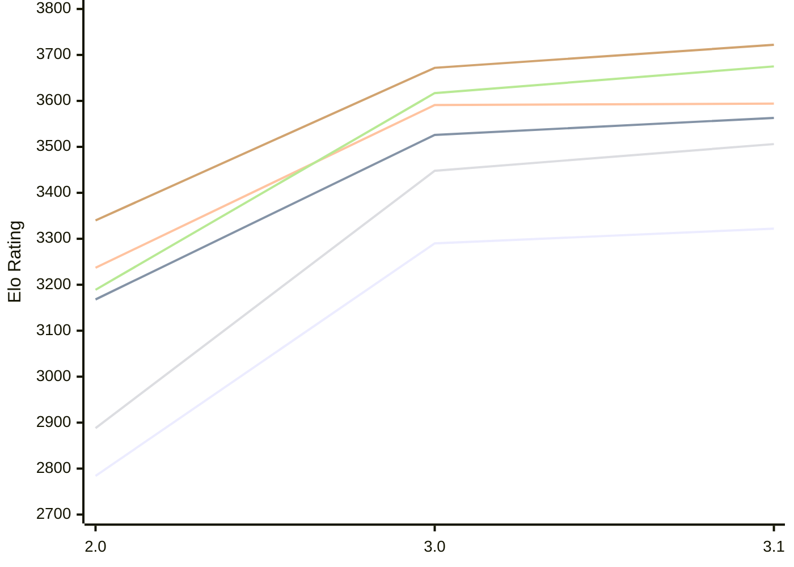

# Engine: Funcomp

Author: James Coit

Home: https://github.com/Moxnar/FunComp

## Elo Ratings E1 (Ultra 7 265T (1.50 GHz) - E-Core)

| Version | Published | STC 8.0+0.08s  | LTC 60.0+0.60s | VLTC 2m24s+1.12s | Comment |
| --- | --- | --- | --- | --- | --- |
| 3.1 | 2026-10-30 | 3322(+32) | 3563(+37) | 3594(+3) |  |
| 3.0 | 2026-10-20 | 3290(+506) | 3526(+358) | 3591(+354) |  |
| 2.0 | 2026-10-03 | 2784 | 3168 | 3237 |  |
 | | | cElo (∆ prev) | cElo (∆ prev) | cElo (∆ prev) | 

## Elo Ratings P1 (Ultra 7 265T (1.50 GHz) - P-Core)

| Version | Published | STC 8.0+0.08s  | LTC 60.0+0.60s | VLTC 2m24s+1.12s | Comment |
| --- | --- | --- | --- | --- | --- |
| 3.1 | 2026-10-30 | 3506(+58) | 3675(+58) | 3722(+50) |  |
| 3.0 | 2026-10-20 | 3448(+560) | 3617(+428) | 3672(+332) |  |
| 2.0 | 2026-10-03 | 2888 | 3189 | 3340 |  |
 | | | cElo (∆ prev) | cElo (∆ prev) | cElo (∆ prev) | 

## Elo Ratings T1 (i5-7500T 2.70GHz)

| Version | Published | STC 8.0+0.08s  | LTC 60.0+0.60s | VLTC 2m24s+1.12s | Comment |
| --- | --- | --- | --- | --- | --- |
| 1.0 | 2026-09-28 | 2576 | 2809 | 2966 |  |
 | | | cElo (∆ prev) | cElo (∆ prev) | cElo (∆ prev) | 

<a href="https://github.com/computer-chess-index/cci/issues/new?template=submit-version.yml&title=[VERSION]+Funcomp+<version>&body=###%20Engine%20name%0AFuncomp%0A%0A###%20Version%0A1.0" target="_blank">Submit new version</a>

 Test Conditions:

GUI/CLI: <a href=https://github.com/cutechess/cutechess target="_blank">Cute-Chess</a> 
Elo Calculation: <a href=https://www.remi-coulom.fr/Bayesian-Elo/ target="_blank">Bayesian-Elo</a> 
CPU for P1: Intel(R) Core(TM) Ultra 7 265T (1.50 GHz) - P-Core 
CPU for E1: Intel(R) Core(TM) Ultra 7 265T (1.50 GHz) - E-Core 
CPU for T1: Intel(R) Core(TM) i5-7500T 2.70GHz 
Opening book: 8_moves_v3 
\* STC: 8.0+0.08s, LTC: 60.0+0.60s, VLTC: 2m24s+1.12s

 Lists:
Ratings: <a href=https://github.com/computer-chess-index/cci/blob/main/lists/CCIRatings.csv target="_blank">Complete list</a>

Generated: 2026-11-12 05:38:20

## Ratings Verlauf E1 / P1

```mermaid
%%{init: {"theme":"base","themeVariables":{"seriesColors:['#a3a3a3','#222221','#faa371']}}}%%
xychart-beta
  x-axis ["2.0", "3.0", "3.1"]
  y-axis "Elo Rating" 2700 --> 3800
  line "E1: STC (8.0+0.08s)" [2784, 3290, 3322]
  line "E1: LTC (60.0+0.60s)" [3168, 3526, 3563]
  line "E1: VLTC (2m24s+1.12s)" [3237, 3591, 3594]
  line "P1: STC (8.0+0.08s)" [2888, 3448, 3506]
  line "P1: LTC (60.0+0.60s)" [3189, 3617, 3675]
  line "P1: VLTC (2m24s+1.12s)" [3340, 3672, 3722]
```

## Detailed Evaluation Results

| Version | Time Control | Variant | Elo  | Range +/- | Matches | Score | Average Opponent Elo | Draws |
| --- | --- |--- | --- | --- | --- | --- | --- | --- |
| 3.1 | VLTC (2m24s+1.12s) | P1 | 3722 | 37 | 174 | 52% | 3707 | 83% |
|  |  | E1 | 3594 | 33 | 218 | 50% | 3596 | 83% |
|  | LTC (60.0+0.60s) | E1 | 3563 | 31 | 252 | 52% | 3552 | 76% |
|  |  | P1 | 3675 | 37 | 184 | 53% | 3653 | 68% |
|  | STC (8.0+0.08s) | E1 | 3322 | 33 | 244 | 51% | 3313 | 60% |
|  |  | P1 | 3506 | 39 | 172 | 51% | 3501 | 66% |
| --- | --- |--- | --- | --- | --- | --- | --- | --- |
| 3.0 | VLTC (2m24s+1.12s) | P1 | 3672 | 40 | 154 | 57% | 3614 | 75% |
|  |  | E1 | 3591 | 36 | 196 | 53% | 3564 | 71% |
|  | LTC (60.0+0.60s) | P1 | 3617 | 45 | 128 | 57% | 3551 | 69% |
|  |  | E1 | 3526 | 36 | 196 | 55% | 3487 | 69% |
|  | STC (8.0+0.08s) | P1 | 3448 | 54 | 96 | 57% | 3359 | 61% |
|  |  | E1 | 3290 | 33 | 260 | 54% | 3248 | 55% |
| --- | --- |--- | --- | --- | --- | --- | --- | --- |
| 2.0 | VLTC (2m24s+1.12s) | E1 | 3237 | 34 | 272 | 54% | 3170 | 42% |
|  |  | P1 | 3340 | 40 | 192 | 57% | 3245 | 46% |
|  | LTC (60.0+0.60s) | E1 | 3168 | 35 | 262 | 53% | 3086 | 39% |
|  |  | P1 | 3189 | 40 | 212 | 61% | 2970 | 43% |
|  | STC (8.0+0.08s) | P1 | 2888 | 45 | 168 | 51% | 2859 | 28% |
|  |  | E1 | 2784 | 34 | 302 | 57% | 2662 | 30% |
| --- | --- |--- | --- | --- | --- | --- | --- | --- |
| 1.0 | VLTC (2m24s+1.12s) | T1 | 2966 | 38 | 230 | 54% | 2924 | 36% |
|  | LTC (60.0+0.60s) | T1 | 2809 | 41 | 204 | 57% | 2719 | 34% |
|  | STC (8.0+0.08s) | T1 | 2576 | 43 | 196 | 56% | 2510 | 25% |