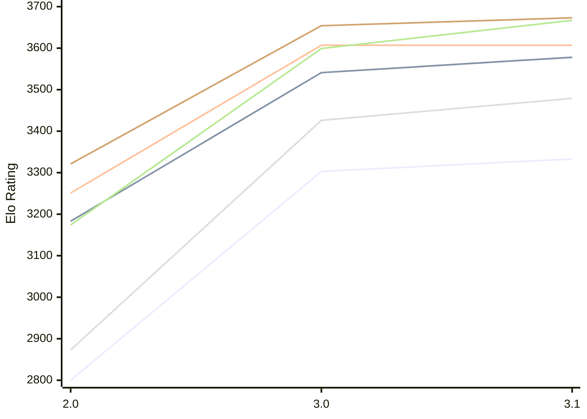

# Engine: Funcomp

Author: James Coit

Home: https://github.com/Moxnar/FunComp

## Elo Ratings E1 (Ultra 7 265T (1.50 GHz) - E-Core)

| Version | Published | STC 8.0+0.08s  | LTC 60.0+0.60s | VLTC 2m24s+1.12s | Comment |
| --- | --- | --- | --- | --- | --- |
| 3.1 | 2026-10-30 | 3333(+30) | 3578(+37) | 3607(0) |  |
| 3.0 | 2026-10-20 | 3303(+503) | 3541(+358) | 3607(+356) |  |
| 2.0 | 2026-10-03 | 2800 | 3183 | 3251 |  |
 | | | cElo (∆ prev) | cElo (∆ prev) | cElo (∆ prev) | 

## Elo Ratings P1 (Ultra 7 265T (1.50 GHz) - P-Core)

| Version | Published | STC 8.0+0.08s  | LTC 60.0+0.60s | VLTC 2m24s+1.12s | Comment |
| --- | --- | --- | --- | --- | --- |
| 3.1 | 2026-10-30 | 3479(+53) | 3667(+68) | 3673(+19) |  |
| 3.0 | 2026-10-20 | 3426(+553) | 3599(+425) | 3654(+333) |  |
| 2.0 | 2026-10-03 | 2873 | 3174 | 3321 |  |
 | | | cElo (∆ prev) | cElo (∆ prev) | cElo (∆ prev) | 

## Elo Ratings T1 (i5-7500T 2.70GHz)

| Version | Published | STC 8.0+0.08s  | LTC 60.0+0.60s | VLTC 2m24s+1.12s | Comment |
| --- | --- | --- | --- | --- | --- |
| 1.0 | 2026-09-28 | 2576 | 2809 | 2966 |  |
 | | | cElo (∆ prev) | cElo (∆ prev) | cElo (∆ prev) | 

<a href="https://github.com/computer-chess-index/cci/issues/new?template=submit-version.yml&title=[VERSION]+Funcomp+<version>&body=###%20Engine%20name%0AFuncomp%0A%0A###%20Version%0A1.0" target="_blank">Submit new version</a>

 Test Conditions:

GUI/CLI: <a href=https://github.com/cutechess/cutechess target="_blank">Cute-Chess</a> 
Elo Calculation: <a href=https://www.remi-coulom.fr/Bayesian-Elo/ target="_blank">Bayesian-Elo</a> 
CPU for P1: Intel(R) Core(TM) Ultra 7 265T (1.50 GHz) - P-Core 
CPU for E1: Intel(R) Core(TM) Ultra 7 265T (1.50 GHz) - E-Core 
CPU for T1: Intel(R) Core(TM) i5-7500T 2.70GHz 
Opening book: 8_moves_v3 
\* STC: 8.0+0.08s, LTC: 60.0+0.60s, VLTC: 2m24s+1.12s

 Lists:
Ratings: <a href=https://github.com/computer-chess-index/cci/blob/main/lists/CCIRatings.csv target="_blank">Complete list</a>

Generated: 2026-11-03 05:38:31

## Ratings Verlauf E1 / P1

```mermaid
%%{init: {"theme":"base","themeVariables":{"seriesColors:['#a3a3a3','#222221','#faa371']}}}%%
xychart-beta
  x-axis ["2.0", "3.0", "3.1"]
  y-axis "Elo Rating" 2800 --> 3700
  line "E1: STC (8.0+0.08s)" [2800, 3303, 3333]
  line "E1: LTC (60.0+0.60s)" [3183, 3541, 3578]
  line "E1: VLTC (2m24s+1.12s)" [3251, 3607, 3607]
  line "P1: STC (8.0+0.08s)" [2873, 3426, 3479]
  line "P1: LTC (60.0+0.60s)" [3174, 3599, 3667]
  line "P1: VLTC (2m24s+1.12s)" [3321, 3654, 3673]
```

## Detailed Evaluation Results

| Version | Time Control | Variant | Elo  | Range +/- | Matches | Score | Average Opponent Elo | Draws |
| --- | --- |--- | --- | --- | --- | --- | --- | --- |
| 3.1 | VLTC (2m24s+1.12s) | P1 | 3673 | 54 | 80 | 49% | 3680 | 84% |
|  |  | E1 | 3607 | 41 | 134 | 49% | 3614 | 87% |
|  | LTC (60.0+0.60s) | P1 | 3667 | 55 | 84 | 57% | 3615 | 65% |
|  |  | E1 | 3578 | 35 | 200 | 52% | 3563 | 75% |
|  | STC (8.0+0.08s) | P1 | 3479 | 48 | 108 | 50% | 3476 | 68% |
|  |  | E1 | 3333 | 38 | 180 | 51% | 3329 | 63% |
| --- | --- |--- | --- | --- | --- | --- | --- | --- |
| 3.0 | VLTC (2m24s+1.12s) | E1 | 3607 | 36 | 192 | 53% | 3579 | 71% |
|  |  | P1 | 3654 | 40 | 154 | 57% | 3596 | 75% |
|  | LTC (60.0+0.60s) | E1 | 3541 | 36 | 196 | 55% | 3502 | 69% |
|  |  | P1 | 3599 | 45 | 128 | 57% | 3533 | 69% |
|  | STC (8.0+0.08s) | P1 | 3426 | 54 | 96 | 57% | 3339 | 61% |
|  |  | E1 | 3303 | 33 | 260 | 54% | 3263 | 55% |
| --- | --- |--- | --- | --- | --- | --- | --- | --- |
| 2.0 | VLTC (2m24s+1.12s) | P1 | 3321 | 40 | 192 | 57% | 3227 | 46% |
|  |  | E1 | 3251 | 34 | 272 | 54% | 3183 | 42% |
|  | LTC (60.0+0.60s) | P1 | 3174 | 40 | 212 | 61% | 2957 | 43% |
|  |  | E1 | 3183 | 35 | 262 | 53% | 3102 | 39% |
|  | STC (8.0+0.08s) | P1 | 2873 | 45 | 168 | 51% | 2846 | 28% |
|  |  | E1 | 2800 | 34 | 302 | 57% | 2677 | 30% |
| --- | --- |--- | --- | --- | --- | --- | --- | --- |
| 1.0 | VLTC (2m24s+1.12s) | T1 | 2966 | 38 | 230 | 54% | 2924 | 36% |
|  | LTC (60.0+0.60s) | T1 | 2809 | 41 | 204 | 57% | 2719 | 34% |
|  | STC (8.0+0.08s) | T1 | 2576 | 43 | 196 | 56% | 2510 | 25% |