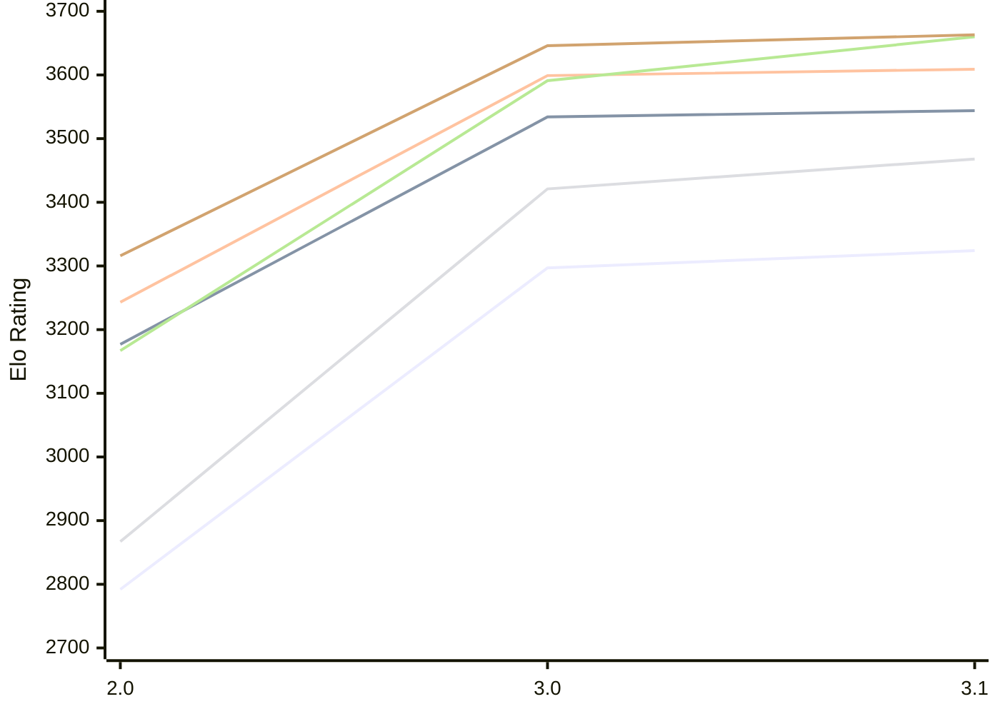

# Engine: Funcomp

Author: James Coit

Home: https://github.com/Moxnar/FunComp

## Elo Ratings E1 (Ultra 7 265T (1.50 GHz) - E-Core)

| Version | Published | STC 8.0+0.08s  | LTC 60.0+0.60s | VLTC 2m24s+1.12s | Comment |
| --- | --- | --- | --- | --- | --- |
| 3.1 | 2026-10-30 | 3324(+27) | 3544(+10) | 3609(+10) |  |
| 3.0 | 2026-10-20 | 3297(+505) | 3534(+357) | 3599(+356) |  |
| 2.0 | 2026-10-03 | 2792 | 3177 | 3243 |  |
 | | | cElo (∆ prev) | cElo (∆ prev) | cElo (∆ prev) | 

## Elo Ratings P1 (Ultra 7 265T (1.50 GHz) - P-Core)

| Version | Published | STC 8.0+0.08s  | LTC 60.0+0.60s | VLTC 2m24s+1.12s | Comment |
| --- | --- | --- | --- | --- | --- |
| 3.1 | 2026-10-30 | 3468(+47) | 3660(+69) | 3663(+17) |  |
| 3.0 | 2026-10-20 | 3421(+554) | 3591(+424) | 3646(+330) |  |
| 2.0 | 2026-10-03 | 2867 | 3167 | 3316 |  |
 | | | cElo (∆ prev) | cElo (∆ prev) | cElo (∆ prev) | 

## Elo Ratings T1 (i5-7500T 2.70GHz)

| Version | Published | STC 8.0+0.08s  | LTC 60.0+0.60s | VLTC 2m24s+1.12s | Comment |
| --- | --- | --- | --- | --- | --- |
| 1.0 | 2026-09-28 | 2576 | 2809 | 2966 |  |
 | | | cElo (∆ prev) | cElo (∆ prev) | cElo (∆ prev) | 

<a href="https://github.com/computer-chess-index/cci/issues/new?template=submit-version.yml&title=[VERSION]+Funcomp+<version>&body=###%20Engine%20name%0AFuncomp%0A%0A###%20Version%0A1.0" target="_blank">Submit new version</a>

 Test Conditions:

GUI/CLI: <a href=https://github.com/cutechess/cutechess target="_blank">Cute-Chess</a> 
Elo Calculation: <a href=https://www.remi-coulom.fr/Bayesian-Elo/ target="_blank">Bayesian-Elo</a> 
CPU for P1: Intel(R) Core(TM) Ultra 7 265T (1.50 GHz) - P-Core 
CPU for E1: Intel(R) Core(TM) Ultra 7 265T (1.50 GHz) - E-Core 
CPU for T1: Intel(R) Core(TM) i5-7500T 2.70GHz 
Opening book: 8_moves_v3 
\* STC: 8.0+0.08s, LTC: 60.0+0.60s, VLTC: 2m24s+1.12s

 Lists:
Ratings: <a href=https://github.com/computer-chess-index/cci/blob/main/lists/CCIRatings.csv target="_blank">Complete list</a>

Generated: 2026-11-02 05:38:35

## Ratings Verlauf E1 / P1

```mermaid
%%{init: {"theme":"base","themeVariables":{"seriesColors:['#a3a3a3','#222221','#faa371']}}}%%
xychart-beta
  x-axis ["2.0", "3.0", "3.1"]
  y-axis "Elo Rating" 2700 --> 3700
  line "E1: STC (8.0+0.08s)" [2792, 3297, 3324]
  line "E1: LTC (60.0+0.60s)" [3177, 3534, 3544]
  line "E1: VLTC (2m24s+1.12s)" [3243, 3599, 3609]
  line "P1: STC (8.0+0.08s)" [2867, 3421, 3468]
  line "P1: LTC (60.0+0.60s)" [3167, 3591, 3660]
  line "P1: VLTC (2m24s+1.12s)" [3316, 3646, 3663]
```

## Detailed Evaluation Results

| Version | Time Control | Variant | Elo  | Range +/- | Matches | Score | Average Opponent Elo | Draws |
| --- | --- |--- | --- | --- | --- | --- | --- | --- |
| 3.1 | VLTC (2m24s+1.12s) | P1 | 3663 | 55 | 76 | 49% | 3672 | 84% |
|  |  | E1 | 3609 | 58 | 66 | 48% | 3617 | 91% |
|  | LTC (60.0+0.60s) | E1 | 3544 | 56 | 76 | 49% | 3549 | 78% |
|  |  | P1 | 3660 | 55 | 84 | 57% | 3609 | 65% |
|  | STC (8.0+0.08s) | E1 | 3324 | 56 | 82 | 52% | 3312 | 62% |
|  |  | P1 | 3468 | 69 | 52 | 51% | 3463 | 67% |
| --- | --- |--- | --- | --- | --- | --- | --- | --- |
| 3.0 | VLTC (2m24s+1.12s) | P1 | 3646 | 40 | 154 | 57% | 3590 | 75% |
|  |  | E1 | 3599 | 36 | 192 | 53% | 3571 | 71% |
|  | LTC (60.0+0.60s) | P1 | 3591 | 45 | 128 | 57% | 3526 | 69% |
|  |  | E1 | 3534 | 36 | 196 | 55% | 3495 | 69% |
|  | STC (8.0+0.08s) | P1 | 3421 | 54 | 96 | 57% | 3332 | 61% |
|  |  | E1 | 3297 | 33 | 260 | 54% | 3256 | 55% |
| --- | --- |--- | --- | --- | --- | --- | --- | --- |
| 2.0 | VLTC (2m24s+1.12s) | E1 | 3243 | 34 | 272 | 54% | 3175 | 42% |
|  |  | P1 | 3316 | 40 | 192 | 57% | 3221 | 46% |
|  | LTC (60.0+0.60s) | E1 | 3177 | 35 | 262 | 53% | 3094 | 39% |
|  |  | P1 | 3167 | 40 | 212 | 61% | 2951 | 43% |
|  | STC (8.0+0.08s) | P1 | 2867 | 45 | 168 | 51% | 2840 | 28% |
|  |  | E1 | 2792 | 34 | 302 | 57% | 2670 | 30% |
| --- | --- |--- | --- | --- | --- | --- | --- | --- |
| 1.0 | VLTC (2m24s+1.12s) | T1 | 2966 | 38 | 230 | 54% | 2924 | 36% |
|  | LTC (60.0+0.60s) | T1 | 2809 | 41 | 204 | 57% | 2719 | 34% |
|  | STC (8.0+0.08s) | T1 | 2576 | 43 | 196 | 56% | 2510 | 25% |