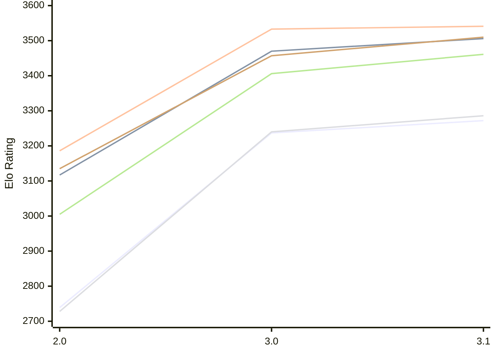

# Engine: Funcomp

Author: James Coit

Home: https://github.com/Moxnar/FunComp

## Elo Ratings E1 (Ultra 7 265T (1.50 GHz) - E-Core)

| Version | Published | STC 8.0+0.08s  | LTC 60.0+0.60s | VLTC 2m24s+1.12s | Comment |
| --- | --- | --- | --- | --- | --- |
| 3.1 | 2026-10-30 | 3272(+35) | 3506(+36) | 3541(+8) |  |
| 3.0 | 2026-10-20 | 3237(+498) | 3470(+353) | 3533(+347) |  |
| 2.0 | 2026-10-03 | 2739 | 3117 | 3186 |  |
 | | | cElo (∆ prev) | cElo (∆ prev) | cElo (∆ prev) | 

## Elo Ratings P1 (Ultra 7 265T (1.50 GHz) - P-Core)

| Version | Published | STC 8.0+0.08s  | LTC 60.0+0.60s | VLTC 2m24s+1.12s | Comment |
| --- | --- | --- | --- | --- | --- |
| 3.1 | 2026-10-30 | 3286(+46) | 3461(+55) | 3510(+53) |  |
| 3.0 | 2026-10-20 | 3240(+512) | 3406(+401) | 3457(+322) |  |
| 2.0 | 2026-10-03 | 2728 | 3005 | 3135 |  |
 | | | cElo (∆ prev) | cElo (∆ prev) | cElo (∆ prev) | 

## Elo Ratings T1 (i5-7500T 2.70GHz)

| Version | Published | STC 8.0+0.08s  | LTC 60.0+0.60s | VLTC 2m24s+1.12s | Comment |
| --- | --- | --- | --- | --- | --- |
| 1.0 | 2026-09-28 | 2576 | 2809 | 2966 |  |
 | | | cElo (∆ prev) | cElo (∆ prev) | cElo (∆ prev) | 

<a href="https://github.com/computer-chess-index/cci/issues/new?template=submit-version.yml&title=[VERSION]+Funcomp+<version>&body=###%20Engine%20name%0AFuncomp%0A%0A###%20Version%0A1.0" target="_blank">Submit new version</a>

 Test Conditions:

GUI/CLI: <a href=https://github.com/cutechess/cutechess target="_blank">Cute-Chess</a> 
Elo Calculation: <a href=https://www.remi-coulom.fr/Bayesian-Elo/ target="_blank">Bayesian-Elo</a> 
CPU for P1: Intel(R) Core(TM) Ultra 7 265T (1.50 GHz) - P-Core 
CPU for E1: Intel(R) Core(TM) Ultra 7 265T (1.50 GHz) - E-Core 
CPU for T1: Intel(R) Core(TM) i5-7500T 2.70GHz 
Opening book: 8_moves_v3 
\* STC: 8.0+0.08s, LTC: 60.0+0.60s, VLTC: 2m24s+1.12s

 Lists:
Ratings: <a href=https://github.com/computer-chess-index/cci/blob/main/lists/CCIRatings.csv target="_blank">Complete list</a>

Generated: 2026-11-19 05:38:36

## Ratings Verlauf E1 / P1

```mermaid
%%{init: {"theme":"base","themeVariables":{"seriesColors:['#a3a3a3','#222221','#faa371']}}}%%
xychart-beta
  x-axis ["2.0", "3.0", "3.1"]
  y-axis "Elo Rating" 2700 --> 3600
  line "E1: STC (8.0+0.08s)" [2739, 3237, 3272]
  line "E1: LTC (60.0+0.60s)" [3117, 3470, 3506]
  line "E1: VLTC (2m24s+1.12s)" [3186, 3533, 3541]
  line "P1: STC (8.0+0.08s)" [2728, 3240, 3286]
  line "P1: LTC (60.0+0.60s)" [3005, 3406, 3461]
  line "P1: VLTC (2m24s+1.12s)" [3135, 3457, 3510]
```

## Detailed Evaluation Results

| Version | Time Control | Variant | Elo  | Range +/- | Matches | Score | Average Opponent Elo | Draws |
| --- | --- |--- | --- | --- | --- | --- | --- | --- |
| 3.1 | VLTC (2m24s+1.12s) | P1 | 3510 | 36 | 182 | 52% | 3497 | 84% |
|  |  | E1 | 3541 | 31 | 242 | 50% | 3541 | 83% |
|  | LTC (60.0+0.60s) | P1 | 3461 | 37 | 184 | 53% | 3440 | 68% |
|  |  | E1 | 3506 | 30 | 267 | 51% | 3495 | 77% |
|  | STC (8.0+0.08s) | P1 | 3286 | 37 | 192 | 50% | 3286 | 65% |
|  |  | E1 | 3272 | 31 | 272 | 51% | 3263 | 60% |
| --- | --- |--- | --- | --- | --- | --- | --- | --- |
| 3.0 | VLTC (2m24s+1.12s) | P1 | 3457 | 40 | 158 | 57% | 3403 | 75% |
|  |  | E1 | 3533 | 34 | 220 | 52% | 3513 | 70% |
|  | LTC (60.0+0.60s) | P1 | 3406 | 44 | 136 | 57% | 3345 | 71% |
|  |  | E1 | 3470 | 34 | 224 | 54% | 3437 | 70% |
|  | STC (8.0+0.08s) | P1 | 3240 | 51 | 106 | 56% | 3163 | 63% |
|  |  | E1 | 3237 | 31 | 292 | 53% | 3202 | 57% |
| --- | --- |--- | --- | --- | --- | --- | --- | --- |
| 2.0 | VLTC (2m24s+1.12s) | P1 | 3135 | 40 | 192 | 57% | 3046 | 46% |
|  |  | E1 | 3186 | 34 | 272 | 54% | 3119 | 42% |
|  | LTC (60.0+0.60s) | P1 | 3005 | 40 | 212 | 61% | 2801 | 43% |
|  |  | E1 | 3117 | 35 | 262 | 53% | 3038 | 39% |
|  | STC (8.0+0.08s) | E1 | 2739 | 34 | 302 | 57% | 2618 | 30% |
|  |  | P1 | 2728 | 45 | 168 | 51% | 2703 | 28% |
| --- | --- |--- | --- | --- | --- | --- | --- | --- |
| 1.0 | VLTC (2m24s+1.12s) | T1 | 2966 | 38 | 230 | 54% | 2924 | 36% |
|  | LTC (60.0+0.60s) | T1 | 2809 | 41 | 204 | 57% | 2719 | 34% |
|  | STC (8.0+0.08s) | T1 | 2576 | 43 | 196 | 56% | 2510 | 25% |