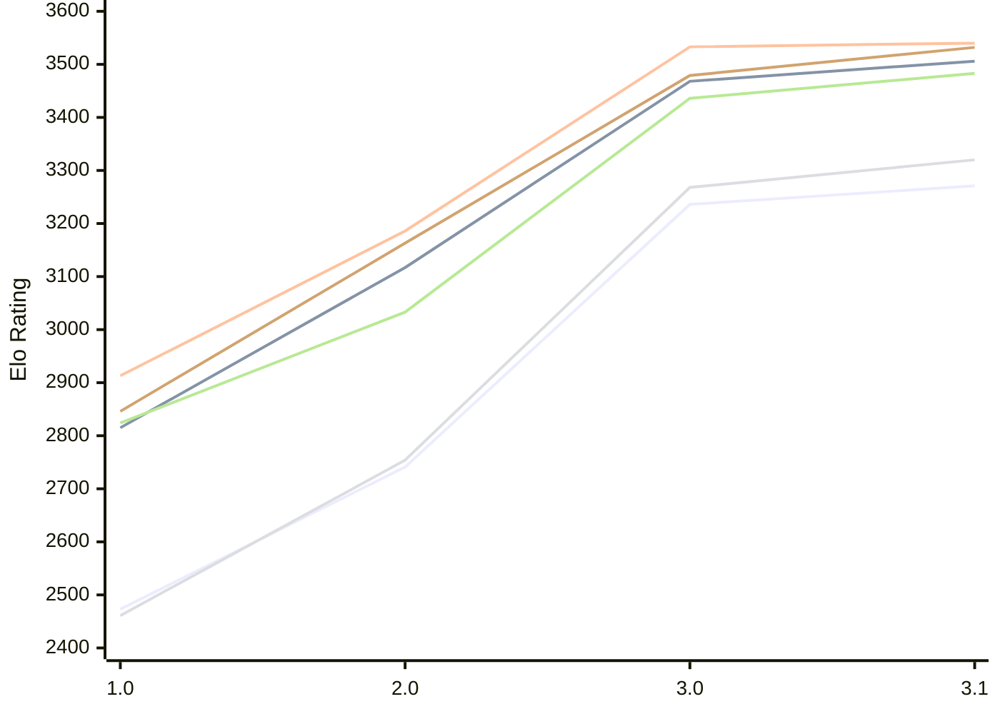

# Engine: Funcomp

Author: James Coit

Home: https://github.com/Moxnar/FunComp

## Elo Ratings E1 (Ultra 7 265T (1.50 GHz) - E-Core)

| Version | Published | STC 8.0+0.08s  | LTC 60.0+0.60s | VLTC 2m24s+1.12s | Comment |
| --- | --- | --- | --- | --- | --- |
| 3.1 | 2026-10-30 | 3271(+35) | 3506(+38) | 3540(+7) |  |
| 3.0 | 2026-10-20 | 3236(+495) | 3468(+351) | 3533(+347) |  |
| 2.0 | 2026-10-03 | 2741(+268) | 3117(+302) | 3186(+273) |  |
| 1.0 | 2026-09-28 | 2473 | 2815 | 2913 |  |
 | | | cElo (∆ prev) | cElo (∆ prev) | cElo (∆ prev) | 

## Elo Ratings P1 (Ultra 7 265T (1.50 GHz) - P-Core)

| Version | Published | STC 8.0+0.08s  | LTC 60.0+0.60s | VLTC 2m24s+1.12s | Comment |
| --- | --- | --- | --- | --- | --- |
| 3.1 | 2026-10-30 | 3320(+52) | 3483(+47) | 3532(+53) |  |
| 3.0 | 2026-10-20 | 3268(+514) | 3436(+403) | 3479(+316) |  |
| 2.0 | 2026-10-03 | 2754(+293) | 3033(+209) | 3163(+317) |  |
| 1.0 | 2026-09-28 | 2461 | 2824 | 2846 |  |
 | | | cElo (∆ prev) | cElo (∆ prev) | cElo (∆ prev) | 

## Elo Ratings T1 (i5-7500T 2.70GHz)

| Version | Published | STC 8.0+0.08s  | LTC 60.0+0.60s | VLTC 2m24s+1.12s | Comment |
| --- | --- | --- | --- | --- | --- |
| 1.0 | 2026-09-28 | 2576 | 2809 | 2966 |  |
 | | | cElo (∆ prev) | cElo (∆ prev) | cElo (∆ prev) | 

<a href="https://github.com/computer-chess-index/cci/issues/new?template=submit-version.yml&title=[VERSION]+Funcomp+<version>&body=###%20Engine%20name%0AFuncomp%0A%0A###%20Version%0A1.0" target="_blank">Submit new version</a>

 Test Conditions:

GUI/CLI: <a href=https://github.com/cutechess/cutechess target="_blank">Cute-Chess</a> 
Elo Calculation: <a href=https://www.remi-coulom.fr/Bayesian-Elo/ target="_blank">Bayesian-Elo</a> 
CPU for P1: Intel(R) Core(TM) Ultra 7 265T (1.50 GHz) - P-Core 
CPU for E1: Intel(R) Core(TM) Ultra 7 265T (1.50 GHz) - E-Core 
CPU for T1: Intel(R) Core(TM) i5-7500T 2.70GHz 
Opening book: 8_moves_v3 
\* STC: 8.0+0.08s, LTC: 60.0+0.60s, VLTC: 2m24s+1.12s

 Lists:
Ratings: <a href=https://github.com/computer-chess-index/cci/blob/main/lists/CCIRatings.csv target="_blank">Complete list</a>

Generated: 2026-11-26 05:38:47

## Ratings Verlauf E1 / P1

```mermaid
%%{init: {"theme":"base","themeVariables":{"seriesColors:['#a3a3a3','#222221','#faa371']}}}%%
xychart-beta
  x-axis ["1.0", "2.0", "3.0", "3.1"]
  y-axis "Elo Rating" 2400 --> 3600
  line "E1: STC (8.0+0.08s)" [2473, 2741, 3236, 3271]
  line "E1: LTC (60.0+0.60s)" [2815, 3117, 3468, 3506]
  line "E1: VLTC (2m24s+1.12s)" [2913, 3186, 3533, 3540]
  line "P1: STC (8.0+0.08s)" [2461, 2754, 3268, 3320]
  line "P1: LTC (60.0+0.60s)" [2824, 3033, 3436, 3483]
  line "P1: VLTC (2m24s+1.12s)" [2846, 3163, 3479, 3532]
```

## Detailed Evaluation Results

| Version | Time Control | Variant | Elo  | Range +/- | Matches | Score | Average Opponent Elo | Draws |
| --- | --- |--- | --- | --- | --- | --- | --- | --- |
| 3.1 | VLTC (2m24s+1.12s) | P1 | 3532 | 36 | 182 | 52% | 3517 | 84% |
|  |  | E1 | 3540 | 31 | 246 | 50% | 3540 | 83% |
|  | LTC (60.0+0.60s) | P1 | 3483 | 37 | 184 | 53% | 3461 | 68% |
|  |  | E1 | 3506 | 29 | 283 | 51% | 3497 | 77% |
|  | STC (8.0+0.08s) | P1 | 3320 | 36 | 204 | 51% | 3312 | 65% |
|  |  | E1 | 3271 | 31 | 288 | 51% | 3263 | 59% |
| --- | --- |--- | --- | --- | --- | --- | --- | --- |
| 3.0 | VLTC (2m24s+1.12s) | E1 | 3533 | 34 | 220 | 52% | 3514 | 70% |
|  |  | P1 | 3479 | 40 | 158 | 57% | 3425 | 75% |
|  | LTC (60.0+0.60s) | E1 | 3468 | 34 | 224 | 54% | 3437 | 70% |
|  |  | P1 | 3436 | 43 | 140 | 57% | 3374 | 71% |
|  | STC (8.0+0.08s) | P1 | 3268 | 49 | 114 | 56% | 3195 | 64% |
|  |  | E1 | 3236 | 31 | 292 | 53% | 3201 | 57% |
| --- | --- |--- | --- | --- | --- | --- | --- | --- |
| 2.0 | VLTC (2m24s+1.12s) | P1 | 3163 | 40 | 192 | 57% | 3074 | 46% |
|  |  | E1 | 3186 | 34 | 272 | 54% | 3119 | 42% |
|  | LTC (60.0+0.60s) | P1 | 3033 | 40 | 212 | 61% | 2827 | 43% |
|  |  | E1 | 3117 | 35 | 262 | 53% | 3036 | 39% |
|  | STC (8.0+0.08s) | P1 | 2754 | 45 | 168 | 51% | 2727 | 28% |
|  |  | E1 | 2741 | 34 | 302 | 57% | 2620 | 30% |
| --- | --- |--- | --- | --- | --- | --- | --- | --- |
| 1.0 | VLTC (2m24s+1.12s) | E1 | 2913 | 39 | 222 | 45% | 2971 | 34% |
|  |  | T1 | 2966 | 38 | 230 | 54% | 2924 | 36% |
|  |  | P1 | 2846 | 93 | 40 | 38% | 2988 | 30% |
|  | LTC (60.0+0.60s) | E1 | 2815 | 33 | 306 | 50% | 2823 | 28% |
|  |  | T1 | 2809 | 41 | 204 | 57% | 2719 | 34% |
|  |  | P1 | 2824 | 38 | 230 | 39% | 2928 | 36% |
|  | STC (8.0+0.08s) | E1 | 2473 | 46 | 172 | 46% | 2523 | 20% |
|  |  | T1 | 2576 | 43 | 196 | 56% | 2510 | 25% |
|  |  | P1 | 2461 | 42 | 192 | 48% | 2489 | 26% |