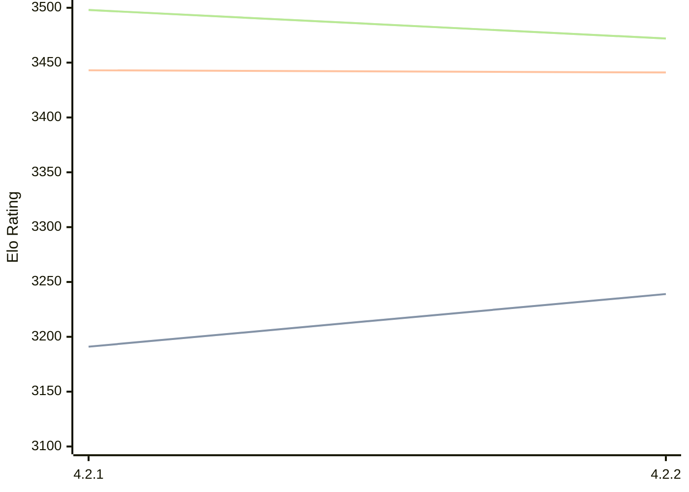

# Engine: Gaia

Author: Jean-Francois Romang, David Rabel

Home: https://github.com/jromang/gaiachess

## Elo Ratings

| Version | Published | STC 8.0+0.08s  | LTC 60.0+0.60s | VLTC 2m24s+1.12s | Comment |
| --- | --- | --- | --- | --- | --- |
| 4.2.2 | 2026-08-13 | 3239(+48) | 3441(-2) | 3472(-26) |  |
| 4.2.1 | 2026-08-09 | 3191(+new) | 3443(+new) | 3498(+new) |  |
| 4.1.3 | 2026-02-26 |  |  |  |  |
| 4.1.2 | 2026-02-24 |  |  |  |  |
| 4.1.1 | 2026-02-24 |  |  |  |  |
| 4.1.0 | 2026-02-22 |  |  |  | Skipped for 4.1.1 |
 | | | cElo (∆ prev) | cElo (∆ prev) | cElo (∆ prev) | 

<a href="https://github.com/computer-chess-index/cci/issues/new?template=submit-version.yml&title=[VERSION]+Gaia+<version>&body=###%20Engine%20name%0AGaia%0A%0A###%20Version%0A4.2.2" target="_blank">Submit new version</a>

 Test Conditions:

GUI/CLI: <a href=https://github.com/cutechess/cutechess target="_blank">Cute-Chess</a> 
Elo Calculation: <a href=https://www.remi-coulom.fr/Bayesian-Elo/ target="_blank">Bayesian-Elo</a> 
CPU: Intel(R) Core(TM) i5-7500T 2.70GHz 
Opening book: 8_moves_v3 
\* STC: 8.0+0.08s, LTC: 60.0+0.60s, VLTC: 2m24s+1.12s

 Lists:
Ratings: <a href=https://github.com/computer-chess-index/cci/blob/main/lists/CCIRatings.csv target="_blank">Complete list</a>

Generated: 2026-08-20 06:25:27

## Ratings Verlauf

⬛ STC (8.0+0.08s) &nbsp;&nbsp; 🟧 LTC (60.0+0.60s) &nbsp;&nbsp; 🟩 VLTC (2m24s+1.12s)

dark mode: 🟩STC (8.0+0.08s) 🟧LTC (60.0+0.60s) ⬜VLTC (2m24s+1.12s)

## Detailed Evaluation Results

| Version | Time Control | Elo  | Range +/- | Matches | Score | Average Opponent Elo | Draws |
| --- | --- | --- | --- | --- | --- | --- | --- |
| 4.2.2 | VLTC (2m24s+1.12s) | 3472 | 37 | 172 | 49% | 3476 | 80% |
| 4.2.2 | LTC (60.0+0.60s) | 3441 | 35 | 196 | 50% | 3441 | 76% |
| 4.2.2 | STC (8.0+0.08s) | 3239 | 36 | 208 | 50% | 3236 | 60% |
| --- | --- | --- | --- | --- | --- | --- | --- |
| 4.2.1 | VLTC (2m24s+1.12s) | 3498 | 56 | 88 | 59% | 3339 | 69% |
| 4.2.1 | LTC (60.0+0.60s) | 3443 | 47 | 128 | 59% | 3270 | 63% |
| 4.2.1 | STC (8.0+0.08s) | 3191 | 44 | 152 | 56% | 3069 | 53% |
| --- | --- | --- | --- | --- | --- | --- | --- |