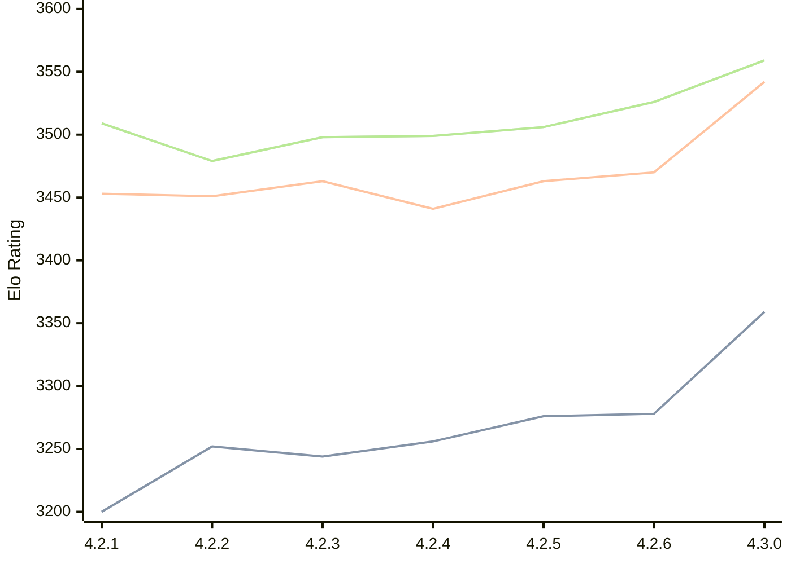

# Engine: Gaia

Author: Jean-Francois Romang, David Rabel

Home: https://github.com/jromang/gaiachess

## Elo Ratings

| Version | Published | STC 8.0+0.08s  | LTC 60.0+0.60s | VLTC 2m24s+1.12s | Comment |
| --- | --- | --- | --- | --- | --- |
| 4.3.1 | 2026-09-08 |  |  |  |  |
| 4.3.0 | 2026-09-05 | 3359(+81) | 3542(+72) | 3559(+33) |  |
| 4.2.6 | 2026-08-29 | 3278(+2) | 3470(+7) | 3526(+20) |  |
| 4.2.5 | 2026-08-24 | 3276(+20) | 3463(+22) | 3506(+7) |  |
| 4.2.4 | 2026-08-23 | 3256(+12) | 3441(-22) | 3499(+1) |  |
| 4.2.3 | 2026-08-21 | 3244(-8) | 3463(+12) | 3498(+19) |  |
| 4.2.2 | 2026-08-13 | 3252(+52) | 3451(-2) | 3479(-30) |  |
| 4.2.1 | 2026-08-09 | 3200(+new) | 3453(+new) | 3509(+new) |  |
| 4.1.3 | 2026-02-26 |  |  |  |  |
| 4.1.2 | 2026-02-24 |  |  |  |  |
| 4.1.1 | 2026-02-24 |  |  |  |  |
| 4.1.0 | 2026-02-22 |  |  |  | Skipped for 4.1.1 |
 | | | cElo (∆ prev) | cElo (∆ prev) | cElo (∆ prev) | 

<a href="https://github.com/computer-chess-index/cci/issues/new?template=submit-version.yml&title=[VERSION]+Gaia+<version>&body=###%20Engine%20name%0AGaia%0A%0A###%20Version%0A4.3.1" target="_blank">Submit new version</a>

 Test Conditions:

GUI/CLI: <a href=https://github.com/cutechess/cutechess target="_blank">Cute-Chess</a> 
Elo Calculation: <a href=https://www.remi-coulom.fr/Bayesian-Elo/ target="_blank">Bayesian-Elo</a> 
CPU: Intel(R) Core(TM) i5-7500T 2.70GHz 
Opening book: 8_moves_v3 
\* STC: 8.0+0.08s, LTC: 60.0+0.60s, VLTC: 2m24s+1.12s

 Lists:
Ratings: <a href=https://github.com/computer-chess-index/cci/blob/main/lists/CCIRatings.csv target="_blank">Complete list</a>

Generated: 2026-09-15 04:38:29

## Ratings Verlauf

## Detailed Evaluation Results

| Version | Time Control | Elo  | Range +/- | Matches | Score | Average Opponent Elo | Draws |
| --- | --- | --- | --- | --- | --- | --- | --- |
| 4.3.0 | VLTC (2m24s+1.12s) | 3559 | 37 | 166 | 51% | 3555 | 92% |
| 4.3.0 | LTC (60.0+0.60s) | 3542 | 32 | 228 | 50% | 3541 | 86% |
| 4.3.0 | STC (8.0+0.08s) | 3359 | 31 | 258 | 49% | 3367 | 70% |
| --- | --- | --- | --- | --- | --- | --- | --- |
| 4.2.6 | VLTC (2m24s+1.12s) | 3526 | 33 | 208 | 50% | 3524 | 84% |
| 4.2.6 | LTC (60.0+0.60s) | 3470 | 31 | 250 | 51% | 3464 | 81% |
| 4.2.6 | STC (8.0+0.08s) | 3278 | 33 | 232 | 50% | 3276 | 66% |
| --- | --- | --- | --- | --- | --- | --- | --- |
| 4.2.5 | VLTC (2m24s+1.12s) | 3506 | 28 | 300 | 51% | 3501 | 79% |
| 4.2.5 | LTC (60.0+0.60s) | 3463 | 28 | 306 | 51% | 3455 | 76% |
| 4.2.5 | STC (8.0+0.08s) | 3276 | 33 | 236 | 52% | 3256 | 63% |
| --- | --- | --- | --- | --- | --- | --- | --- |
| 4.2.4 | VLTC (2m24s+1.12s) | 3499 | 31 | 248 | 49% | 3506 | 79% |
| 4.2.4 | LTC (60.0+0.60s) | 3441 | 33 | 226 | 51% | 3437 | 77% |
| 4.2.4 | STC (8.0+0.08s) | 3256 | 33 | 238 | 47% | 3275 | 66% |
| --- | --- | --- | --- | --- | --- | --- | --- |
| 4.2.3 | VLTC (2m24s+1.12s) | 3498 | 36 | 190 | 51% | 3492 | 77% |
| 4.2.3 | LTC (60.0+0.60s) | 3463 | 30 | 266 | 48% | 3476 | 80% |
| 4.2.3 | STC (8.0+0.08s) | 3244 | 35 | 212 | 49% | 3255 | 64% |
| --- | --- | --- | --- | --- | --- | --- | --- |
| 4.2.2 | VLTC (2m24s+1.12s) | 3479 | 32 | 240 | 50% | 3480 | 79% |
| 4.2.2 | LTC (60.0+0.60s) | 3451 | 32 | 236 | 50% | 3452 | 77% |
| 4.2.2 | STC (8.0+0.08s) | 3252 | 33 | 248 | 51% | 3248 | 60% |
| --- | --- | --- | --- | --- | --- | --- | --- |
| 4.2.1 | VLTC (2m24s+1.12s) | 3509 | 56 | 88 | 59% | 3349 | 69% |
| 4.2.1 | LTC (60.0+0.60s) | 3453 | 47 | 128 | 59% | 3281 | 63% |
| 4.2.1 | STC (8.0+0.08s) | 3200 | 45 | 152 | 56% | 3077 | 53% |
| --- | --- | --- | --- | --- | --- | --- | --- |