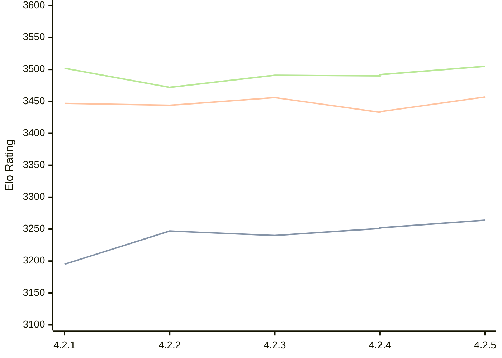

# Engine: Gaia

Author: Jean-Francois Romang, David Rabel

Home: https://github.com/jromang/gaiachess

## Elo Ratings

| Version | Published | STC 8.0+0.08s  | LTC 60.0+0.60s | VLTC 2m24s+1.12s | Comment |
| --- | --- | --- | --- | --- | --- |
| 4.2.5 | 2026-08-24 | 3264(+13) | 3457(+24) | 3505(+15) |  |
| 4.2.4 | 2026-08-23 | 3251(-1) | 3433(-1) | 3490(-2) |  |
| 4.2.4 | 2026-08-23 | 3252(+12) | 3434(-22) | 3492(+1) |  |
| 4.2.3 | 2026-08-21 | 3240(-7) | 3456(+12) | 3491(+19) |  |
| 4.2.2 | 2026-08-13 | 3247(+52) | 3444(-3) | 3472(-30) |  |
| 4.2.1 | 2026-08-09 | 3195(+new) | 3447(+new) | 3502(+new) |  |
| 4.1.3 | 2026-02-26 |  |  |  |  |
| 4.1.2 | 2026-02-24 |  |  |  |  |
| 4.1.1 | 2026-02-24 |  |  |  |  |
| 4.1.0 | 2026-02-22 |  |  |  | Skipped for 4.1.1 |
 | | | cElo (∆ prev) | cElo (∆ prev) | cElo (∆ prev) | 

<a href="https://github.com/computer-chess-index/cci/issues/new?template=submit-version.yml&title=[VERSION]+Gaia+<version>&body=###%20Engine%20name%0AGaia%0A%0A###%20Version%0A4.2.5" target="_blank">Submit new version</a>

 Test Conditions:

GUI/CLI: <a href=https://github.com/cutechess/cutechess target="_blank">Cute-Chess</a> 
Elo Calculation: <a href=https://www.remi-coulom.fr/Bayesian-Elo/ target="_blank">Bayesian-Elo</a> 
CPU: Intel(R) Core(TM) i5-7500T 2.70GHz 
Opening book: 8_moves_v3 
\* STC: 8.0+0.08s, LTC: 60.0+0.60s, VLTC: 2m24s+1.12s

 Lists:
Ratings: <a href=https://github.com/computer-chess-index/cci/blob/main/lists/CCIRatings.csv target="_blank">Complete list</a>

Generated: 2026-08-26 06:25:17

## Ratings Verlauf

⬛ STC (8.0+0.08s) &nbsp;&nbsp; 🟧 LTC (60.0+0.60s) &nbsp;&nbsp; 🟩 VLTC (2m24s+1.12s)

dark mode: 🟩STC (8.0+0.08s) 🟧LTC (60.0+0.60s) ⬜VLTC (2m24s+1.12s)

## Detailed Evaluation Results

| Version | Time Control | Elo  | Range +/- | Matches | Score | Average Opponent Elo | Draws |
| --- | --- | --- | --- | --- | --- | --- | --- |
| 4.2.5 | VLTC (2m24s+1.12s) | 3505 | 30 | 270 | 51% | 3495 | 79% |
| 4.2.5 | LTC (60.0+0.60s) | 3457 | 29 | 294 | 51% | 3448 | 76% |
| 4.2.5 | STC (8.0+0.08s) | 3264 | 34 | 224 | 51% | 3259 | 64% |
| --- | --- | --- | --- | --- | --- | --- | --- |
| 4.2.4 | VLTC (2m24s+1.12s) | 3490 | 31 | 244 | 49% | 3498 | 79% |
| 4.2.4 | VLTC (2m24s+1.12s) | 3492 | 31 | 248 | 49% | 3499 | 79% |
| 4.2.4 | LTC (60.0+0.60s) | 3433 | 33 | 222 | 51% | 3430 | 78% |
| 4.2.4 | LTC (60.0+0.60s) | 3434 | 33 | 226 | 51% | 3430 | 77% |
| 4.2.4 | STC (8.0+0.08s) | 3251 | 33 | 234 | 47% | 3270 | 66% |
| --- | --- | --- | --- | --- | --- | --- | --- |
| 4.2.4 | STC (8.0+0.08s) | 3252 | 33 | 238 | 47% | 3270 | 66% |
| --- | --- | --- | --- | --- | --- | --- | --- |
| 4.2.3 | VLTC (2m24s+1.12s) | 3491 | 36 | 190 | 51% | 3486 | 77% |
| 4.2.3 | LTC (60.0+0.60s) | 3456 | 30 | 266 | 48% | 3470 | 80% |
| 4.2.3 | STC (8.0+0.08s) | 3240 | 35 | 212 | 49% | 3251 | 64% |
| --- | --- | --- | --- | --- | --- | --- | --- |
| 4.2.2 | VLTC (2m24s+1.12s) | 3472 | 32 | 240 | 50% | 3474 | 79% |
| 4.2.2 | LTC (60.0+0.60s) | 3444 | 32 | 236 | 50% | 3445 | 77% |
| 4.2.2 | STC (8.0+0.08s) | 3247 | 33 | 248 | 51% | 3244 | 60% |
| --- | --- | --- | --- | --- | --- | --- | --- |
| 4.2.1 | VLTC (2m24s+1.12s) | 3502 | 56 | 88 | 59% | 3344 | 69% |
| 4.2.1 | LTC (60.0+0.60s) | 3447 | 47 | 128 | 59% | 3275 | 63% |
| 4.2.1 | STC (8.0+0.08s) | 3195 | 45 | 152 | 56% | 3074 | 53% |
| --- | --- | --- | --- | --- | --- | --- | --- |