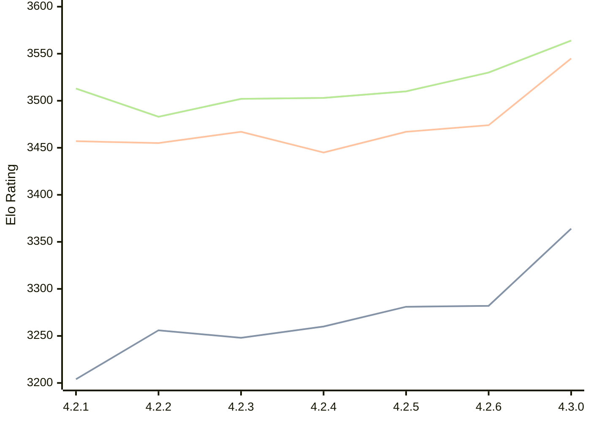

# Engine: Gaia

Author: Jean-Francois Romang, David Rabel

Home: https://github.com/jromang/gaiachess

## Elo Ratings

| Version | Published | STC 8.0+0.08s  | LTC 60.0+0.60s | VLTC 2m24s+1.12s | Comment |
| --- | --- | --- | --- | --- | --- |
| 4.3.2 | 2026-09-19 |  |  |  |  |
| 4.3.1 | 2026-09-08 |  |  |  |  |
| 4.3.0 | 2026-09-05 | 3364(+82) | 3545(+71) | 3564(+34) |  |
| 4.2.6 | 2026-08-29 | 3282(+1) | 3474(+7) | 3530(+20) |  |
| 4.2.5 | 2026-08-24 | 3281(+21) | 3467(+22) | 3510(+7) |  |
| 4.2.4 | 2026-08-23 | 3260(+12) | 3445(-22) | 3503(+1) |  |
| 4.2.3 | 2026-08-21 | 3248(-8) | 3467(+12) | 3502(+19) |  |
| 4.2.2 | 2026-08-13 | 3256(+52) | 3455(-2) | 3483(-30) |  |
| 4.2.1 | 2026-08-09 | 3204(+new) | 3457(+new) | 3513(+new) |  |
| 4.1.3 | 2026-02-26 |  |  |  |  |
| 4.1.2 | 2026-02-24 |  |  |  |  |
| 4.1.1 | 2026-02-24 |  |  |  |  |
| 4.1.0 | 2026-02-22 |  |  |  | Skipped for 4.1.1 |
 | | | cElo (∆ prev) | cElo (∆ prev) | cElo (∆ prev) | 

<a href="https://github.com/computer-chess-index/cci/issues/new?template=submit-version.yml&title=[VERSION]+Gaia+<version>&body=###%20Engine%20name%0AGaia%0A%0A###%20Version%0A4.3.2" target="_blank">Submit new version</a>

 Test Conditions:

GUI/CLI: <a href=https://github.com/cutechess/cutechess target="_blank">Cute-Chess</a> 
Elo Calculation: <a href=https://www.remi-coulom.fr/Bayesian-Elo/ target="_blank">Bayesian-Elo</a> 
CPU: Intel(R) Core(TM) i5-7500T 2.70GHz 
Opening book: 8_moves_v3 
\* STC: 8.0+0.08s, LTC: 60.0+0.60s, VLTC: 2m24s+1.12s

 Lists:
Ratings: <a href=https://github.com/computer-chess-index/cci/blob/main/lists/CCIRatings.csv target="_blank">Complete list</a>

Generated: 2026-09-26 04:38:22

## Ratings Verlauf

## Detailed Evaluation Results

| Version | Time Control | Elo  | Range +/- | Matches | Score | Average Opponent Elo | Draws |
| --- | --- | --- | --- | --- | --- | --- | --- |
| 4.3.0 | VLTC (2m24s+1.12s) | 3564 | 35 | 178 | 51% | 3560 | 92% |
| 4.3.0 | LTC (60.0+0.60s) | 3545 | 30 | 248 | 50% | 3545 | 86% |
| 4.3.0 | STC (8.0+0.08s) | 3364 | 31 | 266 | 49% | 3371 | 70% |
| --- | --- | --- | --- | --- | --- | --- | --- |
| 4.2.6 | VLTC (2m24s+1.12s) | 3530 | 33 | 208 | 50% | 3528 | 84% |
| 4.2.6 | LTC (60.0+0.60s) | 3474 | 31 | 250 | 51% | 3468 | 81% |
| 4.2.6 | STC (8.0+0.08s) | 3282 | 33 | 232 | 50% | 3281 | 66% |
| --- | --- | --- | --- | --- | --- | --- | --- |
| 4.2.5 | VLTC (2m24s+1.12s) | 3510 | 28 | 300 | 51% | 3505 | 79% |
| 4.2.5 | LTC (60.0+0.60s) | 3467 | 28 | 306 | 51% | 3459 | 76% |
| 4.2.5 | STC (8.0+0.08s) | 3281 | 33 | 236 | 52% | 3260 | 63% |
| --- | --- | --- | --- | --- | --- | --- | --- |
| 4.2.4 | VLTC (2m24s+1.12s) | 3503 | 31 | 248 | 49% | 3510 | 79% |
| 4.2.4 | LTC (60.0+0.60s) | 3445 | 33 | 226 | 51% | 3441 | 77% |
| 4.2.4 | STC (8.0+0.08s) | 3260 | 33 | 238 | 47% | 3279 | 66% |
| --- | --- | --- | --- | --- | --- | --- | --- |
| 4.2.3 | VLTC (2m24s+1.12s) | 3502 | 36 | 190 | 51% | 3497 | 77% |
| 4.2.3 | LTC (60.0+0.60s) | 3467 | 30 | 266 | 48% | 3480 | 80% |
| 4.2.3 | STC (8.0+0.08s) | 3248 | 35 | 212 | 49% | 3259 | 64% |
| --- | --- | --- | --- | --- | --- | --- | --- |
| 4.2.2 | VLTC (2m24s+1.12s) | 3483 | 32 | 240 | 50% | 3484 | 79% |
| 4.2.2 | LTC (60.0+0.60s) | 3455 | 32 | 236 | 50% | 3456 | 77% |
| 4.2.2 | STC (8.0+0.08s) | 3256 | 33 | 248 | 51% | 3252 | 60% |
| --- | --- | --- | --- | --- | --- | --- | --- |
| 4.2.1 | VLTC (2m24s+1.12s) | 3513 | 56 | 88 | 59% | 3353 | 69% |
| 4.2.1 | LTC (60.0+0.60s) | 3457 | 47 | 128 | 59% | 3285 | 63% |
| 4.2.1 | STC (8.0+0.08s) | 3204 | 45 | 152 | 56% | 3081 | 53% |
| --- | --- | --- | --- | --- | --- | --- | --- |