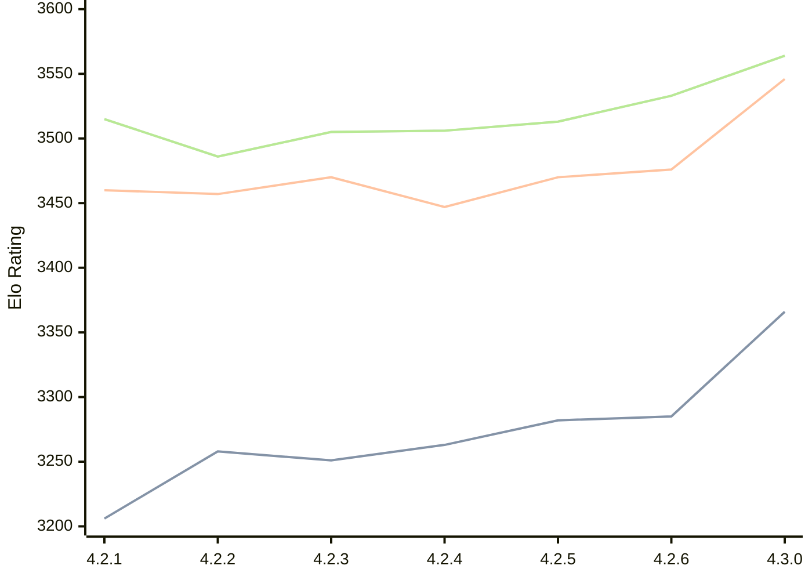

# Engine: Gaia

Author: Jean-Francois Romang, David Rabel

Home: https://github.com/jromang/gaiachess

## Elo Ratings

| Version | Published | STC 8.0+0.08s  | LTC 60.0+0.60s | VLTC 2m24s+1.12s | Comment |
| --- | --- | --- | --- | --- | --- |
| 4.3.2 | 2026-09-19 |  |  |  |  |
| 4.3.1 | 2026-09-08 |  |  |  |  |
| 4.3.0 | 2026-09-05 | 3366(+81) | 3546(+70) | 3564(+31) |  |
| 4.2.6 | 2026-08-29 | 3285(+3) | 3476(+6) | 3533(+20) |  |
| 4.2.5 | 2026-08-24 | 3282(+19) | 3470(+23) | 3513(+7) |  |
| 4.2.4 | 2026-08-23 | 3263(+12) | 3447(-23) | 3506(+1) |  |
| 4.2.3 | 2026-08-21 | 3251(-7) | 3470(+13) | 3505(+19) |  |
| 4.2.2 | 2026-08-13 | 3258(+52) | 3457(-3) | 3486(-29) |  |
| 4.2.1 | 2026-08-09 | 3206(+new) | 3460(+new) | 3515(+new) |  |
| 4.1.3 | 2026-02-26 |  |  |  |  |
| 4.1.2 | 2026-02-24 |  |  |  |  |
| 4.1.1 | 2026-02-24 |  |  |  |  |
| 4.1.0 | 2026-02-22 |  |  |  | Skipped for 4.1.1 |
 | | | cElo (∆ prev) | cElo (∆ prev) | cElo (∆ prev) | 

<a href="https://github.com/computer-chess-index/cci/issues/new?template=submit-version.yml&title=[VERSION]+Gaia+<version>&body=###%20Engine%20name%0AGaia%0A%0A###%20Version%0A4.3.2" target="_blank">Submit new version</a>

 Test Conditions:

GUI/CLI: <a href=https://github.com/cutechess/cutechess target="_blank">Cute-Chess</a> 
Elo Calculation: <a href=https://www.remi-coulom.fr/Bayesian-Elo/ target="_blank">Bayesian-Elo</a> 
CPU: Intel(R) Core(TM) i5-7500T 2.70GHz 
Opening book: 8_moves_v3 
\* STC: 8.0+0.08s, LTC: 60.0+0.60s, VLTC: 2m24s+1.12s

 Lists:
Ratings: <a href=https://github.com/computer-chess-index/cci/blob/main/lists/CCIRatings.csv target="_blank">Complete list</a>

Generated: 2026-10-09 04:38:40

## Ratings Verlauf

```mermaid
%%{init: {"theme":"base","themeVariables":{"seriesColors:['#a3a3a3','#222221','#faa371']}}}%%
xychart-beta
  x-axis ["4.2.1", "4.2.2", "4.2.3", "4.2.4", "4.2.5", "4.2.6", "4.3.0"]
  y-axis "Elo Rating" 3200 --> 3600
  line "" [3206, 3258, 3251, 3263, 3282, 3285, 3366]
  line "STC (8.0+0.08s)" [3206, 3258, 3251, 3263, 3282, 3285, 3366]
  line "LTC (60.0+0.60s)" [3460, 3457, 3470, 3447, 3470, 3476, 3546]
  line "" [3515, 3486, 3505, 3506, 3513, 3533, 3564]
  line "VLTC (2m24s+1.12s)" [3515, 3486, 3505, 3506, 3513, 3533, 3564]
```

## Detailed Evaluation Results

| Version | Time Control | Elo  | Range +/- | Matches | Score | Average Opponent Elo | Draws |
| --- | --- | --- | --- | --- | --- | --- | --- |
| 4.3.0 | VLTC (2m24s+1.12s) | 3564 | 35 | 186 | 51% | 3561 | 91% |
| 4.3.0 | LTC (60.0+0.60s) | 3546 | 30 | 252 | 50% | 3548 | 86% |
| 4.3.0 | STC (8.0+0.08s) | 3366 | 31 | 266 | 49% | 3372 | 70% |
| --- | --- | --- | --- | --- | --- | --- | --- |
| 4.2.6 | VLTC (2m24s+1.12s) | 3533 | 33 | 208 | 50% | 3530 | 84% |
| 4.2.6 | LTC (60.0+0.60s) | 3476 | 31 | 250 | 51% | 3470 | 81% |
| 4.2.6 | STC (8.0+0.08s) | 3285 | 33 | 232 | 50% | 3282 | 66% |
| --- | --- | --- | --- | --- | --- | --- | --- |
| 4.2.5 | VLTC (2m24s+1.12s) | 3513 | 28 | 300 | 51% | 3507 | 79% |
| 4.2.5 | LTC (60.0+0.60s) | 3470 | 28 | 306 | 51% | 3461 | 76% |
| 4.2.5 | STC (8.0+0.08s) | 3282 | 33 | 236 | 52% | 3263 | 63% |
| --- | --- | --- | --- | --- | --- | --- | --- |
| 4.2.4 | VLTC (2m24s+1.12s) | 3506 | 31 | 248 | 49% | 3513 | 79% |
| 4.2.4 | LTC (60.0+0.60s) | 3447 | 33 | 226 | 51% | 3444 | 77% |
| 4.2.4 | STC (8.0+0.08s) | 3263 | 33 | 238 | 47% | 3281 | 66% |
| --- | --- | --- | --- | --- | --- | --- | --- |
| 4.2.3 | VLTC (2m24s+1.12s) | 3505 | 36 | 190 | 51% | 3499 | 77% |
| 4.2.3 | LTC (60.0+0.60s) | 3470 | 30 | 266 | 48% | 3483 | 80% |
| 4.2.3 | STC (8.0+0.08s) | 3251 | 35 | 212 | 49% | 3262 | 64% |
| --- | --- | --- | --- | --- | --- | --- | --- |
| 4.2.2 | VLTC (2m24s+1.12s) | 3486 | 32 | 240 | 50% | 3487 | 79% |
| 4.2.2 | LTC (60.0+0.60s) | 3457 | 32 | 236 | 50% | 3457 | 77% |
| 4.2.2 | STC (8.0+0.08s) | 3258 | 33 | 248 | 51% | 3255 | 60% |
| --- | --- | --- | --- | --- | --- | --- | --- |
| 4.2.1 | VLTC (2m24s+1.12s) | 3515 | 56 | 88 | 59% | 3356 | 69% |
| 4.2.1 | LTC (60.0+0.60s) | 3460 | 47 | 128 | 59% | 3287 | 63% |
| 4.2.1 | STC (8.0+0.08s) | 3206 | 45 | 152 | 56% | 3082 | 53% |
| --- | --- | --- | --- | --- | --- | --- | --- |