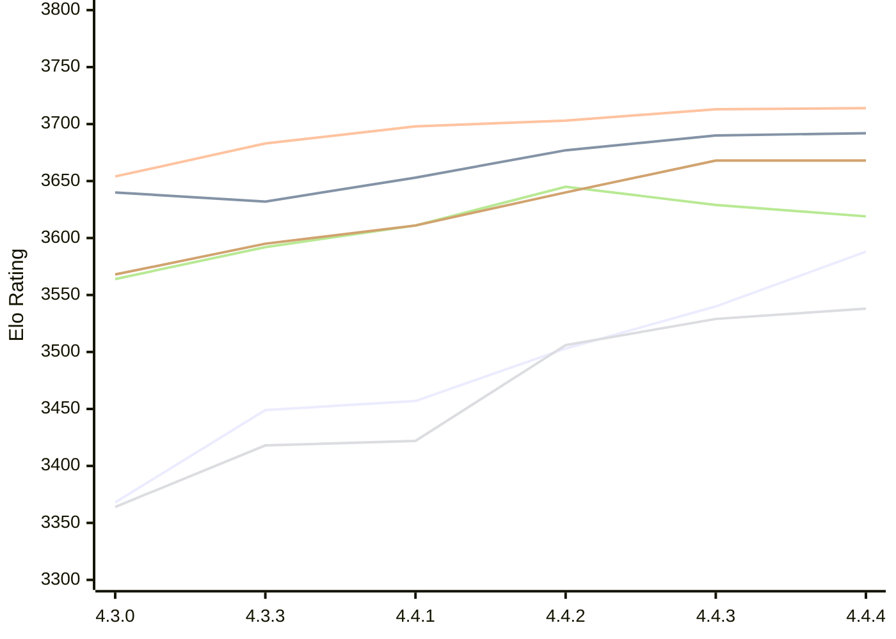
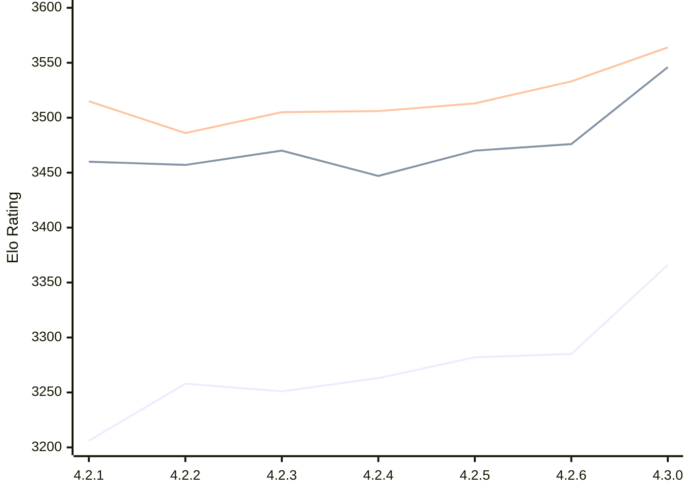

# Engine: Gaia

Author: J.-F. Romang, D. Rabel

Home: https://github.com/jromang/gaiachess

## Elo Ratings E1 (Ultra 7 265T (1.50 GHz) - E-Core)

| Version | Published | STC 8.0+0.08s  | LTC 60.0+0.60s | VLTC 2m24s+1.12s | Comment |
| --- | --- | --- | --- | --- | --- |
| 4.4.4 | 2026-11-18 | 3588(+48) | 3692(+2) | 3714(+1) |  |
| 4.4.3 | 2026-11-05 | 3540(+37) | 3690(+13) | 3713(+10) |  |
| 4.4.2 | 2026-10-24 | 3503(+46) | 3677(+24) | 3703(+5) |  |
| 4.4.1 | 2026-10-19 | 3457(+8) | 3653(+21) | 3698(+15) |  |
| 4.3.3 | 2026-10-08 | 3449(+81) | 3632(-8) | 3683(+29) |  |
| 4.3.0 | 2026-09-05 | 3368 | 3640 | 3654 |  |
 | | | cElo (∆ prev) | cElo (∆ prev) | cElo (∆ prev) | 

## Elo Ratings P1 (Ultra 7 265T (1.50 GHz) - P-Core)

| Version | Published | STC 8.0+0.08s  | LTC 60.0+0.60s | VLTC 2m24s+1.12s | Comment |
| --- | --- | --- | --- | --- | --- |
| 4.4.4 | 2026-11-18 | 3538(+9) | 3619(-10) | 3668(0) |  |
| 4.4.3 | 2026-11-05 | 3529(+23) | 3629(-16) | 3668(+28) |  |
| 4.4.2 | 2026-10-24 | 3506(+84) | 3645(+34) | 3640(+29) |  |
| 4.4.1 | 2026-10-19 | 3422(+4) | 3611(+19) | 3611(+16) |  |
| 4.3.3 | 2026-10-08 | 3418(+54) | 3592(+28) | 3595(+27) |  |
| 4.3.0 | 2026-09-05 | 3364 | 3564 | 3568 |  |
 | | | cElo (∆ prev) | cElo (∆ prev) | cElo (∆ prev) | 

## Elo Ratings T1 (i5-7500T 2.70GHz)

| Version | Published | STC 8.0+0.08s  | LTC 60.0+0.60s | VLTC 2m24s+1.12s | Comment |
| --- | --- | --- | --- | --- | --- |
| 4.3.0 | 2026-09-05 | 3366(+81) | 3546(+70) | 3564(+31) |  |
| 4.2.6 | 2026-08-29 | 3285(+3) | 3476(+6) | 3533(+20) |  |
| 4.2.5 | 2026-08-24 | 3282(+19) | 3470(+23) | 3513(+7) |  |
| 4.2.4 | 2026-08-23 | 3263(+12) | 3447(-23) | 3506(+1) |  |
| 4.2.3 | 2026-08-21 | 3251(-7) | 3470(+13) | 3505(+19) |  |
| 4.2.2 | 2026-08-13 | 3258(+52) | 3457(-3) | 3486(-29) |  |
| 4.2.1 | 2026-08-09 | 3206 | 3460 | 3515 |  |
 | | | cElo (∆ prev) | cElo (∆ prev) | cElo (∆ prev) | 

<a href="https://github.com/computer-chess-index/cci/issues/new?template=submit-version.yml&title=[VERSION]+Gaia+<version>&body=###%20Engine%20name%0AGaia%0A%0A###%20Version%0A4.3.0" target="_blank">Submit new version</a>

 Test Conditions:

GUI/CLI: <a href=https://github.com/cutechess/cutechess target="_blank">Cute-Chess</a> 
Elo Calculation: <a href=https://www.remi-coulom.fr/Bayesian-Elo/ target="_blank">Bayesian-Elo</a> 
CPU for P1: Intel(R) Core(TM) Ultra 7 265T (1.50 GHz) - P-Core 
CPU for E1: Intel(R) Core(TM) Ultra 7 265T (1.50 GHz) - E-Core 
CPU for T1: Intel(R) Core(TM) i5-7500T 2.70GHz 
Opening book: 8_moves_v3 
\* STC: 8.0+0.08s, LTC: 60.0+0.60s, VLTC: 2m24s+1.12s

 Lists:
Ratings: <a href=https://github.com/computer-chess-index/cci/blob/main/lists/CCIRatings.csv target="_blank">Complete list</a>

Generated: 2026-11-20 05:38:33

## Ratings Verlauf E1 / P1

```mermaid
%%{init: {"theme":"base","themeVariables":{"seriesColors:['#a3a3a3','#222221','#faa371']}}}%%
xychart-beta
  x-axis ["4.3.0", "4.3.3", "4.4.1", "4.4.2", "4.4.3", "4.4.4"]
  y-axis "Elo Rating" 3300 --> 3800
  line "E1: STC (8.0+0.08s)" [3368, 3449, 3457, 3503, 3540, 3588]
  line "E1: LTC (60.0+0.60s)" [3640, 3632, 3653, 3677, 3690, 3692]
  line "E1: VLTC (2m24s+1.12s)" [3654, 3683, 3698, 3703, 3713, 3714]
  line "P1: STC (8.0+0.08s)" [3364, 3418, 3422, 3506, 3529, 3538]
  line "P1: LTC (60.0+0.60s)" [3564, 3592, 3611, 3645, 3629, 3619]
  line "P1: VLTC (2m24s+1.12s)" [3568, 3595, 3611, 3640, 3668, 3668]
```

## Ratings Verlauf T1

```mermaid
%%{init: {"theme":"base","themeVariables":{"seriesColors:['#a3a3a3','#222221','#faa371']}}}%%
xychart-beta
  x-axis ["4.2.1", "4.2.2", "4.2.3", "4.2.4", "4.2.5", "4.2.6", "4.3.0"]
  y-axis "Elo Rating" 3200 --> 3600
  line "T1: STC (8.0+0.08s)" [3206, 3258, 3251, 3263, 3282, 3285, 3366]
  line "T1: LTC (60.0+0.60s)" [3460, 3457, 3470, 3447, 3470, 3476, 3546]
  line "T1: VLTC (2m24s+1.12s)" [3515, 3486, 3505, 3506, 3513, 3533, 3564]
```

## Detailed Evaluation Results

| Version | Time Control | Variant | Elo  | Range +/- | Matches | Score | Average Opponent Elo | Draws |
| --- | --- |--- | --- | --- | --- | --- | --- | --- |
| 4.4.4 | VLTC (2m24s+1.12s) | P1 | 3668 | 112 | 16 | 50% | 3668 | 100% |
|  |  | E1 | 3714 | 54 | 76 | 51% | 3706 | 89% |
|  | LTC (60.0+0.60s) | P1 | 3619 | 81 | 32 | 50% | 3619 | 100% |
|  |  | E1 | 3692 | 55 | 72 | 51% | 3690 | 96% |
|  | STC (8.0+0.08s) | P1 | 3538 | 88 | 28 | 52% | 3528 | 89% |
|  |  | E1 | 3588 | 41 | 140 | 53% | 3569 | 77% |
| --- | --- |--- | --- | --- | --- | --- | --- | --- |
| 4.4.3 | VLTC (2m24s+1.12s) | P1 | 3668 | 48 | 96 | 52% | 3659 | 89% |
|  |  | E1 | 3713 | 29 | 264 | 52% | 3702 | 92% |
|  | LTC (60.0+0.60s) | P1 | 3629 | 55 | 72 | 51% | 3625 | 93% |
|  |  | E1 | 3690 | 32 | 216 | 50% | 3692 | 94% |
|  | STC (8.0+0.08s) | P1 | 3529 | 46 | 112 | 48% | 3540 | 82% |
|  |  | E1 | 3540 | 31 | 242 | 49% | 3545 | 79% |
| --- | --- |--- | --- | --- | --- | --- | --- | --- |
| 4.4.2 | VLTC (2m24s+1.12s) | P1 | 3640 | 59 | 64 | 51% | 3633 | 89% |
|  |  | E1 | 3703 | 37 | 164 | 52% | 3692 | 90% |
|  | LTC (60.0+0.60s) | P1 | 3645 | 54 | 76 | 52% | 3632 | 91% |
|  |  | E1 | 3677 | 38 | 152 | 50% | 3676 | 91% |
|  | STC (8.0+0.08s) | P1 | 3506 | 40 | 144 | 49% | 3514 | 83% |
|  |  | E1 | 3503 | 32 | 235 | 50% | 3503 | 78% |
| --- | --- |--- | --- | --- | --- | --- | --- | --- |
| 4.4.1 | VLTC (2m24s+1.12s) | P1 | 3611 | 57 | 70 | 51% | 3602 | 89% |
|  |  | E1 | 3698 | 33 | 204 | 52% | 3683 | 90% |
|  | LTC (60.0+0.60s) | P1 | 3611 | 52 | 84 | 49% | 3614 | 85% |
|  |  | E1 | 3653 | 40 | 136 | 49% | 3661 | 92% |
|  | STC (8.0+0.08s) | P1 | 3422 | 50 | 96 | 51% | 3416 | 75% |
|  |  | E1 | 3457 | 38 | 176 | 52% | 3441 | 68% |
| --- | --- |--- | --- | --- | --- | --- | --- | --- |
| 4.3.3 | VLTC (2m24s+1.12s) | P1 | 3595 | 72 | 42 | 50% | 3595 | 90% |
|  |  | E1 | 3683 | 41 | 134 | 50% | 3686 | 89% |
|  | LTC (60.0+0.60s) | P1 | 3592 | 64 | 54 | 50% | 3592 | 93% |
|  |  | E1 | 3632 | 46 | 108 | 49% | 3638 | 89% |
|  | STC (8.0+0.08s) | P1 | 3418 | 38 | 160 | 53% | 3398 | 81% |
|  |  | E1 | 3449 | 42 | 144 | 50% | 3449 | 65% |
| --- | --- |--- | --- | --- | --- | --- | --- | --- |
| 4.3.0 | VLTC (2m24s+1.12s) | T1 | 3564 | 35 | 186 | 51% | 3561 | 91% |
|  |  | P1 | 3568 | 42 | 128 | 50% | 3571 | 90% |
|  |  | E1 | 3654 | 38 | 156 | 51% | 3649 | 91% |
|  | LTC (60.0+0.60s) | P1 | 3564 | 41 | 134 | 51% | 3559 | 88% |
|  |  | E1 | 3640 | 35 | 192 | 51% | 3632 | 83% |
|  |  | T1 | 3546 | 30 | 252 | 50% | 3548 | 86% |
|  | STC (8.0+0.08s) | P1 | 3364 | 37 | 190 | 51% | 3355 | 66% |
|  |  | E1 | 3368 | 29 | 304 | 48% | 3383 | 68% |
|  |  | T1 | 3366 | 31 | 266 | 49% | 3372 | 70% |
| --- | --- |--- | --- | --- | --- | --- | --- | --- |
| 4.2.6 | VLTC (2m24s+1.12s) | T1 | 3533 | 33 | 208 | 50% | 3530 | 84% |
|  | LTC (60.0+0.60s) | T1 | 3476 | 31 | 250 | 51% | 3470 | 81% |
|  | STC (8.0+0.08s) | T1 | 3285 | 33 | 232 | 50% | 3282 | 66% |
| --- | --- |--- | --- | --- | --- | --- | --- | --- |
| 4.2.5 | VLTC (2m24s+1.12s) | T1 | 3513 | 28 | 300 | 51% | 3507 | 79% |
|  | LTC (60.0+0.60s) | T1 | 3470 | 28 | 306 | 51% | 3461 | 76% |
|  | STC (8.0+0.08s) | T1 | 3282 | 33 | 236 | 52% | 3263 | 63% |
| --- | --- |--- | --- | --- | --- | --- | --- | --- |
| 4.2.4 | VLTC (2m24s+1.12s) | T1 | 3506 | 31 | 248 | 49% | 3513 | 79% |
|  | LTC (60.0+0.60s) | T1 | 3447 | 33 | 226 | 51% | 3444 | 77% |
|  | STC (8.0+0.08s) | T1 | 3263 | 33 | 238 | 47% | 3281 | 66% |
| --- | --- |--- | --- | --- | --- | --- | --- | --- |
| 4.2.3 | VLTC (2m24s+1.12s) | T1 | 3505 | 36 | 190 | 51% | 3499 | 77% |
|  | LTC (60.0+0.60s) | T1 | 3470 | 30 | 266 | 48% | 3483 | 80% |
|  | STC (8.0+0.08s) | T1 | 3251 | 35 | 212 | 49% | 3262 | 64% |
| --- | --- |--- | --- | --- | --- | --- | --- | --- |
| 4.2.2 | VLTC (2m24s+1.12s) | T1 | 3486 | 32 | 240 | 50% | 3487 | 79% |
|  | LTC (60.0+0.60s) | T1 | 3457 | 32 | 236 | 50% | 3457 | 77% |
|  | STC (8.0+0.08s) | T1 | 3258 | 33 | 248 | 51% | 3255 | 60% |
| --- | --- |--- | --- | --- | --- | --- | --- | --- |
| 4.2.1 | VLTC (2m24s+1.12s) | T1 | 3515 | 56 | 88 | 59% | 3356 | 69% |
|  | LTC (60.0+0.60s) | T1 | 3460 | 47 | 128 | 59% | 3287 | 63% |
|  | STC (8.0+0.08s) | T1 | 3206 | 45 | 152 | 56% | 3082 | 53% |