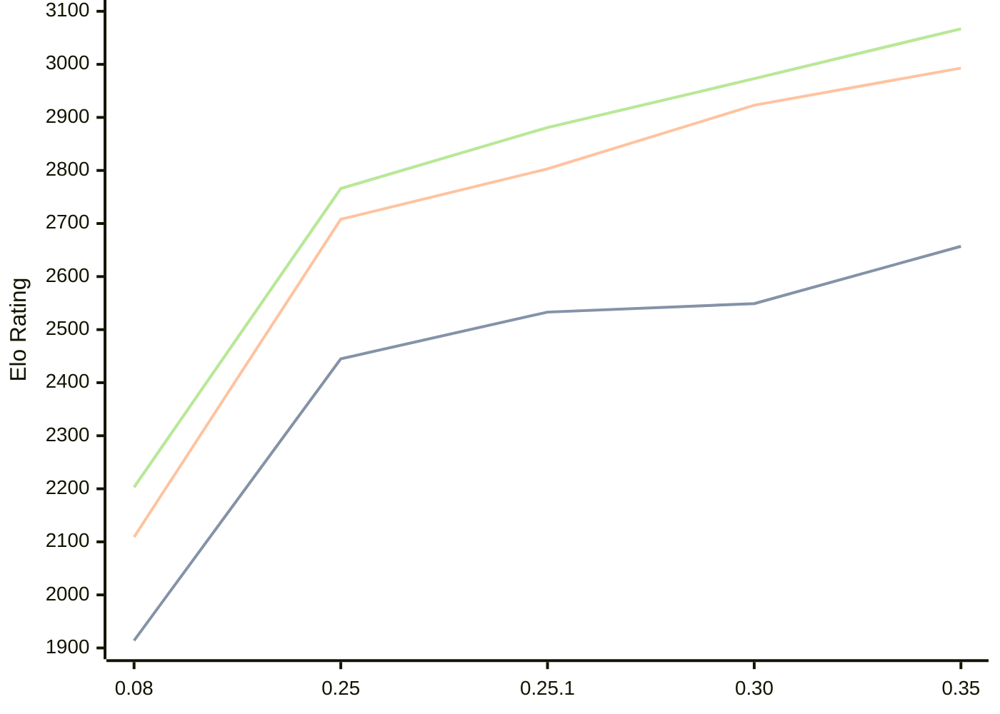

# Engine: Gecko

Author: Bingwen Yang

Home: https://github.com/sgtqwq/Gecko

## Elo Ratings

| Version | Published | STC 8.0+0.08s  | LTC 60.0+0.60s | VLTC 2m24s+1.12s | Comment |
| --- | --- | --- | --- | --- | --- |
| 0.35 | 2026-05-13 | 2657(+108) | 2993(+70) | 3067(+94) |  |
| 0.30 | 2026-05-01 | 2549(+16) | 2923(+120) | 2973(+92) |  |
| 0.25.1 | 2026-04-12 | 2533(+88) | 2803(+95) | 2881(+115) |  |
| 0.25 | 2026-04-06 | 2445(+531) | 2708(+599) | 2766(+563) |  |
| 0.08 | 2026-02-05 | 1914 | 2109 | 2203 |  |
 | | | cElo (∆ prev) | cElo (∆ prev) | cElo (∆ prev) | 

<a href="https://github.com/computer-chess-index/cci/issues/new?template=submit-version.yml&title=[VERSION]+Gecko+<version>&body=###%20Engine%20name%0AGecko%0A%0A###%20Version%0A0.35" target="_blank">Submit new version</a>

 Test Conditions:

GUI/CLI: <a href=https://github.com/cutechess/cutechess target="_blank">Cute-Chess</a> 
Elo Calculation: <a href=https://www.remi-coulom.fr/Bayesian-Elo/ target="_blank">Bayesian-Elo</a> 
CPU: Intel(R) Core(TM) i5-7500T 2.70GHz 
Opening book: 8_moves_v3 
\* STC: 8.0+0.08s, LTC: 60.0+0.60s, VLTC: 2m24s+1.12s

 Lists:
Ratings: <a href=https://github.com/computer-chess-index/cci/blob/main/lists/CCIRatings.csv target="_blank">Complete list</a>

Generated: 2026-05-18 06:24:34

## Ratings Verlauf

⬛ STC (8.0+0.08s) &nbsp;&nbsp; 🟧 LTC (60.0+0.60s) &nbsp;&nbsp; 🟩 VLTC (2m24s+1.12s)

dark mode: 🟩STC (8.0+0.08s) 🟧LTC (60.0+0.60s) ⬜VLTC (2m24s+1.12s)

## Detailed Evaluation Results

| Version | Time Control | Elo  | Range +/- | Matches | Score | Average Opponent Elo | Draws |
| --- | --- | --- | --- | --- | --- | --- | --- |
| 0.35 | VLTC (2m24s+1.12s) | 3067 | 30 | 324 | 51% | 3056 | 45% |
| 0.35 | LTC (60.0+0.60s) | 2993 | 31 | 292 | 48% | 3005 | 50% |
| 0.35 | STC (8.0+0.08s) | 2657 | 33 | 300 | 50% | 2661 | 30% |
| --- | --- | --- | --- | --- | --- | --- | --- |
| 0.30 | VLTC (2m24s+1.12s) | 2973 | 32 | 304 | 51% | 2966 | 36% |
| 0.30 | LTC (60.0+0.60s) | 2923 | 30 | 336 | 49% | 2932 | 43% |
| 0.30 | STC (8.0+0.08s) | 2549 | 36 | 280 | 50% | 2545 | 22% |
| --- | --- | --- | --- | --- | --- | --- | --- |
| 0.25.1 | VLTC (2m24s+1.12s) | 2881 | 31 | 328 | 51% | 2876 | 37% |
| 0.25.1 | LTC (60.0+0.60s) | 2803 | 32 | 312 | 50% | 2804 | 33% |
| 0.25.1 | STC (8.0+0.08s) | 2533 | 31 | 356 | 51% | 2525 | 25% |
| --- | --- | --- | --- | --- | --- | --- | --- |
| 0.25 | VLTC (2m24s+1.12s) | 2766 | 36 | 236 | 55% | 2715 | 45% |
| 0.25 | LTC (60.0+0.60s) | 2708 | 36 | 228 | 57% | 2645 | 47% |
| 0.25 | STC (8.0+0.08s) | 2445 | 37 | 236 | 55% | 2399 | 36% |
| --- | --- | --- | --- | --- | --- | --- | --- |
| 0.08 | VLTC (2m24s+1.12s) | 2203 | 28 | 392 | 46% | 2252 | 40% |
| 0.08 | LTC (60.0+0.60s) | 2109 | 29 | 384 | 48% | 2136 | 35% |
| 0.08 | STC (8.0+0.08s) | 1914 | 31 | 356 | 48% | 1939 | 31% |
| --- | --- | --- | --- | --- | --- | --- | --- |