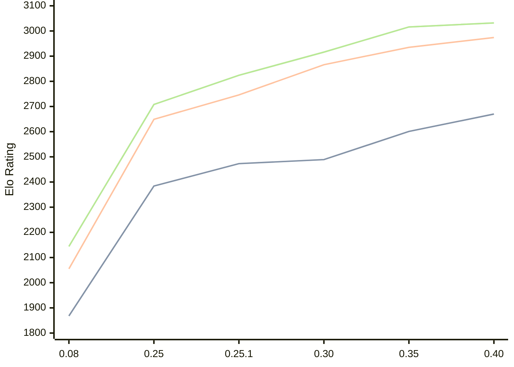

# Engine: Gecko

Author: Bingwen Yang

Home: https://github.com/sgtqwq/Gecko

## Elo Ratings

| Version | Published | STC 8.0+0.08s  | LTC 60.0+0.60s | VLTC 2m24s+1.12s | Comment |
| --- | --- | --- | --- | --- | --- |
| 0.40 | 2026-06-11 | 2670(+69) | 2974(+39) | 3032(+16) |  |
| 0.35 | 2026-05-13 | 2601(+112) | 2935(+69) | 3016(+100) |  |
| 0.30 | 2026-05-01 | 2489(+16) | 2866(+120) | 2916(+92) |  |
| 0.25.1 | 2026-04-12 | 2473(+89) | 2746(+97) | 2824(+116) |  |
| 0.25 | 2026-04-06 | 2384(+516) | 2649(+594) | 2708(+564) |  |
| 0.08 | 2026-02-05 | 1868 | 2055 | 2144 |  |
 | | | cElo (∆ prev) | cElo (∆ prev) | cElo (∆ prev) | 

<a href="https://github.com/computer-chess-index/cci/issues/new?template=submit-version.yml&title=[VERSION]+Gecko+<version>&body=###%20Engine%20name%0AGecko%0A%0A###%20Version%0A0.40" target="_blank">Submit new version</a>

 Test Conditions:

GUI/CLI: <a href=https://github.com/cutechess/cutechess target="_blank">Cute-Chess</a> 
Elo Calculation: <a href=https://www.remi-coulom.fr/Bayesian-Elo/ target="_blank">Bayesian-Elo</a> 
CPU: Intel(R) Core(TM) i5-7500T 2.70GHz 
Opening book: 8_moves_v3 
\* STC: 8.0+0.08s, LTC: 60.0+0.60s, VLTC: 2m24s+1.12s

 Lists:
Ratings: <a href=https://github.com/computer-chess-index/cci/blob/main/lists/CCIRatings.csv target="_blank">Complete list</a>

Generated: 2026-07-24 06:25:49

## Ratings Verlauf

⬛ STC (8.0+0.08s) &nbsp;&nbsp; 🟧 LTC (60.0+0.60s) &nbsp;&nbsp; 🟩 VLTC (2m24s+1.12s)

dark mode: 🟩STC (8.0+0.08s) 🟧LTC (60.0+0.60s) ⬜VLTC (2m24s+1.12s)

## Detailed Evaluation Results

| Version | Time Control | Elo  | Range +/- | Matches | Score | Average Opponent Elo | Draws |
| --- | --- | --- | --- | --- | --- | --- | --- |
| 0.40 | VLTC (2m24s+1.12s) | 3032 | 30 | 324 | 51% | 3020 | 45% |
| 0.40 | LTC (60.0+0.60s) | 2974 | 31 | 330 | 50% | 2977 | 40% |
| 0.40 | STC (8.0+0.08s) | 2670 | 30 | 364 | 50% | 2670 | 33% |
| --- | --- | --- | --- | --- | --- | --- | --- |
| 0.35 | VLTC (2m24s+1.12s) | 3016 | 28 | 388 | 51% | 3006 | 45% |
| 0.35 | LTC (60.0+0.60s) | 2935 | 30 | 324 | 49% | 2946 | 49% |
| 0.35 | STC (8.0+0.08s) | 2601 | 31 | 340 | 50% | 2603 | 31% |
| --- | --- | --- | --- | --- | --- | --- | --- |
| 0.30 | VLTC (2m24s+1.12s) | 2916 | 32 | 304 | 51% | 2909 | 36% |
| 0.30 | LTC (60.0+0.60s) | 2866 | 30 | 336 | 49% | 2876 | 43% |
| 0.30 | STC (8.0+0.08s) | 2489 | 36 | 280 | 50% | 2487 | 22% |
| --- | --- | --- | --- | --- | --- | --- | --- |
| 0.25.1 | VLTC (2m24s+1.12s) | 2824 | 31 | 328 | 51% | 2819 | 37% |
| 0.25.1 | LTC (60.0+0.60s) | 2746 | 32 | 312 | 50% | 2747 | 33% |
| 0.25.1 | STC (8.0+0.08s) | 2473 | 31 | 356 | 51% | 2464 | 25% |
| --- | --- | --- | --- | --- | --- | --- | --- |
| 0.25 | VLTC (2m24s+1.12s) | 2708 | 36 | 236 | 55% | 2657 | 45% |
| 0.25 | LTC (60.0+0.60s) | 2649 | 36 | 228 | 57% | 2585 | 47% |
| 0.25 | STC (8.0+0.08s) | 2384 | 37 | 236 | 55% | 2340 | 36% |
| --- | --- | --- | --- | --- | --- | --- | --- |
| 0.08 | VLTC (2m24s+1.12s) | 2144 | 28 | 392 | 46% | 2194 | 40% |
| 0.08 | LTC (60.0+0.60s) | 2055 | 29 | 384 | 48% | 2082 | 35% |
| 0.08 | STC (8.0+0.08s) | 1868 | 31 | 356 | 48% | 1891 | 31% |
| --- | --- | --- | --- | --- | --- | --- | --- |