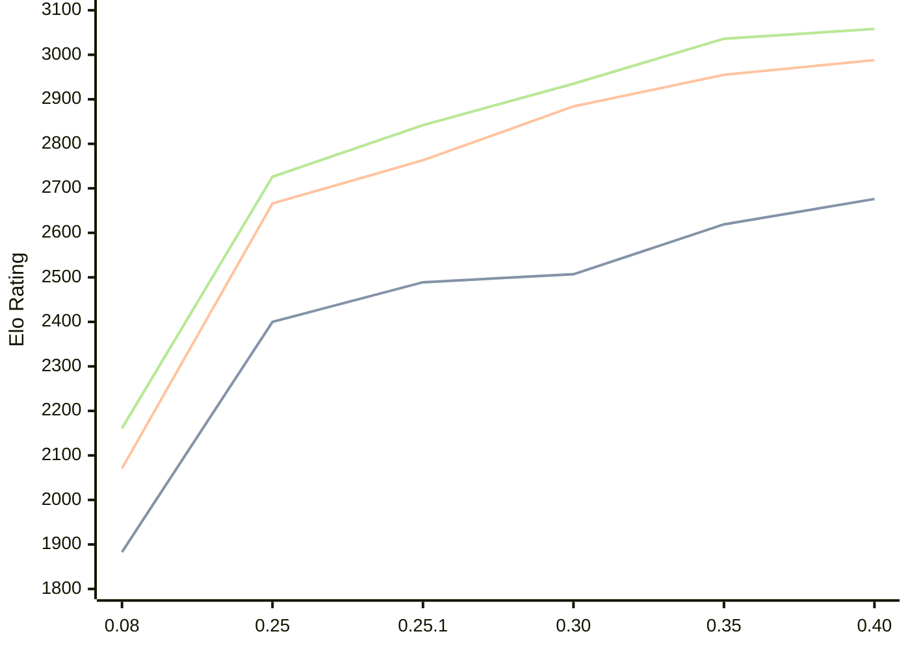

# Engine: Gecko

Author: Bingwen Yang

Home: https://github.com/sgtqwq/Gecko

## Elo Ratings E1

| Version | Published | STC 8.0+0.08s  | LTC 60.0+0.60s | VLTC 2m24s+1.12s | Comment |
| --- | --- | --- | --- | --- | --- |
| 0.40 | 2026-06-11 | 2496 | 2889 | 2962 |  |
 | | | cElo (∆ prev) | cElo (∆ prev) | cElo (∆ prev) | 

## Elo Ratings P1

| Version | Published | STC 8.0+0.08s  | LTC 60.0+0.60s | VLTC 2m24s+1.12s | Comment |
| --- | --- | --- | --- | --- | --- |
| 0.40 | 2026-06-11 | 2780 | 3148 | 3245 |  |
 | | | cElo (∆ prev) | cElo (∆ prev) | cElo (∆ prev) | 

## Elo Ratings T1

| Version | Published | STC 8.0+0.08s  | LTC 60.0+0.60s | VLTC 2m24s+1.12s | Comment |
| --- | --- | --- | --- | --- | --- |
| 0.40 | 2026-06-11 | 2676(+57) | 2988(+33) | 3058(+22) |  |
| 0.35 | 2026-05-13 | 2619(+112) | 2955(+71) | 3036(+101) |  |
| 0.30 | 2026-05-01 | 2507(+18) | 2884(+121) | 2935(+93) |  |
| 0.25.1 | 2026-04-12 | 2489(+89) | 2763(+97) | 2842(+116) |  |
| 0.25 | 2026-04-06 | 2400(+517) | 2666(+595) | 2726(+565) |  |
| 0.08 | 2026-02-05 | 1883 | 2071 | 2161 |  |
 | | | cElo (∆ prev) | cElo (∆ prev) | cElo (∆ prev) | 

<a href="https://github.com/computer-chess-index/cci/issues/new?template=submit-version.yml&title=[VERSION]+Gecko+<version>&body=###%20Engine%20name%0AGecko%0A%0A###%20Version%0A0.40" target="_blank">Submit new version</a>

 Test Conditions:

GUI/CLI: <a href=https://github.com/cutechess/cutechess target="_blank">Cute-Chess</a> 
Elo Calculation: <a href=https://www.remi-coulom.fr/Bayesian-Elo/ target="_blank">Bayesian-Elo</a> 
CPU for P1: Intel(R) Core(TM) Ultra 7 265T (1.50 GHz) - P-Core 
CPU for E1: Intel(R) Core(TM) Ultra 7 265T (1.50 GHz) - E-Core 
CPU for T1: Intel(R) Core(TM) i5-7500T 2.70GHz 
Opening book: 8_moves_v3 
\* STC: 8.0+0.08s, LTC: 60.0+0.60s, VLTC: 2m24s+1.12s

 Lists:
Ratings: <a href=https://github.com/computer-chess-index/cci/blob/main/lists/CCIRatings.csv target="_blank">Complete list</a>

Generated: 2026-10-10 04:38:47

## Ratings Verlauf

```mermaid
%%{init: {"theme":"base","themeVariables":{"seriesColors:['#a3a3a3','#222221','#faa371']}}}%%
xychart-beta
  x-axis ["0.08", "0.25", "0.25.1", "0.30", "0.35", "0.40"]
  y-axis "Elo Rating" 1800 --> 3100
  line "" [1883, 2400, 2489, 2507, 2619, 2676]
  line "STC (8.0+0.08s)" [1883, 2400, 2489, 2507, 2619, 2676]
  line "LTC (60.0+0.60s)" [2071, 2666, 2763, 2884, 2955, 2988]
  line "" [2161, 2726, 2842, 2935, 3036, 3058]
  line "VLTC (2m24s+1.12s)" [2161, 2726, 2842, 2935, 3036, 3058]
```

## Detailed Evaluation Results

| Version | Time Control | Elo  | Range +/- | Matches | Score | Average Opponent Elo | Draws |
| --- | --- | --- | --- | --- | --- | --- | --- |
| 0.40 | VLTC (2m24s+1.12s) | 2962 | 37 | 240 | 53% | 2878 | 39% |
| 0.40 | VLTC (2m24s+1.12s) | 3058 | 27 | 394 | 52% | 3043 | 44% |
| 0.40 | VLTC (2m24s+1.12s) | 3245 | 44 | 164 | 56% | 3170 | 41% |
| 0.40 | LTC (60.0+0.60s) | 2889 | 36 | 276 | 56% | 2785 | 31% |
| 0.40 | LTC (60.0+0.60s) | 2988 | 27 | 422 | 49% | 2994 | 41% |
| 0.40 | LTC (60.0+0.60s) | 3148 | 43 | 178 | 52% | 3114 | 34% |
| 0.40 | STC (8.0+0.08s) | 2496 | 37 | 256 | 43% | 2560 | 25% |
| --- | --- | --- | --- | --- | --- | --- | --- |
| 0.40 | STC (8.0+0.08s) | 2676 | 26 | 484 | 49% | 2685 | 35% |
| --- | --- | --- | --- | --- | --- | --- | --- |
| 0.40 | STC (8.0+0.08s) | 2780 | 42 | 194 | 46% | 2832 | 29% |
| --- | --- | --- | --- | --- | --- | --- | --- |
| 0.35 | VLTC (2m24s+1.12s) | 3036 | 28 | 388 | 51% | 3027 | 45% |
| 0.35 | LTC (60.0+0.60s) | 2955 | 30 | 324 | 49% | 2965 | 49% |
| 0.35 | STC (8.0+0.08s) | 2619 | 31 | 340 | 50% | 2620 | 31% |
| --- | --- | --- | --- | --- | --- | --- | --- |
| 0.30 | VLTC (2m24s+1.12s) | 2935 | 32 | 304 | 51% | 2928 | 36% |
| 0.30 | LTC (60.0+0.60s) | 2884 | 30 | 336 | 49% | 2893 | 43% |
| 0.30 | STC (8.0+0.08s) | 2507 | 36 | 280 | 50% | 2503 | 22% |
| --- | --- | --- | --- | --- | --- | --- | --- |
| 0.25.1 | VLTC (2m24s+1.12s) | 2842 | 31 | 328 | 51% | 2836 | 37% |
| 0.25.1 | LTC (60.0+0.60s) | 2763 | 32 | 312 | 50% | 2763 | 33% |
| 0.25.1 | STC (8.0+0.08s) | 2489 | 31 | 356 | 51% | 2481 | 25% |
| --- | --- | --- | --- | --- | --- | --- | --- |
| 0.25 | VLTC (2m24s+1.12s) | 2726 | 36 | 236 | 55% | 2674 | 45% |
| 0.25 | LTC (60.0+0.60s) | 2666 | 36 | 228 | 57% | 2603 | 47% |
| 0.25 | STC (8.0+0.08s) | 2400 | 37 | 236 | 55% | 2354 | 36% |
| --- | --- | --- | --- | --- | --- | --- | --- |
| 0.08 | VLTC (2m24s+1.12s) | 2161 | 28 | 392 | 46% | 2211 | 40% |
| 0.08 | LTC (60.0+0.60s) | 2071 | 29 | 384 | 48% | 2099 | 35% |
| 0.08 | STC (8.0+0.08s) | 1883 | 31 | 356 | 48% | 1908 | 31% |
| --- | --- | --- | --- | --- | --- | --- | --- |