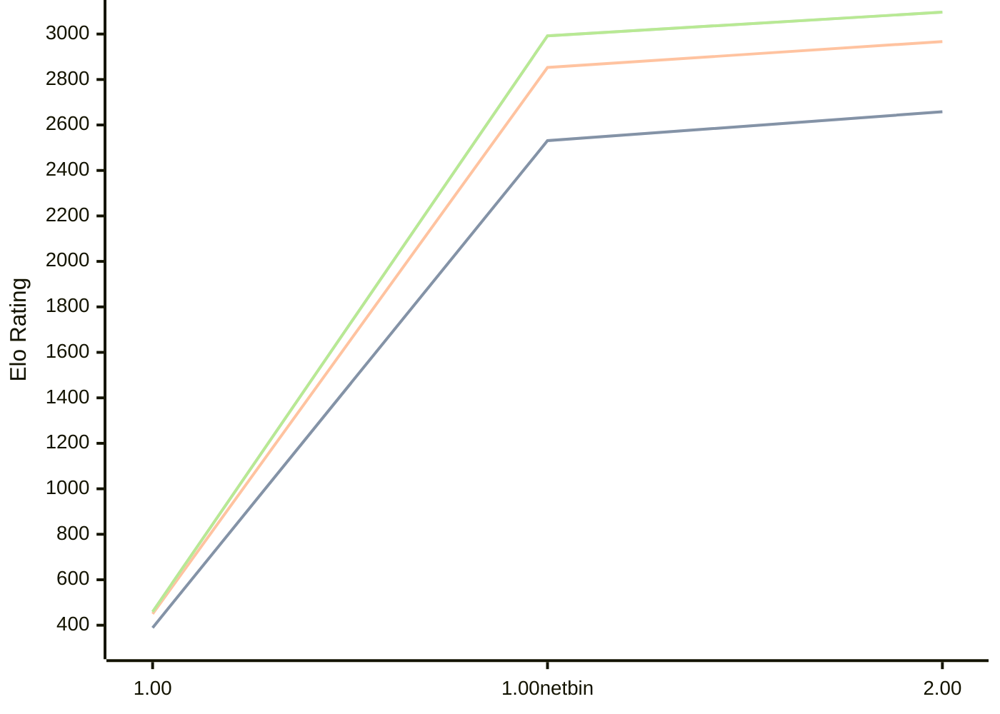

# Engine: Gilipol

Author: José Carlos Martínez Galán

Home: https://github.com/Lacovipo/Gilipol

## Elo Ratings

| Version | Published | STC 8.0+0.08s  | LTC 60.0+0.60s | VLTC 2m24s+1.12s | Comment |
| --- | --- | --- | --- | --- | --- |
| 2.00 | 2026-06-06 | 2658(+127) | 2967(+114) | 3096(+104) |  |
| 1.00netbin | 2026-04-13 | 2531(+2142) | 2853(+2403) | 2992(+2533) |  |
| 1.00 | 2026-04-12 | 389 | 450 | 459 |  |
 | | | cElo (∆ prev) | cElo (∆ prev) | cElo (∆ prev) | 

<a href="https://github.com/computer-chess-index/cci/issues/new?template=submit-version.yml&title=[VERSION]+Gilipol+<version>&body=###%20Engine%20name%0AGilipol%0A%0A###%20Version%0A2.00" target="_blank">Submit new version</a>

 Test Conditions:

GUI/CLI: <a href=https://github.com/cutechess/cutechess target="_blank">Cute-Chess</a> 
Elo Calculation: <a href=https://www.remi-coulom.fr/Bayesian-Elo/ target="_blank">Bayesian-Elo</a> 
CPU: Intel(R) Core(TM) i5-7500T 2.70GHz 
Opening book: 8_moves_v3 
\* STC: 8.0+0.08s, LTC: 60.0+0.60s, VLTC: 2m24s+1.12s

 Lists:
Ratings: <a href=https://github.com/computer-chess-index/cci/blob/main/lists/CCIRatings.csv target="_blank">Complete list</a>

Generated: 2026-07-17 06:25:10

## Ratings Verlauf

## Ratings Verlauf

⬛ STC (8.0+0.08s) &nbsp;&nbsp; 🟧 LTC (60.0+0.60s) &nbsp;&nbsp; 🟩 VLTC (2m24s+1.12s)

dark mode: 🟩STC (8.0+0.08s) 🟧LTC (60.0+0.60s) ⬜VLTC (2m24s+1.12s)

## Detailed Evaluation Results

| Version | Time Control | Elo  | Range +/- | Matches | Score | Average Opponent Elo | Draws |
| --- | --- | --- | --- | --- | --- | --- | --- |
| 2.00 | VLTC (2m24s+1.12s) | 3096 | 28 | 370 | 53% | 3067 | 53% |
| 2.00 | LTC (60.0+0.60s) | 2967 | 30 | 340 | 50% | 2959 | 45% |
| 2.00 | STC (8.0+0.08s) | 2658 | 32 | 324 | 52% | 2635 | 32% |
| --- | --- | --- | --- | --- | --- | --- | --- |
| 1.00netbin | VLTC (2m24s+1.12s) | 2992 | 28 | 426 | 57% | 2773 | 41% |
| 1.00netbin | LTC (60.0+0.60s) | 2853 | 25 | 546 | 59% | 2674 | 39% |
| 1.00netbin | STC (8.0+0.08s) | 2531 | 28 | 470 | 55% | 2369 | 28% |
| --- | --- | --- | --- | --- | --- | --- | --- |
| 1.00 | VLTC (2m24s+1.12s) | 459 | 58 | 176 | 24% | 1046 | 21% |
| 1.00 | LTC (60.0+0.60s) | 450 | 59 | 148 | 27% | 940 | 30% |
| 1.00 | STC (8.0+0.08s) | 389 | 55 | 132 | 34% | 728 | 40% |
| --- | --- | --- | --- | --- | --- | --- | --- |