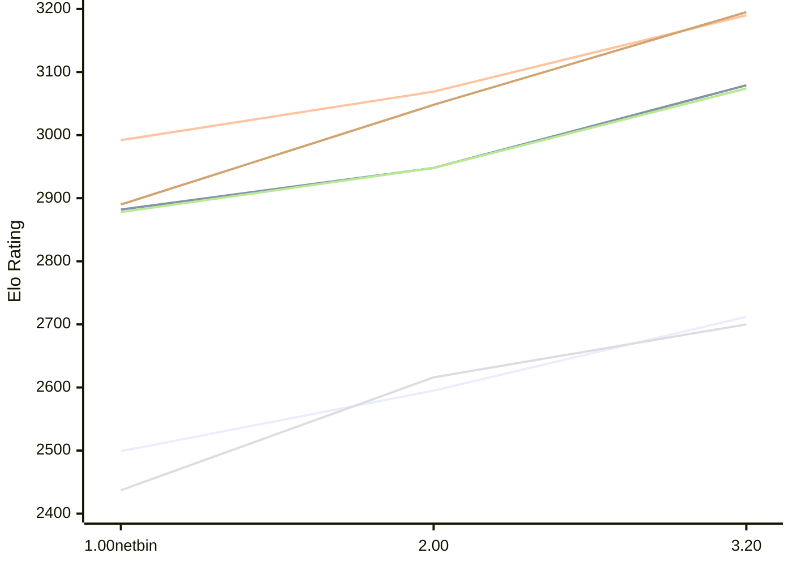
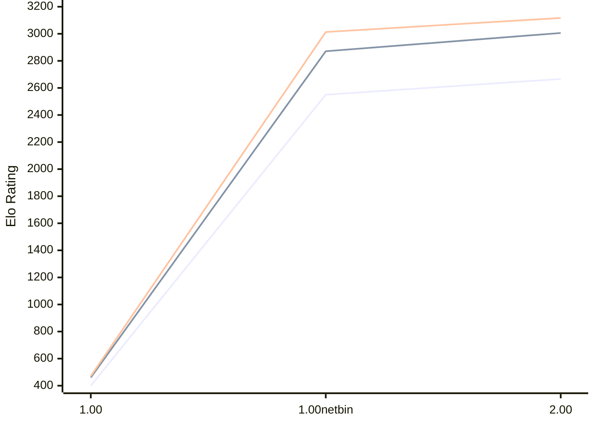

# Engine: Gilipol

Author: José Carlos Martínez Galán

Home: https://github.com/Lacovipo/Gilipol

## Elo Ratings E1 (Ultra 7 265T (1.50 GHz) - E-Core)

| Version | Published | STC 8.0+0.08s  | LTC 60.0+0.60s | VLTC 2m24s+1.12s | Comment |
| --- | --- | --- | --- | --- | --- |
| 3.20 | 2026-11-23 | 2712(+117) | 3079(+131) | 3190(+121) |  |
| 2.00 | 2026-06-06 | 2595(+96) | 2948(+66) | 3069(+77) |  |
| 1.00netbin | 2026-04-13 | 2499 | 2882 | 2992 |  |
 | | | cElo (∆ prev) | cElo (∆ prev) | cElo (∆ prev) | 

## Elo Ratings P1 (Ultra 7 265T (1.50 GHz) - P-Core)

| Version | Published | STC 8.0+0.08s  | LTC 60.0+0.60s | VLTC 2m24s+1.12s | Comment |
| --- | --- | --- | --- | --- | --- |
| 3.20 | 2026-11-23 | 2700(+84) | 3074(+126) | 3195(+147) |  |
| 2.00 | 2026-06-06 | 2616(+179) | 2948(+70) | 3048(+158) |  |
| 1.00netbin | 2026-04-13 | 2437 | 2878 | 2890 |  |
 | | | cElo (∆ prev) | cElo (∆ prev) | cElo (∆ prev) | 

## Elo Ratings T1 (i5-7500T 2.70GHz)

| Version | Published | STC 8.0+0.08s  | LTC 60.0+0.60s | VLTC 2m24s+1.12s | Comment |
| --- | --- | --- | --- | --- | --- |
| 2.00 | 2026-06-06 | 2666(+116) | 3006(+135) | 3117(+104) |  |
| 1.00netbin | 2026-04-13 | 2550(+2150) | 2871(+2411) | 3013(+2542) |  |
| 1.00 | 2026-04-12 | 400 | 460 | 471 |  |
 | | | cElo (∆ prev) | cElo (∆ prev) | cElo (∆ prev) | 

<a href="https://github.com/computer-chess-index/cci/issues/new?template=submit-version.yml&title=[VERSION]+Gilipol+<version>&body=###%20Engine%20name%0AGilipol%0A%0A###%20Version%0A2.00" target="_blank">Submit new version</a>

 Test Conditions:

GUI/CLI: <a href=https://github.com/cutechess/cutechess target="_blank">Cute-Chess</a> 
Elo Calculation: <a href=https://www.remi-coulom.fr/Bayesian-Elo/ target="_blank">Bayesian-Elo</a> 
CPU for P1: Intel(R) Core(TM) Ultra 7 265T (1.50 GHz) - P-Core 
CPU for E1: Intel(R) Core(TM) Ultra 7 265T (1.50 GHz) - E-Core 
CPU for T1: Intel(R) Core(TM) i5-7500T 2.70GHz 
Opening book: 8_moves_v3 
\* STC: 8.0+0.08s, LTC: 60.0+0.60s, VLTC: 2m24s+1.12s

 Lists:
Ratings: <a href=https://github.com/computer-chess-index/cci/blob/main/lists/CCIRatings.csv target="_blank">Complete list</a>

Generated: 2026-11-28 05:38:53

## Ratings Verlauf E1 / P1

```mermaid
%%{init: {"theme":"base","themeVariables":{"seriesColors:['#a3a3a3','#222221','#faa371']}}}%%
xychart-beta
  x-axis ["1.00netbin", "2.00", "3.20"]
  y-axis "Elo Rating" 2400 --> 3200
  line "E1: STC (8.0+0.08s)" [2499, 2595, 2712]
  line "E1: LTC (60.0+0.60s)" [2882, 2948, 3079]
  line "E1: VLTC (2m24s+1.12s)" [2992, 3069, 3190]
  line "P1: STC (8.0+0.08s)" [2437, 2616, 2700]
  line "P1: LTC (60.0+0.60s)" [2878, 2948, 3074]
  line "P1: VLTC (2m24s+1.12s)" [2890, 3048, 3195]
```

## Ratings Verlauf T1

```mermaid
%%{init: {"theme":"base","themeVariables":{"seriesColors:['#a3a3a3','#222221','#faa371']}}}%%
xychart-beta
  x-axis ["1.00", "1.00netbin", "2.00"]
  y-axis "Elo Rating" 400 --> 3200
  line "T1: STC (8.0+0.08s)" [400, 2550, 2666]
  line "T1: LTC (60.0+0.60s)" [460, 2871, 3006]
  line "T1: VLTC (2m24s+1.12s)" [471, 3013, 3117]
```

## Detailed Evaluation Results

| Version | Time Control | Variant | Elo  | Range +/- | Matches | Score | Average Opponent Elo | Draws |
| --- | --- |--- | --- | --- | --- | --- | --- | --- |
| 3.20 | VLTC (2m24s+1.12s) | E1 | 3190 | 35 | 216 | 54% | 3159 | 58% |
|  |  | P1 | 3195 | 51 | 108 | 51% | 3183 | 51% |
|  | LTC (60.0+0.60s) | E1 | 3079 | 36 | 212 | 51% | 3067 | 53% |
|  |  | P1 | 3074 | 35 | 224 | 47% | 3093 | 54% |
|  | STC (8.0+0.08s) | E1 | 2712 | 36 | 248 | 52% | 2691 | 36% |
|  |  | P1 | 2700 | 52 | 112 | 52% | 2678 | 40% |
| --- | --- |--- | --- | --- | --- | --- | --- | --- |
| 2.00 | VLTC (2m24s+1.12s) | T1 | 3117 | 24 | 488 | 53% | 3092 | 54% |
|  |  | P1 | 3048 | 32 | 280 | 49% | 3038 | 54% |
|  |  | E1 | 3069 | 27 | 404 | 52% | 3051 | 47% |
|  | LTC (60.0+0.60s) | T1 | 3006 | 26 | 432 | 52% | 2985 | 46% |
|  |  | P1 | 2948 | 31 | 310 | 52% | 2928 | 47% |
|  |  | E1 | 2948 | 26 | 450 | 53% | 2925 | 44% |
|  | STC (8.0+0.08s) | T1 | 2666 | 27 | 436 | 51% | 2655 | 33% |
|  |  | P1 | 2616 | 31 | 326 | 49% | 2623 | 38% |
|  |  | E1 | 2595 | 26 | 488 | 48% | 2616 | 32% |
| --- | --- |--- | --- | --- | --- | --- | --- | --- |
| 1.00netbin | VLTC (2m24s+1.12s) | P1 | 2890 | 68 | 72 | 47% | 2917 | 33% |
|  |  | E1 | 2992 | 55 | 100 | 50% | 2986 | 44% |
|  |  | T1 | 3013 | 28 | 426 | 57% | 2795 | 41% |
|  | LTC (60.0+0.60s) | P1 | 2878 | 62 | 104 | 67% | 2568 | 31% |
|  |  | E1 | 2882 | 58 | 104 | 52% | 2826 | 33% |
|  |  | T1 | 2871 | 25 | 546 | 59% | 2695 | 39% |
|  | STC (8.0+0.08s) | P1 | 2437 | 62 | 92 | 54% | 2398 | 25% |
|  |  | E1 | 2499 | 57 | 108 | 47% | 2570 | 29% |
|  |  | T1 | 2550 | 28 | 470 | 55% | 2388 | 28% |
| --- | --- |--- | --- | --- | --- | --- | --- | --- |
| 1.00 | VLTC (2m24s+1.12s) | T1 | 471 | 58 | 176 | 24% | 1060 | 21% |
|  | LTC (60.0+0.60s) | T1 | 460 | 59 | 148 | 27% | 952 | 30% |
|  | STC (8.0+0.08s) | T1 | 400 | 56 | 132 | 34% | 740 | 40% |