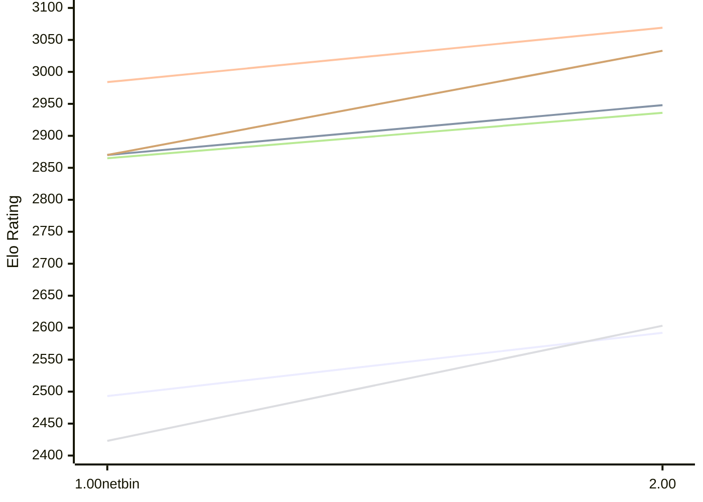
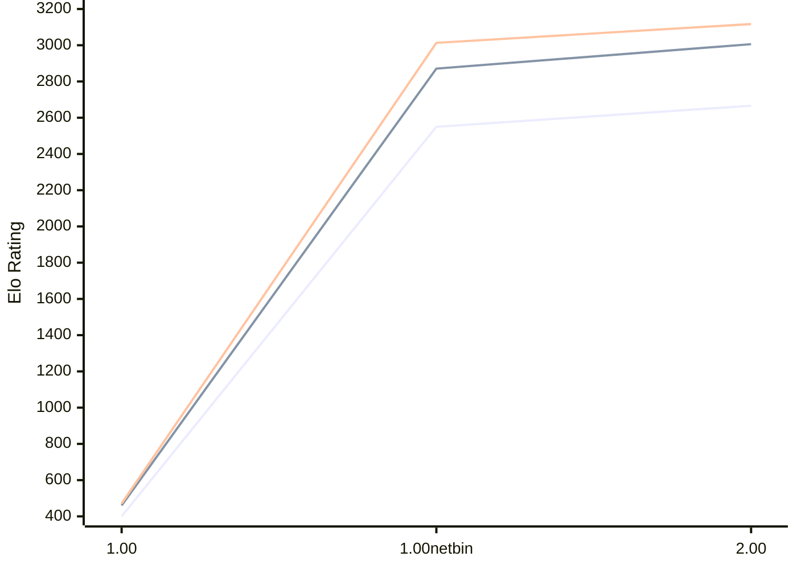

# Engine: Gilipol

Author: José Carlos Martínez Galán

Home: https://github.com/Lacovipo/Gilipol

## Elo Ratings E1 (Ultra 7 265T (1.50 GHz) - E-Core)

| Version | Published | STC 8.0+0.08s  | LTC 60.0+0.60s | VLTC 2m24s+1.12s | Comment |
| --- | --- | --- | --- | --- | --- |
| 2.00 | 2026-06-06 | 2592(+99) | 2948(+78) | 3069(+85) |  |
| 1.00netbin | 2026-04-13 | 2493 | 2870 | 2984 |  |
 | | | cElo (∆ prev) | cElo (∆ prev) | cElo (∆ prev) | 

## Elo Ratings P1 (Ultra 7 265T (1.50 GHz) - P-Core)

| Version | Published | STC 8.0+0.08s  | LTC 60.0+0.60s | VLTC 2m24s+1.12s | Comment |
| --- | --- | --- | --- | --- | --- |
| 2.00 | 2026-06-06 | 2603(+180) | 2936(+71) | 3033(+163) |  |
| 1.00netbin | 2026-04-13 | 2423 | 2865 | 2870 |  |
 | | | cElo (∆ prev) | cElo (∆ prev) | cElo (∆ prev) | 

## Elo Ratings T1 (i5-7500T 2.70GHz)

| Version | Published | STC 8.0+0.08s  | LTC 60.0+0.60s | VLTC 2m24s+1.12s | Comment |
| --- | --- | --- | --- | --- | --- |
| 2.00 | 2026-06-06 | 2666(+116) | 3006(+135) | 3117(+104) |  |
| 1.00netbin | 2026-04-13 | 2550(+2150) | 2871(+2411) | 3013(+2542) |  |
| 1.00 | 2026-04-12 | 400 | 460 | 471 |  |
 | | | cElo (∆ prev) | cElo (∆ prev) | cElo (∆ prev) | 

<a href="https://github.com/computer-chess-index/cci/issues/new?template=submit-version.yml&title=[VERSION]+Gilipol+<version>&body=###%20Engine%20name%0AGilipol%0A%0A###%20Version%0A2.00" target="_blank">Submit new version</a>

 Test Conditions:

GUI/CLI: <a href=https://github.com/cutechess/cutechess target="_blank">Cute-Chess</a> 
Elo Calculation: <a href=https://www.remi-coulom.fr/Bayesian-Elo/ target="_blank">Bayesian-Elo</a> 
CPU for P1: Intel(R) Core(TM) Ultra 7 265T (1.50 GHz) - P-Core 
CPU for E1: Intel(R) Core(TM) Ultra 7 265T (1.50 GHz) - E-Core 
CPU for T1: Intel(R) Core(TM) i5-7500T 2.70GHz 
Opening book: 8_moves_v3 
\* STC: 8.0+0.08s, LTC: 60.0+0.60s, VLTC: 2m24s+1.12s

 Lists:
Ratings: <a href=https://github.com/computer-chess-index/cci/blob/main/lists/CCIRatings.csv target="_blank">Complete list</a>

Generated: 2026-11-23 05:38:44

## Ratings Verlauf E1 / P1

```mermaid
%%{init: {"theme":"base","themeVariables":{"seriesColors:['#a3a3a3','#222221','#faa371']}}}%%
xychart-beta
  x-axis ["1.00netbin", "2.00"]
  y-axis "Elo Rating" 2400 --> 3100
  line "E1: STC (8.0+0.08s)" [2493, 2592]
  line "E1: LTC (60.0+0.60s)" [2870, 2948]
  line "E1: VLTC (2m24s+1.12s)" [2984, 3069]
  line "P1: STC (8.0+0.08s)" [2423, 2603]
  line "P1: LTC (60.0+0.60s)" [2865, 2936]
  line "P1: VLTC (2m24s+1.12s)" [2870, 3033]
```

## Ratings Verlauf T1

```mermaid
%%{init: {"theme":"base","themeVariables":{"seriesColors:['#a3a3a3','#222221','#faa371']}}}%%
xychart-beta
  x-axis ["1.00", "1.00netbin", "2.00"]
  y-axis "Elo Rating" 400 --> 3200
  line "T1: STC (8.0+0.08s)" [400, 2550, 2666]
  line "T1: LTC (60.0+0.60s)" [460, 2871, 3006]
  line "T1: VLTC (2m24s+1.12s)" [471, 3013, 3117]
```

## Detailed Evaluation Results

| Version | Time Control | Variant | Elo  | Range +/- | Matches | Score | Average Opponent Elo | Draws |
| --- | --- |--- | --- | --- | --- | --- | --- | --- |
| 2.00 | VLTC (2m24s+1.12s) | T1 | 3117 | 24 | 488 | 53% | 3092 | 54% |
|  |  | P1 | 3033 | 32 | 280 | 49% | 3021 | 54% |
|  |  | E1 | 3069 | 27 | 392 | 52% | 3052 | 47% |
|  | LTC (60.0+0.60s) | T1 | 3006 | 26 | 432 | 52% | 2985 | 46% |
|  |  | P1 | 2936 | 31 | 306 | 52% | 2913 | 46% |
|  |  | E1 | 2948 | 27 | 430 | 52% | 2925 | 43% |
|  | STC (8.0+0.08s) | T1 | 2666 | 27 | 436 | 51% | 2655 | 33% |
|  |  | P1 | 2603 | 32 | 314 | 49% | 2610 | 39% |
|  |  | E1 | 2592 | 26 | 476 | 48% | 2615 | 32% |
| --- | --- |--- | --- | --- | --- | --- | --- | --- |
| 1.00netbin | VLTC (2m24s+1.12s) | T1 | 3013 | 28 | 426 | 57% | 2795 | 41% |
|  |  | P1 | 2870 | 68 | 72 | 47% | 2897 | 33% |
|  |  | E1 | 2984 | 58 | 88 | 49% | 2982 | 44% |
|  | LTC (60.0+0.60s) | T1 | 2871 | 25 | 546 | 59% | 2695 | 39% |
|  |  | P1 | 2865 | 62 | 104 | 67% | 2556 | 31% |
|  |  | E1 | 2870 | 65 | 84 | 51% | 2817 | 32% |
|  | STC (8.0+0.08s) | T1 | 2550 | 28 | 470 | 55% | 2388 | 28% |
|  |  | P1 | 2423 | 62 | 92 | 54% | 2384 | 25% |
|  |  | E1 | 2493 | 59 | 100 | 46% | 2573 | 28% |
| --- | --- |--- | --- | --- | --- | --- | --- | --- |
| 1.00 | VLTC (2m24s+1.12s) | T1 | 471 | 58 | 176 | 24% | 1060 | 21% |
|  | LTC (60.0+0.60s) | T1 | 460 | 59 | 148 | 27% | 952 | 30% |
|  | STC (8.0+0.08s) | T1 | 400 | 56 | 132 | 34% | 740 | 40% |