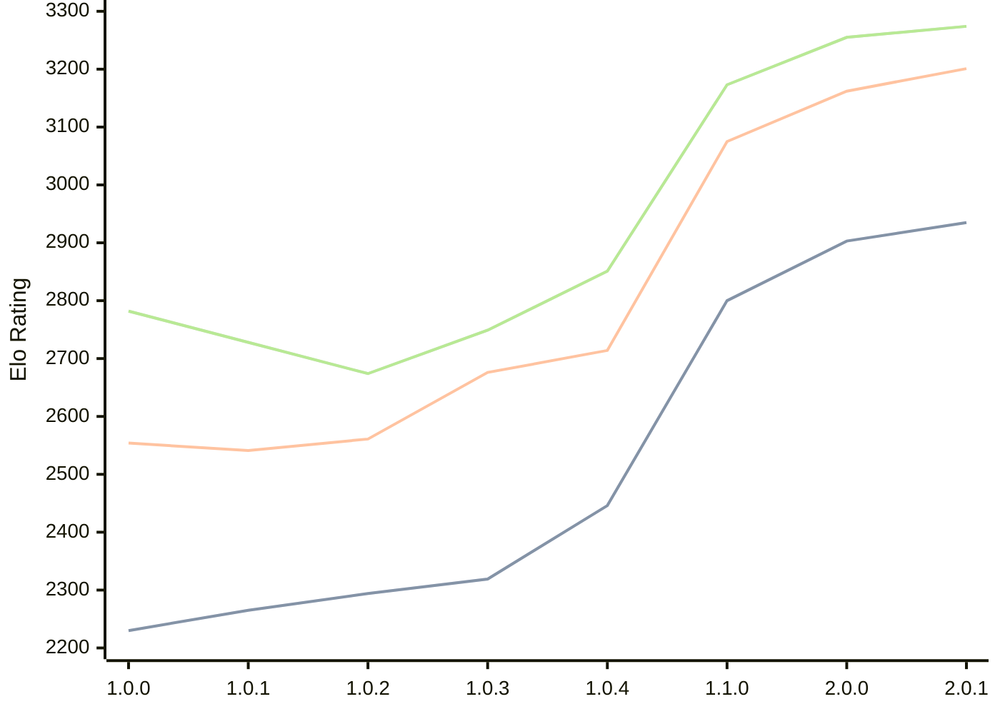

# Engine: Grail

Author: Jorgen Hanssen

Home: https://github.com/jorgenhanssen/grail

## Elo Ratings

| Version | Published | STC 8.0+0.08s  | LTC 60.0+0.60s | VLTC 2m24s+1.12s | Comment |
| --- | --- | --- | --- | --- | --- |
| 2.0.1 | 2026-06-10 | 2935(+32) | 3201(+39) | 3274(+19) |  |
| 2.0.0 | 2026-05-11 | 2903(+103) | 3162(+87) | 3255(+82) |  |
| 1.1.0 | 2026-02-28 | 2800(+354) | 3075(+361) | 3173(+322) |  |
| 1.0.4 | 2026-01-16 | 2446(+127) | 2714(+38) | 2851(+102) |  |
| 1.0.3 | 2026-01-04 | 2319(+25) | 2676(+115) | 2749(+75) |  |
| 1.0.2 | 2025-12-16 | 2294(+29) | 2561(+20) | 2674(-54) |  |
| 1.0.1 | 2025-12-10 | 2265(+35) | 2541(-13) | 2728(-54) |  |
| 1.0.0 | 2025-12-05 | 2230 | 2554 | 2782 |  |
 | | | cElo (∆ prev) | cElo (∆ prev) | cElo (∆ prev) | 

<a href="https://github.com/computer-chess-index/cci/issues/new?template=submit-version.yml&title=[VERSION]+Grail+<version>&body=###%20Engine%20name%0AGrail%0A%0A###%20Version%0A2.0.1" target="_blank">Submit new version</a>

 Test Conditions:

GUI/CLI: <a href=https://github.com/cutechess/cutechess target="_blank">Cute-Chess</a> 
Elo Calculation: <a href=https://www.remi-coulom.fr/Bayesian-Elo/ target="_blank">Bayesian-Elo</a> 
CPU: Intel(R) Core(TM) i5-7500T 2.70GHz 
Opening book: 8_moves_v3 
\* STC: 8.0+0.08s, LTC: 60.0+0.60s, VLTC: 2m24s+1.12s

 Lists:
Ratings: <a href=https://github.com/computer-chess-index/cci/blob/main/lists/CCIRatings.csv target="_blank">Complete list</a>

Generated: 2026-08-21 06:26:01

## Ratings Verlauf

⬛ STC (8.0+0.08s) &nbsp;&nbsp; 🟧 LTC (60.0+0.60s) &nbsp;&nbsp; 🟩 VLTC (2m24s+1.12s)

dark mode: 🟩STC (8.0+0.08s) 🟧LTC (60.0+0.60s) ⬜VLTC (2m24s+1.12s)

## Detailed Evaluation Results

| Version | Time Control | Elo  | Range +/- | Matches | Score | Average Opponent Elo | Draws |
| --- | --- | --- | --- | --- | --- | --- | --- |
| 2.0.1 | VLTC (2m24s+1.12s) | 3274 | 27 | 376 | 52% | 3262 | 58% |
| 2.0.1 | LTC (60.0+0.60s) | 3201 | 26 | 392 | 51% | 3197 | 59% |
| 2.0.1 | STC (8.0+0.08s) | 2935 | 26 | 430 | 52% | 2916 | 44% |
| --- | --- | --- | --- | --- | --- | --- | --- |
| 2.0.0 | VLTC (2m24s+1.12s) | 3255 | 29 | 316 | 51% | 3248 | 61% |
| 2.0.0 | LTC (60.0+0.60s) | 3162 | 29 | 322 | 48% | 3175 | 54% |
| 2.0.0 | STC (8.0+0.08s) | 2903 | 29 | 352 | 52% | 2882 | 41% |
| --- | --- | --- | --- | --- | --- | --- | --- |
| 1.1.0 | VLTC (2m24s+1.12s) | 3173 | 27 | 392 | 53% | 3154 | 53% |
| 1.1.0 | LTC (60.0+0.60s) | 3075 | 28 | 356 | 51% | 3062 | 53% |
| 1.1.0 | STC (8.0+0.08s) | 2800 | 28 | 398 | 51% | 2790 | 40% |
| --- | --- | --- | --- | --- | --- | --- | --- |
| 1.0.4 | VLTC (2m24s+1.12s) | 2851 | 34 | 272 | 49% | 2858 | 39% |
| 1.0.4 | LTC (60.0+0.60s) | 2714 | 35 | 252 | 50% | 2715 | 35% |
| 1.0.4 | STC (8.0+0.08s) | 2446 | 31 | 348 | 55% | 2402 | 30% |
| --- | --- | --- | --- | --- | --- | --- | --- |
| 1.0.3 | VLTC (2m24s+1.12s) | 2749 | 43 | 172 | 50% | 2753 | 31% |
| 1.0.3 | LTC (60.0+0.60s) | 2676 | 45 | 160 | 51% | 2669 | 33% |
| 1.0.3 | STC (8.0+0.08s) | 2319 | 44 | 172 | 51% | 2313 | 29% |
| --- | --- | --- | --- | --- | --- | --- | --- |
| 1.0.2 | VLTC (2m24s+1.12s) | 2674 | 38 | 214 | 50% | 2676 | 35% |
| 1.0.2 | LTC (60.0+0.60s) | 2561 | 35 | 264 | 46% | 2599 | 33% |
| 1.0.2 | STC (8.0+0.08s) | 2294 | 41 | 212 | 55% | 2249 | 22% |
| --- | --- | --- | --- | --- | --- | --- | --- |
| 1.0.1 | VLTC (2m24s+1.12s) | 2728 | 42 | 180 | 52% | 2714 | 34% |
| 1.0.1 | LTC (60.0+0.60s) | 2541 | 40 | 202 | 53% | 2514 | 30% |
| 1.0.1 | STC (8.0+0.08s) | 2265 | 50 | 142 | 48% | 2284 | 20% |
| --- | --- | --- | --- | --- | --- | --- | --- |
| 1.0.0 | VLTC (2m24s+1.12s) | 2782 | 61 | 92 | 42% | 2851 | 28% |
| 1.0.0 | LTC (60.0+0.60s) | 2554 | 59 | 92 | 46% | 2588 | 34% |
| 1.0.0 | STC (8.0+0.08s) | 2230 | 67 | 82 | 59% | 2145 | 20% |
| --- | --- | --- | --- | --- | --- | --- | --- |