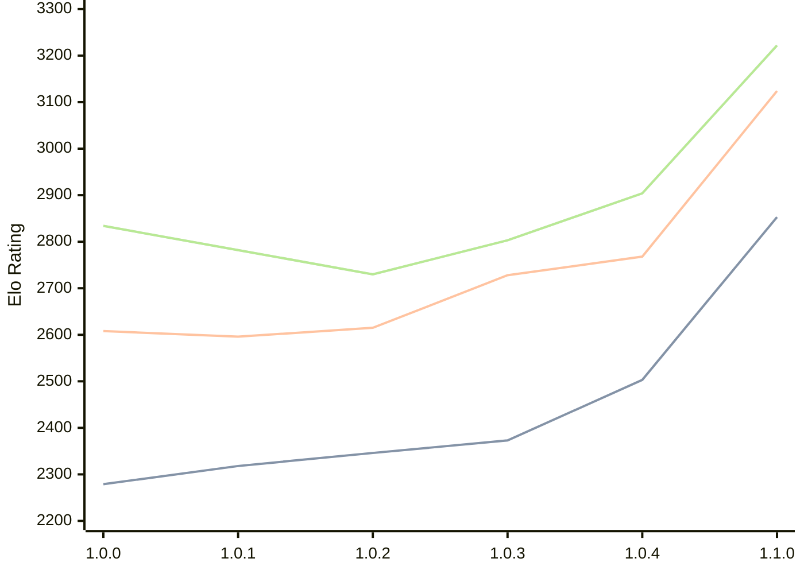

# Engine: Grail

Author: Jorgen Hanssen

Home: https://github.com/jorgenhanssen/grail

## Elo Ratings

| Version | Published | STC 8.0+0.08s  | LTC 60.0+0.60s | VLTC 2m24s+1.12s | Comment |
| --- | --- | --- | --- | --- | --- |
| 1.1.0 | 2026-02-28 | 2853(+350) | 3124(+356) | 3222(+318) |  |
| 1.0.4 | 2026-01-16 | 2503(+130) | 2768(+40) | 2904(+101) |  |
| 1.0.3 | 2026-01-04 | 2373(+27) | 2728(+113) | 2803(+73) |  |
| 1.0.2 | 2025-12-16 | 2346(+28) | 2615(+19) | 2730(-52) |  |
| 1.0.1 | 2025-12-10 | 2318(+39) | 2596(-12) | 2782(-52) |  |
| 1.0.0 | 2025-12-05 | 2279 | 2608 | 2834 |  |
 | | | cElo (∆ prev) | cElo (∆ prev) | cElo (∆ prev) | 

<a href="https://github.com/computer-chess-index/cci/issues/new?template=submit-version.yml&title=[VERSION]+Grail+<version>&body=###%20Engine%20name%0AGrail%0A%0A###%20Version%0A1.1.0" target="_blank">Submit new version</a>

 Test Conditions:

GUI/CLI: <a href=https://github.com/cutechess/cutechess target="_blank">Cute-Chess</a> 
Elo Calculation: <a href=https://www.remi-coulom.fr/Bayesian-Elo/ target="_blank">Bayesian-Elo</a> 
CPU: Intel(R) Core(TM) i5-7500T 2.70GHz 
Opening book: 8_moves_v3 
\* STC: 8.0+0.08s, LTC: 60.0+0.60s, VLTC: 2m24s+1.12s

 Lists:
Ratings: <a href=https://github.com/computer-chess-index/cci/blob/main/lists/CCIRatings.csv target="_blank">Complete list</a>

Generated: 2026-05-04 06:24:35

## Ratings Verlauf

⬛ STC (8.0+0.08s) &nbsp;&nbsp; 🟧 LTC (60.0+0.60s) &nbsp;&nbsp; 🟩 VLTC (2m24s+1.12s)

dark mode: 🟩STC (8.0+0.08s) 🟧LTC (60.0+0.60s) ⬜VLTC (2m24s+1.12s)

## Detailed Evaluation Results

| Version | Time Control | Elo  | Range +/- | Matches | Score | Average Opponent Elo | Draws |
| --- | --- | --- | --- | --- | --- | --- | --- |
| 1.1.0 | VLTC (2m24s+1.12s) | 3222 | 27 | 388 | 52% | 3204 | 53% |
| 1.1.0 | LTC (60.0+0.60s) | 3124 | 28 | 348 | 51% | 3113 | 53% |
| 1.1.0 | STC (8.0+0.08s) | 2853 | 28 | 390 | 51% | 2844 | 40% |
| --- | --- | --- | --- | --- | --- | --- | --- |
| 1.0.4 | VLTC (2m24s+1.12s) | 2904 | 34 | 272 | 49% | 2912 | 39% |
| 1.0.4 | LTC (60.0+0.60s) | 2768 | 35 | 252 | 50% | 2769 | 35% |
| 1.0.4 | STC (8.0+0.08s) | 2503 | 31 | 348 | 55% | 2458 | 30% |
| --- | --- | --- | --- | --- | --- | --- | --- |
| 1.0.3 | VLTC (2m24s+1.12s) | 2803 | 43 | 172 | 50% | 2805 | 31% |
| 1.0.3 | LTC (60.0+0.60s) | 2728 | 45 | 160 | 51% | 2723 | 33% |
| 1.0.3 | STC (8.0+0.08s) | 2373 | 44 | 172 | 51% | 2367 | 29% |
| --- | --- | --- | --- | --- | --- | --- | --- |
| 1.0.2 | VLTC (2m24s+1.12s) | 2730 | 38 | 214 | 50% | 2730 | 35% |
| 1.0.2 | LTC (60.0+0.60s) | 2615 | 35 | 264 | 46% | 2653 | 33% |
| 1.0.2 | STC (8.0+0.08s) | 2346 | 41 | 212 | 55% | 2302 | 22% |
| --- | --- | --- | --- | --- | --- | --- | --- |
| 1.0.1 | VLTC (2m24s+1.12s) | 2782 | 42 | 180 | 52% | 2768 | 34% |
| 1.0.1 | LTC (60.0+0.60s) | 2596 | 40 | 202 | 53% | 2569 | 30% |
| 1.0.1 | STC (8.0+0.08s) | 2318 | 50 | 142 | 48% | 2337 | 20% |
| --- | --- | --- | --- | --- | --- | --- | --- |
| 1.0.0 | VLTC (2m24s+1.12s) | 2834 | 61 | 92 | 42% | 2903 | 28% |
| 1.0.0 | LTC (60.0+0.60s) | 2608 | 59 | 92 | 46% | 2643 | 34% |
| 1.0.0 | STC (8.0+0.08s) | 2279 | 67 | 82 | 59% | 2195 | 20% |
| --- | --- | --- | --- | --- | --- | --- | --- |