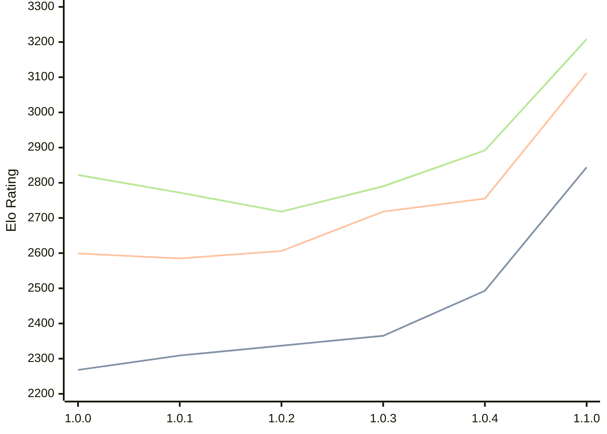

# Engine: Grail

Author: Jorgen Hanssen

Home: https://github.com/jorgenhanssen/grail

## Ratings nach Version

| Version | Published | STC 8.0+0.08s  | LTC 60.0+0.60s | VLTC 2m24s+1.12s | Comment |
| --- | --- | --- | --- | --- | --- |
| 1.1.0 | 2026-02-28 | 2844(+351) | 3112(+357) | 3208(+316) |  |
| 1.0.4 | 2026-01-16 | 2493(+128) | 2755(+37) | 2892(+102) |  |
| 1.0.3 | 2026-01-04 | 2365(+28) | 2718(+112) | 2790(+72) |  |
| 1.0.2 | 2025-12-16 | 2337(+28) | 2606(+21) | 2718(-54) |  |
| 1.0.1 | 2025-12-10 | 2309(+41) | 2585(-14) | 2772(-50) |  |
| 1.0.0 | 2025-12-05 | 2268 | 2599 | 2822 |  |
 | | | cElo (∆ prev) | cElo (∆ prev) | cElo (∆ prev) | 

<a href="https://github.com/computer-chess-index/cci/issues/new?template=submit-version.yml&title=[VERSION]+Grail+<version>&body=###%20Engine%20name%0AGrail%0A%0A###%20Version%0A1.1.0" target="_blank">Submit new version</a>

 Test Conditions:

GUI/CLI: <a href=https://github.com/cutechess/cutechess target="_blank">Cute-Chess</a> 
Elo Calculation: <a href=https://www.remi-coulom.fr/Bayesian-Elo/ target="_blank">Bayesian-Elo</a> 
CPU: Intel(R) Core(TM) i5-7500T 2.70GHz 
Opening book: 8_moves_v3 
\* STC: 8.0+0.08s, LTC: 60.0+0.60s, VLTC: 2m24s+1.12s

 Lists:
Ratings: <a href=https://github.com/computer-chess-index/cci/blob/main/lists/CCIRatings.csv target="_blank">Complete list</a>

Generated: 2026-04-16 06:24:06

## Ratings Verlauf

⬛ STC (8.0+0.08s) &nbsp;&nbsp; 🟧 LTC (60.0+0.60s) &nbsp;&nbsp; 🟩 VLTC (2m24s+1.12s)

dark mode: 🟩STC (8.0+0.08s) 🟧LTC (60.0+0.60s) ⬜VLTC (2m24s+1.12s)

