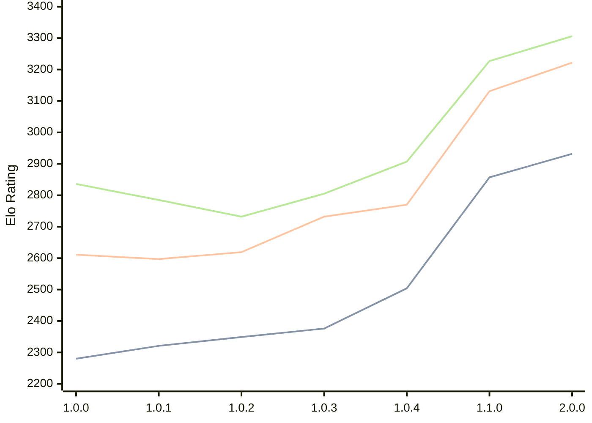

# Engine: Grail

Author: Jorgen Hanssen

Home: https://github.com/jorgenhanssen/grail

## Elo Ratings

| Version | Published | STC 8.0+0.08s  | LTC 60.0+0.60s | VLTC 2m24s+1.12s | Comment |
| --- | --- | --- | --- | --- | --- |
| 2.0.0 | 2026-05-11 | 2932(+75) | 3222(+91) | 3306(+79) |  |
| 1.1.0 | 2026-02-28 | 2857(+353) | 3131(+361) | 3227(+320) |  |
| 1.0.4 | 2026-01-16 | 2504(+128) | 2770(+38) | 2907(+102) |  |
| 1.0.3 | 2026-01-04 | 2376(+27) | 2732(+113) | 2805(+73) |  |
| 1.0.2 | 2025-12-16 | 2349(+28) | 2619(+22) | 2732(-53) |  |
| 1.0.1 | 2025-12-10 | 2321(+41) | 2597(-14) | 2785(-51) |  |
| 1.0.0 | 2025-12-05 | 2280 | 2611 | 2836 |  |
 | | | cElo (∆ prev) | cElo (∆ prev) | cElo (∆ prev) | 

<a href="https://github.com/computer-chess-index/cci/issues/new?template=submit-version.yml&title=[VERSION]+Grail+<version>&body=###%20Engine%20name%0AGrail%0A%0A###%20Version%0A2.0.0" target="_blank">Submit new version</a>

 Test Conditions:

GUI/CLI: <a href=https://github.com/cutechess/cutechess target="_blank">Cute-Chess</a> 
Elo Calculation: <a href=https://www.remi-coulom.fr/Bayesian-Elo/ target="_blank">Bayesian-Elo</a> 
CPU: Intel(R) Core(TM) i5-7500T 2.70GHz 
Opening book: 8_moves_v3 
\* STC: 8.0+0.08s, LTC: 60.0+0.60s, VLTC: 2m24s+1.12s

 Lists:
Ratings: <a href=https://github.com/computer-chess-index/cci/blob/main/lists/CCIRatings.csv target="_blank">Complete list</a>

Generated: 2026-05-15 06:24:35

## Ratings Verlauf

⬛ STC (8.0+0.08s) &nbsp;&nbsp; 🟧 LTC (60.0+0.60s) &nbsp;&nbsp; 🟩 VLTC (2m24s+1.12s)

dark mode: 🟩STC (8.0+0.08s) 🟧LTC (60.0+0.60s) ⬜VLTC (2m24s+1.12s)

## Detailed Evaluation Results

| Version | Time Control | Elo  | Range +/- | Matches | Score | Average Opponent Elo | Draws |
| --- | --- | --- | --- | --- | --- | --- | --- |
| 2.0.0 | VLTC (2m24s+1.12s) | 3306 | 34 | 228 | 50% | 3303 | 62% |
| 2.0.0 | LTC (60.0+0.60s) | 3222 | 33 | 258 | 49% | 3229 | 50% |
| 2.0.0 | STC (8.0+0.08s) | 2932 | 37 | 224 | 51% | 2925 | 41% |
| --- | --- | --- | --- | --- | --- | --- | --- |
| 1.1.0 | VLTC (2m24s+1.12s) | 3227 | 27 | 392 | 53% | 3208 | 53% |
| 1.1.0 | LTC (60.0+0.60s) | 3131 | 28 | 356 | 51% | 3117 | 53% |
| 1.1.0 | STC (8.0+0.08s) | 2857 | 28 | 398 | 51% | 2847 | 40% |
| --- | --- | --- | --- | --- | --- | --- | --- |
| 1.0.4 | VLTC (2m24s+1.12s) | 2907 | 34 | 272 | 49% | 2915 | 39% |
| 1.0.4 | LTC (60.0+0.60s) | 2770 | 35 | 252 | 50% | 2773 | 35% |
| 1.0.4 | STC (8.0+0.08s) | 2504 | 31 | 348 | 55% | 2460 | 30% |
| --- | --- | --- | --- | --- | --- | --- | --- |
| 1.0.3 | VLTC (2m24s+1.12s) | 2805 | 43 | 172 | 50% | 2809 | 31% |
| 1.0.3 | LTC (60.0+0.60s) | 2732 | 45 | 160 | 51% | 2726 | 33% |
| 1.0.3 | STC (8.0+0.08s) | 2376 | 44 | 172 | 51% | 2369 | 29% |
| --- | --- | --- | --- | --- | --- | --- | --- |
| 1.0.2 | VLTC (2m24s+1.12s) | 2732 | 38 | 214 | 50% | 2732 | 35% |
| 1.0.2 | LTC (60.0+0.60s) | 2619 | 35 | 264 | 46% | 2655 | 33% |
| 1.0.2 | STC (8.0+0.08s) | 2349 | 41 | 212 | 55% | 2304 | 22% |
| --- | --- | --- | --- | --- | --- | --- | --- |
| 1.0.1 | VLTC (2m24s+1.12s) | 2785 | 42 | 180 | 52% | 2770 | 34% |
| 1.0.1 | LTC (60.0+0.60s) | 2597 | 40 | 202 | 53% | 2570 | 30% |
| 1.0.1 | STC (8.0+0.08s) | 2321 | 50 | 142 | 48% | 2340 | 20% |
| --- | --- | --- | --- | --- | --- | --- | --- |
| 1.0.0 | VLTC (2m24s+1.12s) | 2836 | 61 | 92 | 42% | 2907 | 28% |
| 1.0.0 | LTC (60.0+0.60s) | 2611 | 59 | 92 | 46% | 2646 | 34% |
| 1.0.0 | STC (8.0+0.08s) | 2280 | 67 | 82 | 59% | 2196 | 20% |
| --- | --- | --- | --- | --- | --- | --- | --- |