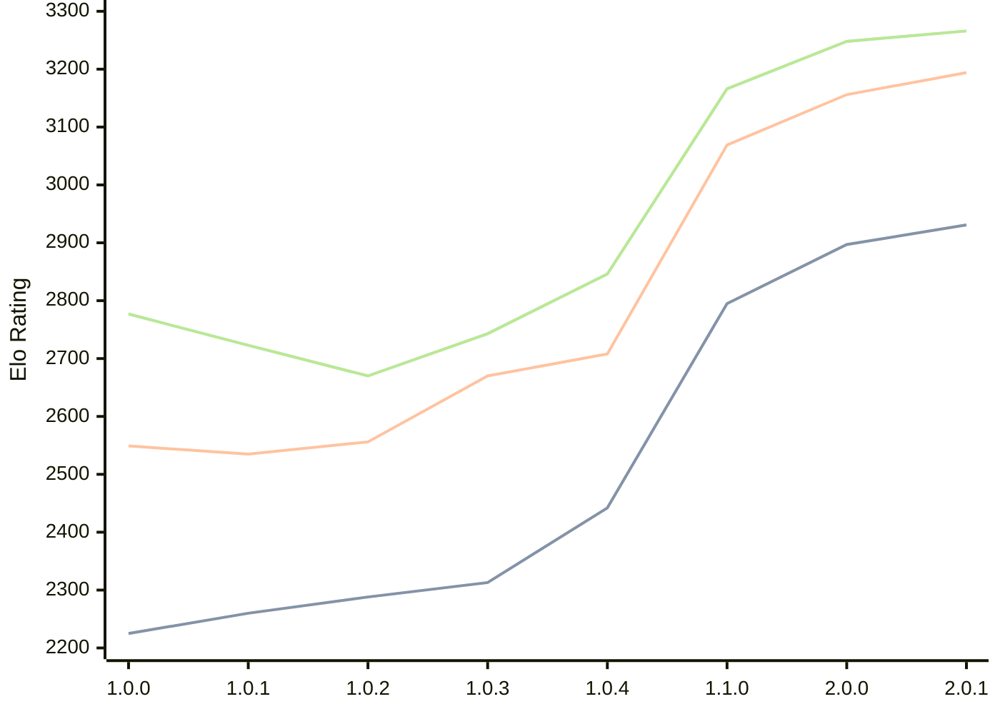

# Engine: Grail

Author: Jorgen Hanssen

Home: https://github.com/jorgenhanssen/grail

## Elo Ratings

| Version | Published | STC 8.0+0.08s  | LTC 60.0+0.60s | VLTC 2m24s+1.12s | Comment |
| --- | --- | --- | --- | --- | --- |
| 2.0.1 | 2026-06-10 | 2931(+34) | 3194(+38) | 3266(+18) |  |
| 2.0.0 | 2026-05-11 | 2897(+102) | 3156(+87) | 3248(+82) |  |
| 1.1.0 | 2026-02-28 | 2795(+353) | 3069(+361) | 3166(+320) |  |
| 1.0.4 | 2026-01-16 | 2442(+129) | 2708(+38) | 2846(+103) |  |
| 1.0.3 | 2026-01-04 | 2313(+25) | 2670(+114) | 2743(+73) |  |
| 1.0.2 | 2025-12-16 | 2288(+28) | 2556(+21) | 2670(-53) |  |
| 1.0.1 | 2025-12-10 | 2260(+35) | 2535(-14) | 2723(-54) |  |
| 1.0.0 | 2025-12-05 | 2225 | 2549 | 2777 |  |
 | | | cElo (∆ prev) | cElo (∆ prev) | cElo (∆ prev) | 

<a href="https://github.com/computer-chess-index/cci/issues/new?template=submit-version.yml&title=[VERSION]+Grail+<version>&body=###%20Engine%20name%0AGrail%0A%0A###%20Version%0A2.0.1" target="_blank">Submit new version</a>

 Test Conditions:

GUI/CLI: <a href=https://github.com/cutechess/cutechess target="_blank">Cute-Chess</a> 
Elo Calculation: <a href=https://www.remi-coulom.fr/Bayesian-Elo/ target="_blank">Bayesian-Elo</a> 
CPU: Intel(R) Core(TM) i5-7500T 2.70GHz 
Opening book: 8_moves_v3 
\* STC: 8.0+0.08s, LTC: 60.0+0.60s, VLTC: 2m24s+1.12s

 Lists:
Ratings: <a href=https://github.com/computer-chess-index/cci/blob/main/lists/CCIRatings.csv target="_blank">Complete list</a>

Generated: 2026-08-07 08:45:07

## Ratings Verlauf

⬛ STC (8.0+0.08s) &nbsp;&nbsp; 🟧 LTC (60.0+0.60s) &nbsp;&nbsp; 🟩 VLTC (2m24s+1.12s)

dark mode: 🟩STC (8.0+0.08s) 🟧LTC (60.0+0.60s) ⬜VLTC (2m24s+1.12s)

## Detailed Evaluation Results

| Version | Time Control | Elo  | Range +/- | Matches | Score | Average Opponent Elo | Draws |
| --- | --- | --- | --- | --- | --- | --- | --- |
| 2.0.1 | VLTC (2m24s+1.12s) | 3266 | 27 | 364 | 52% | 3254 | 58% |
| 2.0.1 | LTC (60.0+0.60s) | 3194 | 27 | 376 | 51% | 3190 | 60% |
| 2.0.1 | STC (8.0+0.08s) | 2931 | 27 | 398 | 53% | 2908 | 43% |
| --- | --- | --- | --- | --- | --- | --- | --- |
| 2.0.0 | VLTC (2m24s+1.12s) | 3248 | 29 | 316 | 51% | 3241 | 61% |
| 2.0.0 | LTC (60.0+0.60s) | 3155 | 29 | 322 | 48% | 3168 | 54% |
| 2.0.0 | STC (8.0+0.08s) | 2897 | 29 | 352 | 52% | 2877 | 41% |
| --- | --- | --- | --- | --- | --- | --- | --- |
| 1.1.0 | VLTC (2m24s+1.12s) | 3166 | 27 | 392 | 53% | 3147 | 53% |
| 1.1.0 | LTC (60.0+0.60s) | 3069 | 28 | 356 | 51% | 3055 | 53% |
| 1.1.0 | STC (8.0+0.08s) | 2795 | 28 | 398 | 51% | 2785 | 40% |
| --- | --- | --- | --- | --- | --- | --- | --- |
| 1.0.4 | VLTC (2m24s+1.12s) | 2846 | 34 | 272 | 49% | 2854 | 39% |
| 1.0.4 | LTC (60.0+0.60s) | 2708 | 35 | 252 | 50% | 2711 | 35% |
| 1.0.4 | STC (8.0+0.08s) | 2442 | 31 | 348 | 55% | 2396 | 30% |
| --- | --- | --- | --- | --- | --- | --- | --- |
| 1.0.3 | VLTC (2m24s+1.12s) | 2743 | 43 | 172 | 50% | 2747 | 31% |
| 1.0.3 | LTC (60.0+0.60s) | 2670 | 45 | 160 | 51% | 2664 | 33% |
| 1.0.3 | STC (8.0+0.08s) | 2313 | 44 | 172 | 51% | 2307 | 29% |
| --- | --- | --- | --- | --- | --- | --- | --- |
| 1.0.2 | VLTC (2m24s+1.12s) | 2669 | 38 | 214 | 50% | 2670 | 35% |
| 1.0.2 | LTC (60.0+0.60s) | 2556 | 35 | 264 | 46% | 2593 | 33% |
| 1.0.2 | STC (8.0+0.08s) | 2288 | 41 | 212 | 55% | 2244 | 22% |
| --- | --- | --- | --- | --- | --- | --- | --- |
| 1.0.1 | VLTC (2m24s+1.12s) | 2723 | 42 | 180 | 52% | 2708 | 34% |
| 1.0.1 | LTC (60.0+0.60s) | 2535 | 40 | 202 | 53% | 2508 | 30% |
| 1.0.1 | STC (8.0+0.08s) | 2260 | 50 | 142 | 48% | 2279 | 20% |
| --- | --- | --- | --- | --- | --- | --- | --- |
| 1.0.0 | VLTC (2m24s+1.12s) | 2777 | 61 | 92 | 42% | 2846 | 28% |
| 1.0.0 | LTC (60.0+0.60s) | 2549 | 59 | 92 | 46% | 2584 | 34% |
| 1.0.0 | STC (8.0+0.08s) | 2225 | 67 | 82 | 59% | 2140 | 20% |
| --- | --- | --- | --- | --- | --- | --- | --- |