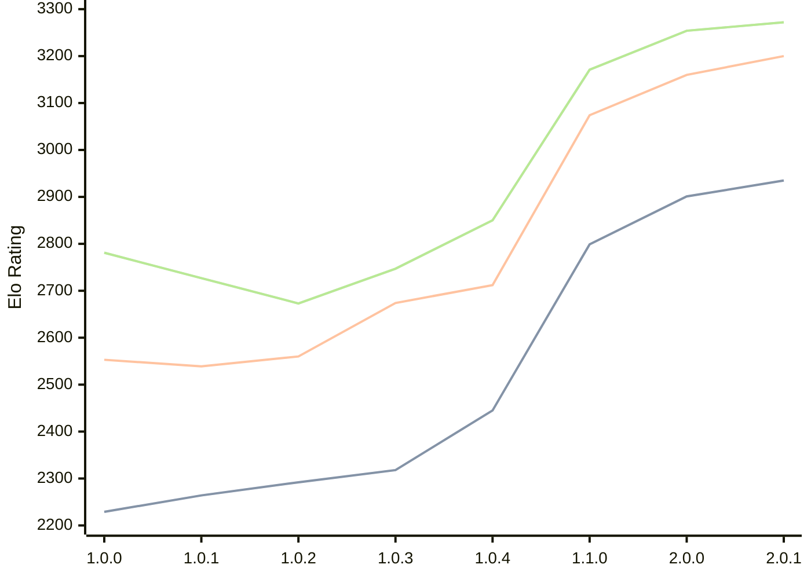

# Engine: Grail

Author: Jorgen Hanssen

Home: https://github.com/jorgenhanssen/grail

## Elo Ratings

| Version | Published | STC 8.0+0.08s  | LTC 60.0+0.60s | VLTC 2m24s+1.12s | Comment |
| --- | --- | --- | --- | --- | --- |
| 2.0.1 | 2026-06-10 | 2935(+34) | 3200(+40) | 3272(+18) |  |
| 2.0.0 | 2026-05-11 | 2901(+102) | 3160(+86) | 3254(+83) |  |
| 1.1.0 | 2026-02-28 | 2799(+354) | 3074(+362) | 3171(+321) |  |
| 1.0.4 | 2026-01-16 | 2445(+127) | 2712(+38) | 2850(+103) |  |
| 1.0.3 | 2026-01-04 | 2318(+26) | 2674(+114) | 2747(+74) |  |
| 1.0.2 | 2025-12-16 | 2292(+28) | 2560(+21) | 2673(-54) |  |
| 1.0.1 | 2025-12-10 | 2264(+35) | 2539(-14) | 2727(-54) |  |
| 1.0.0 | 2025-12-05 | 2229 | 2553 | 2781 |  |
 | | | cElo (∆ prev) | cElo (∆ prev) | cElo (∆ prev) | 

<a href="https://github.com/computer-chess-index/cci/issues/new?template=submit-version.yml&title=[VERSION]+Grail+<version>&body=###%20Engine%20name%0AGrail%0A%0A###%20Version%0A2.0.1" target="_blank">Submit new version</a>

 Test Conditions:

GUI/CLI: <a href=https://github.com/cutechess/cutechess target="_blank">Cute-Chess</a> 
Elo Calculation: <a href=https://www.remi-coulom.fr/Bayesian-Elo/ target="_blank">Bayesian-Elo</a> 
CPU: Intel(R) Core(TM) i5-7500T 2.70GHz 
Opening book: 8_moves_v3 
\* STC: 8.0+0.08s, LTC: 60.0+0.60s, VLTC: 2m24s+1.12s

 Lists:
Ratings: <a href=https://github.com/computer-chess-index/cci/blob/main/lists/CCIRatings.csv target="_blank">Complete list</a>

Generated: 2026-08-19 06:25:28

## Ratings Verlauf

⬛ STC (8.0+0.08s) &nbsp;&nbsp; 🟧 LTC (60.0+0.60s) &nbsp;&nbsp; 🟩 VLTC (2m24s+1.12s)

dark mode: 🟩STC (8.0+0.08s) 🟧LTC (60.0+0.60s) ⬜VLTC (2m24s+1.12s)

## Detailed Evaluation Results

| Version | Time Control | Elo  | Range +/- | Matches | Score | Average Opponent Elo | Draws |
| --- | --- | --- | --- | --- | --- | --- | --- |
| 2.0.1 | VLTC (2m24s+1.12s) | 3272 | 27 | 376 | 52% | 3259 | 58% |
| 2.0.1 | LTC (60.0+0.60s) | 3200 | 26 | 392 | 51% | 3195 | 59% |
| 2.0.1 | STC (8.0+0.08s) | 2935 | 26 | 426 | 52% | 2915 | 44% |
| --- | --- | --- | --- | --- | --- | --- | --- |
| 2.0.0 | VLTC (2m24s+1.12s) | 3254 | 29 | 316 | 51% | 3247 | 61% |
| 2.0.0 | LTC (60.0+0.60s) | 3160 | 29 | 322 | 48% | 3174 | 54% |
| 2.0.0 | STC (8.0+0.08s) | 2901 | 29 | 352 | 52% | 2881 | 41% |
| --- | --- | --- | --- | --- | --- | --- | --- |
| 1.1.0 | VLTC (2m24s+1.12s) | 3171 | 27 | 392 | 53% | 3152 | 53% |
| 1.1.0 | LTC (60.0+0.60s) | 3074 | 28 | 356 | 51% | 3060 | 53% |
| 1.1.0 | STC (8.0+0.08s) | 2799 | 28 | 398 | 51% | 2789 | 40% |
| --- | --- | --- | --- | --- | --- | --- | --- |
| 1.0.4 | VLTC (2m24s+1.12s) | 2850 | 34 | 272 | 49% | 2858 | 39% |
| 1.0.4 | LTC (60.0+0.60s) | 2712 | 35 | 252 | 50% | 2715 | 35% |
| 1.0.4 | STC (8.0+0.08s) | 2445 | 31 | 348 | 55% | 2400 | 30% |
| --- | --- | --- | --- | --- | --- | --- | --- |
| 1.0.3 | VLTC (2m24s+1.12s) | 2747 | 43 | 172 | 50% | 2751 | 31% |
| 1.0.3 | LTC (60.0+0.60s) | 2674 | 45 | 160 | 51% | 2668 | 33% |
| 1.0.3 | STC (8.0+0.08s) | 2318 | 44 | 172 | 51% | 2311 | 29% |
| --- | --- | --- | --- | --- | --- | --- | --- |
| 1.0.2 | VLTC (2m24s+1.12s) | 2673 | 38 | 214 | 50% | 2674 | 35% |
| 1.0.2 | LTC (60.0+0.60s) | 2560 | 35 | 264 | 46% | 2597 | 33% |
| 1.0.2 | STC (8.0+0.08s) | 2292 | 41 | 212 | 55% | 2248 | 22% |
| --- | --- | --- | --- | --- | --- | --- | --- |
| 1.0.1 | VLTC (2m24s+1.12s) | 2727 | 42 | 180 | 52% | 2712 | 34% |
| 1.0.1 | LTC (60.0+0.60s) | 2539 | 40 | 202 | 53% | 2512 | 30% |
| 1.0.1 | STC (8.0+0.08s) | 2264 | 50 | 142 | 48% | 2283 | 20% |
| --- | --- | --- | --- | --- | --- | --- | --- |
| 1.0.0 | VLTC (2m24s+1.12s) | 2781 | 61 | 92 | 42% | 2851 | 28% |
| 1.0.0 | LTC (60.0+0.60s) | 2553 | 59 | 92 | 46% | 2587 | 34% |
| 1.0.0 | STC (8.0+0.08s) | 2229 | 67 | 82 | 59% | 2145 | 20% |
| --- | --- | --- | --- | --- | --- | --- | --- |