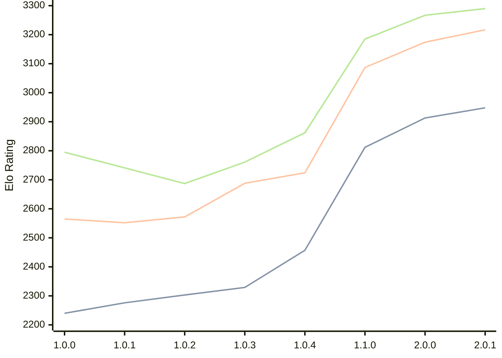

# Engine: Grail

Author: Jorgen Hanssen

Home: https://github.com/jorgenhanssen/grail

## Elo Ratings

| Version | Published | STC 8.0+0.08s  | LTC 60.0+0.60s | VLTC 2m24s+1.12s | Comment |
| --- | --- | --- | --- | --- | --- |
| 2.0.1 | 2026-06-10 | 2948(+35) | 3217(+43) | 3290(+23) |  |
| 2.0.0 | 2026-05-11 | 2913(+101) | 3174(+87) | 3267(+82) |  |
| 1.1.0 | 2026-02-28 | 2812(+355) | 3087(+363) | 3185(+323) |  |
| 1.0.4 | 2026-01-16 | 2457(+128) | 2724(+36) | 2862(+101) |  |
| 1.0.3 | 2026-01-04 | 2329(+26) | 2688(+116) | 2761(+74) |  |
| 1.0.2 | 2025-12-16 | 2303(+27) | 2572(+20) | 2687(-54) |  |
| 1.0.1 | 2025-12-10 | 2276(+36) | 2552(-13) | 2741(-54) |  |
| 1.0.0 | 2025-12-05 | 2240 | 2565 | 2795 |  |
 | | | cElo (∆ prev) | cElo (∆ prev) | cElo (∆ prev) | 

<a href="https://github.com/computer-chess-index/cci/issues/new?template=submit-version.yml&title=[VERSION]+Grail+<version>&body=###%20Engine%20name%0AGrail%0A%0A###%20Version%0A2.0.1" target="_blank">Submit new version</a>

 Test Conditions:

GUI/CLI: <a href=https://github.com/cutechess/cutechess target="_blank">Cute-Chess</a> 
Elo Calculation: <a href=https://www.remi-coulom.fr/Bayesian-Elo/ target="_blank">Bayesian-Elo</a> 
CPU: Intel(R) Core(TM) i5-7500T 2.70GHz 
Opening book: 8_moves_v3 
\* STC: 8.0+0.08s, LTC: 60.0+0.60s, VLTC: 2m24s+1.12s

 Lists:
Ratings: <a href=https://github.com/computer-chess-index/cci/blob/main/lists/CCIRatings.csv target="_blank">Complete list</a>

Generated: 2026-09-25 04:38:49

## Ratings Verlauf

## Detailed Evaluation Results

| Version | Time Control | Elo  | Range +/- | Matches | Score | Average Opponent Elo | Draws |
| --- | --- | --- | --- | --- | --- | --- | --- |
| 2.0.1 | VLTC (2m24s+1.12s) | 3290 | 26 | 420 | 52% | 3275 | 57% |
| 2.0.1 | LTC (60.0+0.60s) | 3217 | 25 | 424 | 51% | 3209 | 60% |
| 2.0.1 | STC (8.0+0.08s) | 2948 | 25 | 468 | 52% | 2931 | 45% |
| --- | --- | --- | --- | --- | --- | --- | --- |
| 2.0.0 | VLTC (2m24s+1.12s) | 3267 | 29 | 316 | 51% | 3260 | 61% |
| 2.0.0 | LTC (60.0+0.60s) | 3174 | 29 | 322 | 48% | 3186 | 54% |
| 2.0.0 | STC (8.0+0.08s) | 2913 | 29 | 352 | 52% | 2894 | 41% |
| --- | --- | --- | --- | --- | --- | --- | --- |
| 1.1.0 | VLTC (2m24s+1.12s) | 3185 | 27 | 392 | 53% | 3164 | 53% |
| 1.1.0 | LTC (60.0+0.60s) | 3087 | 28 | 356 | 51% | 3074 | 53% |
| 1.1.0 | STC (8.0+0.08s) | 2812 | 28 | 398 | 51% | 2801 | 40% |
| --- | --- | --- | --- | --- | --- | --- | --- |
| 1.0.4 | VLTC (2m24s+1.12s) | 2862 | 34 | 272 | 49% | 2870 | 39% |
| 1.0.4 | LTC (60.0+0.60s) | 2724 | 35 | 252 | 50% | 2727 | 35% |
| 1.0.4 | STC (8.0+0.08s) | 2457 | 31 | 348 | 55% | 2412 | 30% |
| --- | --- | --- | --- | --- | --- | --- | --- |
| 1.0.3 | VLTC (2m24s+1.12s) | 2761 | 43 | 172 | 50% | 2765 | 31% |
| 1.0.3 | LTC (60.0+0.60s) | 2688 | 45 | 160 | 51% | 2681 | 33% |
| 1.0.3 | STC (8.0+0.08s) | 2329 | 44 | 172 | 51% | 2322 | 29% |
| --- | --- | --- | --- | --- | --- | --- | --- |
| 1.0.2 | VLTC (2m24s+1.12s) | 2687 | 38 | 214 | 50% | 2688 | 35% |
| 1.0.2 | LTC (60.0+0.60s) | 2572 | 35 | 264 | 46% | 2610 | 33% |
| 1.0.2 | STC (8.0+0.08s) | 2303 | 41 | 212 | 55% | 2259 | 22% |
| --- | --- | --- | --- | --- | --- | --- | --- |
| 1.0.1 | VLTC (2m24s+1.12s) | 2741 | 42 | 180 | 52% | 2726 | 34% |
| 1.0.1 | LTC (60.0+0.60s) | 2552 | 40 | 202 | 53% | 2525 | 30% |
| 1.0.1 | STC (8.0+0.08s) | 2276 | 50 | 142 | 48% | 2294 | 20% |
| --- | --- | --- | --- | --- | --- | --- | --- |
| 1.0.0 | VLTC (2m24s+1.12s) | 2795 | 61 | 92 | 42% | 2865 | 28% |
| 1.0.0 | LTC (60.0+0.60s) | 2565 | 59 | 92 | 46% | 2600 | 34% |
| 1.0.0 | STC (8.0+0.08s) | 2240 | 67 | 82 | 59% | 2155 | 20% |
| --- | --- | --- | --- | --- | --- | --- | --- |