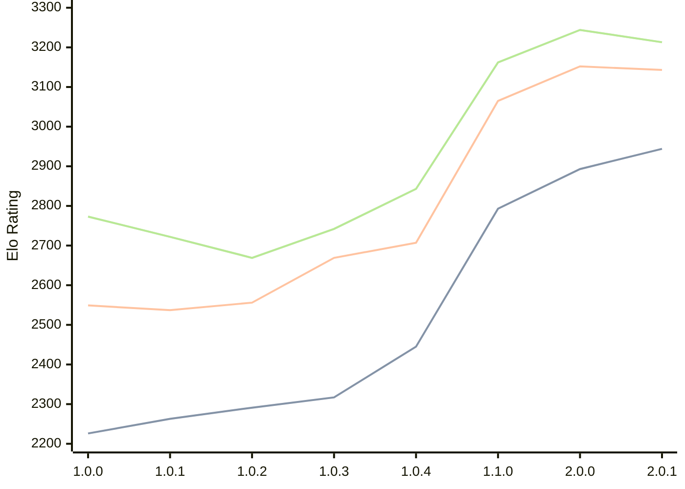

# Engine: Grail

Author: Jorgen Hanssen

Home: https://github.com/jorgenhanssen/grail

## Elo Ratings

| Version | Published | STC 8.0+0.08s  | LTC 60.0+0.60s | VLTC 2m24s+1.12s | Comment |
| --- | --- | --- | --- | --- | --- |
| 2.0.1 | 2026-06-10 | 2944(+51) | 3143(-9) | 3213(-31) |  |
| 2.0.0 | 2026-05-11 | 2893(+100) | 3152(+87) | 3244(+82) |  |
| 1.1.0 | 2026-02-28 | 2793(+348) | 3065(+358) | 3162(+319) |  |
| 1.0.4 | 2026-01-16 | 2445(+128) | 2707(+38) | 2843(+101) |  |
| 1.0.3 | 2026-01-04 | 2317(+26) | 2669(+113) | 2742(+73) |  |
| 1.0.2 | 2025-12-16 | 2291(+28) | 2556(+19) | 2669(-53) |  |
| 1.0.1 | 2025-12-10 | 2263(+37) | 2537(-12) | 2722(-51) |  |
| 1.0.0 | 2025-12-05 | 2226 | 2549 | 2773 |  |
 | | | cElo (∆ prev) | cElo (∆ prev) | cElo (∆ prev) | 

<a href="https://github.com/computer-chess-index/cci/issues/new?template=submit-version.yml&title=[VERSION]+Grail+<version>&body=###%20Engine%20name%0AGrail%0A%0A###%20Version%0A2.0.1" target="_blank">Submit new version</a>

 Test Conditions:

GUI/CLI: <a href=https://github.com/cutechess/cutechess target="_blank">Cute-Chess</a> 
Elo Calculation: <a href=https://www.remi-coulom.fr/Bayesian-Elo/ target="_blank">Bayesian-Elo</a> 
CPU: Intel(R) Core(TM) i5-7500T 2.70GHz 
Opening book: 8_moves_v3 
\* STC: 8.0+0.08s, LTC: 60.0+0.60s, VLTC: 2m24s+1.12s

 Lists:
Ratings: <a href=https://github.com/computer-chess-index/cci/blob/main/lists/CCIRatings.csv target="_blank">Complete list</a>

Generated: 2026-06-11 06:24:49

## Ratings Verlauf

⬛ STC (8.0+0.08s) &nbsp;&nbsp; 🟧 LTC (60.0+0.60s) &nbsp;&nbsp; 🟩 VLTC (2m24s+1.12s)

dark mode: 🟩STC (8.0+0.08s) 🟧LTC (60.0+0.60s) ⬜VLTC (2m24s+1.12s)

## Detailed Evaluation Results

| Version | Time Control | Elo  | Range +/- | Matches | Score | Average Opponent Elo | Draws |
| --- | --- | --- | --- | --- | --- | --- | --- |
| 2.0.1 | VLTC (2m24s+1.12s) | 3213 | 71 | 52 | 52% | 3198 | 62% |
| 2.0.1 | LTC (60.0+0.60s) | 3143 | 83 | 40 | 54% | 3117 | 53% |
| 2.0.1 | STC (8.0+0.08s) | 2944 | 77 | 56 | 63% | 2823 | 34% |
| --- | --- | --- | --- | --- | --- | --- | --- |
| 2.0.0 | VLTC (2m24s+1.12s) | 3244 | 29 | 316 | 51% | 3237 | 61% |
| 2.0.0 | LTC (60.0+0.60s) | 3152 | 29 | 322 | 48% | 3164 | 54% |
| 2.0.0 | STC (8.0+0.08s) | 2893 | 29 | 352 | 52% | 2873 | 41% |
| --- | --- | --- | --- | --- | --- | --- | --- |
| 1.1.0 | VLTC (2m24s+1.12s) | 3162 | 27 | 392 | 53% | 3143 | 53% |
| 1.1.0 | LTC (60.0+0.60s) | 3065 | 28 | 356 | 51% | 3052 | 53% |
| 1.1.0 | STC (8.0+0.08s) | 2793 | 28 | 398 | 51% | 2784 | 40% |
| --- | --- | --- | --- | --- | --- | --- | --- |
| 1.0.4 | VLTC (2m24s+1.12s) | 2843 | 34 | 272 | 49% | 2851 | 39% |
| 1.0.4 | LTC (60.0+0.60s) | 2707 | 35 | 252 | 50% | 2709 | 35% |
| 1.0.4 | STC (8.0+0.08s) | 2445 | 31 | 348 | 55% | 2400 | 30% |
| --- | --- | --- | --- | --- | --- | --- | --- |
| 1.0.3 | VLTC (2m24s+1.12s) | 2742 | 43 | 172 | 50% | 2746 | 31% |
| 1.0.3 | LTC (60.0+0.60s) | 2669 | 45 | 160 | 51% | 2664 | 33% |
| 1.0.3 | STC (8.0+0.08s) | 2317 | 44 | 172 | 51% | 2310 | 29% |
| --- | --- | --- | --- | --- | --- | --- | --- |
| 1.0.2 | VLTC (2m24s+1.12s) | 2669 | 38 | 214 | 50% | 2670 | 35% |
| 1.0.2 | LTC (60.0+0.60s) | 2556 | 35 | 264 | 46% | 2593 | 33% |
| 1.0.2 | STC (8.0+0.08s) | 2291 | 41 | 212 | 55% | 2246 | 22% |
| --- | --- | --- | --- | --- | --- | --- | --- |
| 1.0.1 | VLTC (2m24s+1.12s) | 2722 | 42 | 180 | 52% | 2707 | 34% |
| 1.0.1 | LTC (60.0+0.60s) | 2537 | 40 | 202 | 53% | 2510 | 30% |
| 1.0.1 | STC (8.0+0.08s) | 2263 | 50 | 142 | 48% | 2282 | 20% |
| --- | --- | --- | --- | --- | --- | --- | --- |
| 1.0.0 | VLTC (2m24s+1.12s) | 2773 | 61 | 92 | 42% | 2843 | 28% |
| 1.0.0 | LTC (60.0+0.60s) | 2549 | 59 | 92 | 46% | 2584 | 34% |
| 1.0.0 | STC (8.0+0.08s) | 2226 | 67 | 82 | 59% | 2142 | 20% |
| --- | --- | --- | --- | --- | --- | --- | --- |