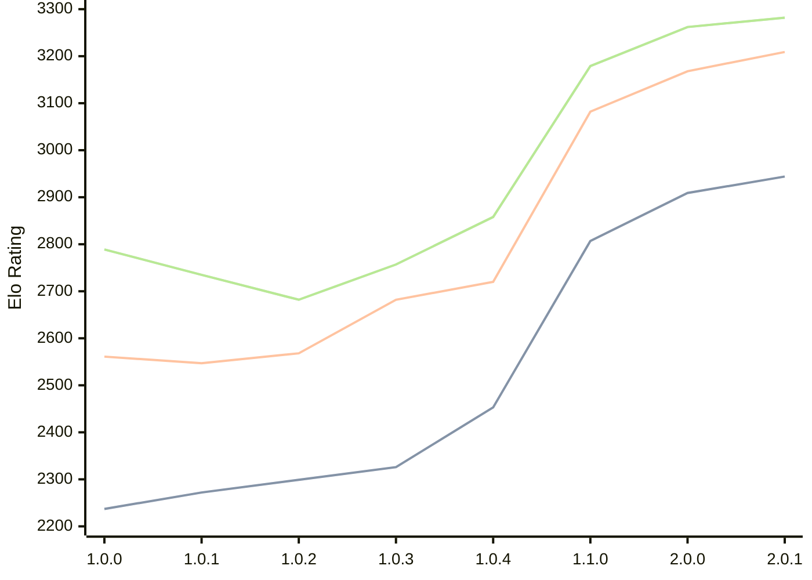

# Engine: Grail

Author: Jorgen Hanssen

Home: https://github.com/jorgenhanssen/grail

## Elo Ratings

| Version | Published | STC 8.0+0.08s  | LTC 60.0+0.60s | VLTC 2m24s+1.12s | Comment |
| --- | --- | --- | --- | --- | --- |
| 2.0.1 | 2026-06-10 | 2944(+35) | 3209(+41) | 3282(+20) |  |
| 2.0.0 | 2026-05-11 | 2909(+102) | 3168(+86) | 3262(+83) |  |
| 1.1.0 | 2026-02-28 | 2807(+354) | 3082(+362) | 3179(+321) |  |
| 1.0.4 | 2026-01-16 | 2453(+127) | 2720(+38) | 2858(+101) |  |
| 1.0.3 | 2026-01-04 | 2326(+27) | 2682(+114) | 2757(+75) |  |
| 1.0.2 | 2025-12-16 | 2299(+27) | 2568(+21) | 2682(-53) |  |
| 1.0.1 | 2025-12-10 | 2272(+35) | 2547(-14) | 2735(-54) |  |
| 1.0.0 | 2025-12-05 | 2237 | 2561 | 2789 |  |
 | | | cElo (∆ prev) | cElo (∆ prev) | cElo (∆ prev) | 

<a href="https://github.com/computer-chess-index/cci/issues/new?template=submit-version.yml&title=[VERSION]+Grail+<version>&body=###%20Engine%20name%0AGrail%0A%0A###%20Version%0A2.0.1" target="_blank">Submit new version</a>

 Test Conditions:

GUI/CLI: <a href=https://github.com/cutechess/cutechess target="_blank">Cute-Chess</a> 
Elo Calculation: <a href=https://www.remi-coulom.fr/Bayesian-Elo/ target="_blank">Bayesian-Elo</a> 
CPU: Intel(R) Core(TM) i5-7500T 2.70GHz 
Opening book: 8_moves_v3 
\* STC: 8.0+0.08s, LTC: 60.0+0.60s, VLTC: 2m24s+1.12s

 Lists:
Ratings: <a href=https://github.com/computer-chess-index/cci/blob/main/lists/CCIRatings.csv target="_blank">Complete list</a>

Generated: 2026-09-08 04:38:33

## Ratings Verlauf

## Detailed Evaluation Results

| Version | Time Control | Elo  | Range +/- | Matches | Score | Average Opponent Elo | Draws |
| --- | --- | --- | --- | --- | --- | --- | --- |
| 2.0.1 | VLTC (2m24s+1.12s) | 3282 | 26 | 408 | 51% | 3270 | 58% |
| 2.0.1 | LTC (60.0+0.60s) | 3209 | 25 | 416 | 51% | 3204 | 59% |
| 2.0.1 | STC (8.0+0.08s) | 2944 | 26 | 450 | 52% | 2925 | 45% |
| --- | --- | --- | --- | --- | --- | --- | --- |
| 2.0.0 | VLTC (2m24s+1.12s) | 3262 | 29 | 316 | 51% | 3255 | 61% |
| 2.0.0 | LTC (60.0+0.60s) | 3168 | 29 | 322 | 48% | 3182 | 54% |
| 2.0.0 | STC (8.0+0.08s) | 2909 | 29 | 352 | 52% | 2889 | 41% |
| --- | --- | --- | --- | --- | --- | --- | --- |
| 1.1.0 | VLTC (2m24s+1.12s) | 3179 | 27 | 392 | 53% | 3160 | 53% |
| 1.1.0 | LTC (60.0+0.60s) | 3082 | 28 | 356 | 51% | 3069 | 53% |
| 1.1.0 | STC (8.0+0.08s) | 2807 | 28 | 398 | 51% | 2797 | 40% |
| --- | --- | --- | --- | --- | --- | --- | --- |
| 1.0.4 | VLTC (2m24s+1.12s) | 2858 | 34 | 272 | 49% | 2866 | 39% |
| 1.0.4 | LTC (60.0+0.60s) | 2720 | 35 | 252 | 50% | 2723 | 35% |
| 1.0.4 | STC (8.0+0.08s) | 2453 | 31 | 348 | 55% | 2408 | 30% |
| --- | --- | --- | --- | --- | --- | --- | --- |
| 1.0.3 | VLTC (2m24s+1.12s) | 2757 | 43 | 172 | 50% | 2759 | 31% |
| 1.0.3 | LTC (60.0+0.60s) | 2682 | 45 | 160 | 51% | 2676 | 33% |
| 1.0.3 | STC (8.0+0.08s) | 2326 | 44 | 172 | 51% | 2319 | 29% |
| --- | --- | --- | --- | --- | --- | --- | --- |
| 1.0.2 | VLTC (2m24s+1.12s) | 2682 | 38 | 214 | 50% | 2682 | 35% |
| 1.0.2 | LTC (60.0+0.60s) | 2568 | 35 | 264 | 46% | 2606 | 33% |
| 1.0.2 | STC (8.0+0.08s) | 2299 | 41 | 212 | 55% | 2255 | 22% |
| --- | --- | --- | --- | --- | --- | --- | --- |
| 1.0.1 | VLTC (2m24s+1.12s) | 2735 | 42 | 180 | 52% | 2720 | 34% |
| 1.0.1 | LTC (60.0+0.60s) | 2547 | 40 | 202 | 53% | 2520 | 30% |
| 1.0.1 | STC (8.0+0.08s) | 2272 | 50 | 142 | 48% | 2291 | 20% |
| --- | --- | --- | --- | --- | --- | --- | --- |
| 1.0.0 | VLTC (2m24s+1.12s) | 2789 | 61 | 92 | 42% | 2859 | 28% |
| 1.0.0 | LTC (60.0+0.60s) | 2561 | 59 | 92 | 46% | 2596 | 34% |
| 1.0.0 | STC (8.0+0.08s) | 2237 | 67 | 82 | 59% | 2152 | 20% |
| --- | --- | --- | --- | --- | --- | --- | --- |