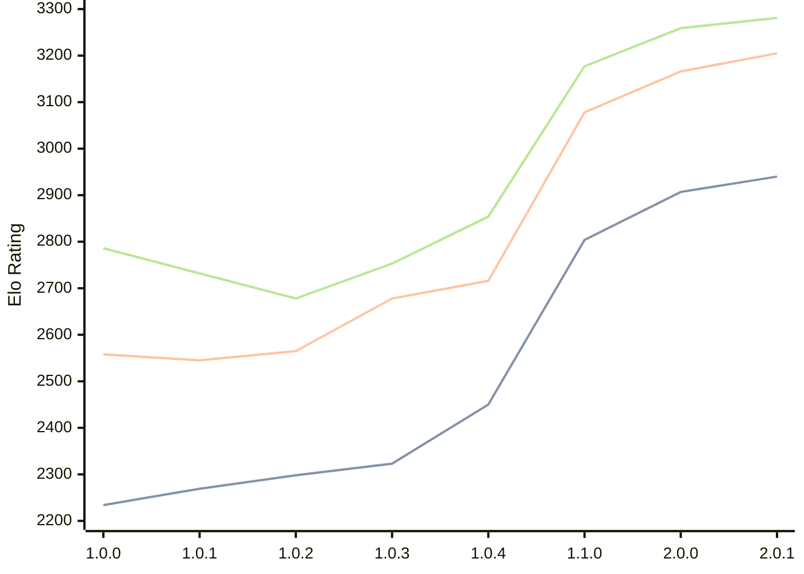

# Engine: Grail

Author: Jorgen Hanssen

Home: https://github.com/jorgenhanssen/grail

## Elo Ratings

| Version | Published | STC 8.0+0.08s  | LTC 60.0+0.60s | VLTC 2m24s+1.12s | Comment |
| --- | --- | --- | --- | --- | --- |
| 2.0.1 | 2026-06-10 | 2940(+33) | 3205(+39) | 3281(+22) |  |
| 2.0.0 | 2026-05-11 | 2907(+103) | 3166(+88) | 3259(+82) |  |
| 1.1.0 | 2026-02-28 | 2804(+354) | 3078(+362) | 3177(+323) |  |
| 1.0.4 | 2026-01-16 | 2450(+127) | 2716(+38) | 2854(+101) |  |
| 1.0.3 | 2026-01-04 | 2323(+25) | 2678(+113) | 2753(+75) |  |
| 1.0.2 | 2025-12-16 | 2298(+29) | 2565(+20) | 2678(-54) |  |
| 1.0.1 | 2025-12-10 | 2269(+35) | 2545(-13) | 2732(-54) |  |
| 1.0.0 | 2025-12-05 | 2234 | 2558 | 2786 |  |
 | | | cElo (∆ prev) | cElo (∆ prev) | cElo (∆ prev) | 

<a href="https://github.com/computer-chess-index/cci/issues/new?template=submit-version.yml&title=[VERSION]+Grail+<version>&body=###%20Engine%20name%0AGrail%0A%0A###%20Version%0A2.0.1" target="_blank">Submit new version</a>

 Test Conditions:

GUI/CLI: <a href=https://github.com/cutechess/cutechess target="_blank">Cute-Chess</a> 
Elo Calculation: <a href=https://www.remi-coulom.fr/Bayesian-Elo/ target="_blank">Bayesian-Elo</a> 
CPU: Intel(R) Core(TM) i5-7500T 2.70GHz 
Opening book: 8_moves_v3 
\* STC: 8.0+0.08s, LTC: 60.0+0.60s, VLTC: 2m24s+1.12s

 Lists:
Ratings: <a href=https://github.com/computer-chess-index/cci/blob/main/lists/CCIRatings.csv target="_blank">Complete list</a>

Generated: 2026-08-26 06:25:27

## Ratings Verlauf

⬛ STC (8.0+0.08s) &nbsp;&nbsp; 🟧 LTC (60.0+0.60s) &nbsp;&nbsp; 🟩 VLTC (2m24s+1.12s)

dark mode: 🟩STC (8.0+0.08s) 🟧LTC (60.0+0.60s) ⬜VLTC (2m24s+1.12s)

## Detailed Evaluation Results

| Version | Time Control | Elo  | Range +/- | Matches | Score | Average Opponent Elo | Draws |
| --- | --- | --- | --- | --- | --- | --- | --- |
| 2.0.1 | VLTC (2m24s+1.12s) | 3281 | 26 | 396 | 52% | 3266 | 58% |
| 2.0.1 | LTC (60.0+0.60s) | 3205 | 26 | 392 | 51% | 3200 | 59% |
| 2.0.1 | STC (8.0+0.08s) | 2940 | 26 | 430 | 52% | 2921 | 44% |
| --- | --- | --- | --- | --- | --- | --- | --- |
| 2.0.0 | VLTC (2m24s+1.12s) | 3259 | 29 | 316 | 51% | 3252 | 61% |
| 2.0.0 | LTC (60.0+0.60s) | 3166 | 29 | 322 | 48% | 3178 | 54% |
| 2.0.0 | STC (8.0+0.08s) | 2907 | 29 | 352 | 52% | 2886 | 41% |
| --- | --- | --- | --- | --- | --- | --- | --- |
| 1.1.0 | VLTC (2m24s+1.12s) | 3177 | 27 | 392 | 53% | 3156 | 53% |
| 1.1.0 | LTC (60.0+0.60s) | 3078 | 28 | 356 | 51% | 3066 | 53% |
| 1.1.0 | STC (8.0+0.08s) | 2804 | 28 | 398 | 51% | 2793 | 40% |
| --- | --- | --- | --- | --- | --- | --- | --- |
| 1.0.4 | VLTC (2m24s+1.12s) | 2854 | 34 | 272 | 49% | 2862 | 39% |
| 1.0.4 | LTC (60.0+0.60s) | 2716 | 35 | 252 | 50% | 2719 | 35% |
| 1.0.4 | STC (8.0+0.08s) | 2450 | 31 | 348 | 55% | 2406 | 30% |
| --- | --- | --- | --- | --- | --- | --- | --- |
| 1.0.3 | VLTC (2m24s+1.12s) | 2753 | 43 | 172 | 50% | 2757 | 31% |
| 1.0.3 | LTC (60.0+0.60s) | 2678 | 45 | 160 | 51% | 2673 | 33% |
| 1.0.3 | STC (8.0+0.08s) | 2323 | 44 | 172 | 51% | 2317 | 29% |
| --- | --- | --- | --- | --- | --- | --- | --- |
| 1.0.2 | VLTC (2m24s+1.12s) | 2678 | 38 | 214 | 50% | 2680 | 35% |
| 1.0.2 | LTC (60.0+0.60s) | 2565 | 35 | 264 | 46% | 2603 | 33% |
| 1.0.2 | STC (8.0+0.08s) | 2298 | 41 | 212 | 55% | 2253 | 22% |
| --- | --- | --- | --- | --- | --- | --- | --- |
| 1.0.1 | VLTC (2m24s+1.12s) | 2732 | 42 | 180 | 52% | 2718 | 34% |
| 1.0.1 | LTC (60.0+0.60s) | 2545 | 40 | 202 | 53% | 2518 | 30% |
| 1.0.1 | STC (8.0+0.08s) | 2269 | 50 | 142 | 48% | 2288 | 20% |
| --- | --- | --- | --- | --- | --- | --- | --- |
| 1.0.0 | VLTC (2m24s+1.12s) | 2786 | 61 | 92 | 42% | 2855 | 28% |
| 1.0.0 | LTC (60.0+0.60s) | 2558 | 59 | 92 | 46% | 2592 | 34% |
| 1.0.0 | STC (8.0+0.08s) | 2234 | 67 | 82 | 59% | 2149 | 20% |
| --- | --- | --- | --- | --- | --- | --- | --- |