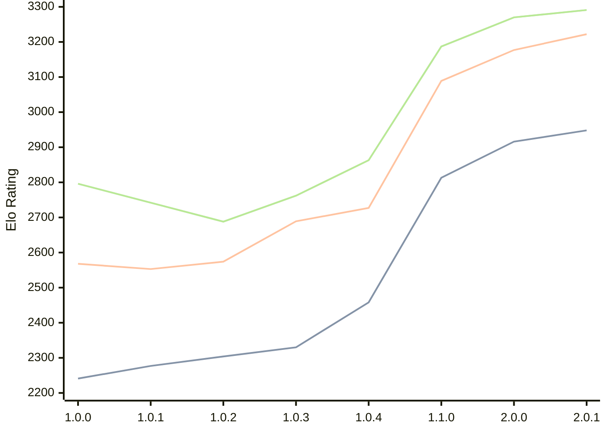

# Engine: Grail

Author: Jorgen Hanssen

Home: https://github.com/jorgenhanssen/grail

## Elo Ratings

| Version | Published | STC 8.0+0.08s  | LTC 60.0+0.60s | VLTC 2m24s+1.12s | Comment |
| --- | --- | --- | --- | --- | --- |
| 2.0.1 | 2026-06-10 | 2948(+32) | 3222(+45) | 3291(+21) |  |
| 2.0.0 | 2026-05-11 | 2916(+103) | 3177(+88) | 3270(+83) |  |
| 1.1.0 | 2026-02-28 | 2813(+355) | 3089(+362) | 3187(+324) |  |
| 1.0.4 | 2026-01-16 | 2458(+128) | 2727(+38) | 2863(+101) |  |
| 1.0.3 | 2026-01-04 | 2330(+26) | 2689(+115) | 2762(+74) |  |
| 1.0.2 | 2025-12-16 | 2304(+27) | 2574(+21) | 2688(-54) |  |
| 1.0.1 | 2025-12-10 | 2277(+36) | 2553(-15) | 2742(-54) |  |
| 1.0.0 | 2025-12-05 | 2241 | 2568 | 2796 |  |
 | | | cElo (∆ prev) | cElo (∆ prev) | cElo (∆ prev) | 

<a href="https://github.com/computer-chess-index/cci/issues/new?template=submit-version.yml&title=[VERSION]+Grail+<version>&body=###%20Engine%20name%0AGrail%0A%0A###%20Version%0A2.0.1" target="_blank">Submit new version</a>

 Test Conditions:

GUI/CLI: <a href=https://github.com/cutechess/cutechess target="_blank">Cute-Chess</a> 
Elo Calculation: <a href=https://www.remi-coulom.fr/Bayesian-Elo/ target="_blank">Bayesian-Elo</a> 
CPU: Intel(R) Core(TM) i5-7500T 2.70GHz 
Opening book: 8_moves_v3 
\* STC: 8.0+0.08s, LTC: 60.0+0.60s, VLTC: 2m24s+1.12s

 Lists:
Ratings: <a href=https://github.com/computer-chess-index/cci/blob/main/lists/CCIRatings.csv target="_blank">Complete list</a>

Generated: 2026-10-09 04:38:50

## Ratings Verlauf

```mermaid
%%{init: {"theme":"base","themeVariables":{"seriesColors:['#a3a3a3','#222221','#faa371']}}}%%
xychart-beta
  x-axis ["1.0.0", "1.0.1", "1.0.2", "1.0.3", "1.0.4", "1.1.0", "2.0.0", "2.0.1"]
  y-axis "Elo Rating" 2200 --> 3300
  line "" [2241, 2277, 2304, 2330, 2458, 2813, 2916, 2948]
  line "STC (8.0+0.08s)" [2241, 2277, 2304, 2330, 2458, 2813, 2916, 2948]
  line "LTC (60.0+0.60s)" [2568, 2553, 2574, 2689, 2727, 3089, 3177, 3222]
  line "" [2796, 2742, 2688, 2762, 2863, 3187, 3270, 3291]
  line "VLTC (2m24s+1.12s)" [2796, 2742, 2688, 2762, 2863, 3187, 3270, 3291]
```

## Detailed Evaluation Results

| Version | Time Control | Elo  | Range +/- | Matches | Score | Average Opponent Elo | Draws |
| --- | --- | --- | --- | --- | --- | --- | --- |
| 2.0.1 | VLTC (2m24s+1.12s) | 3291 | 26 | 420 | 52% | 3278 | 57% |
| 2.0.1 | LTC (60.0+0.60s) | 3222 | 25 | 432 | 51% | 3213 | 60% |
| 2.0.1 | STC (8.0+0.08s) | 2948 | 25 | 480 | 52% | 2934 | 46% |
| --- | --- | --- | --- | --- | --- | --- | --- |
| 2.0.0 | VLTC (2m24s+1.12s) | 3270 | 29 | 316 | 51% | 3263 | 61% |
| 2.0.0 | LTC (60.0+0.60s) | 3177 | 29 | 322 | 48% | 3189 | 54% |
| 2.0.0 | STC (8.0+0.08s) | 2916 | 29 | 352 | 52% | 2896 | 41% |
| --- | --- | --- | --- | --- | --- | --- | --- |
| 1.1.0 | VLTC (2m24s+1.12s) | 3187 | 27 | 392 | 53% | 3167 | 53% |
| 1.1.0 | LTC (60.0+0.60s) | 3089 | 28 | 356 | 51% | 3075 | 53% |
| 1.1.0 | STC (8.0+0.08s) | 2813 | 28 | 398 | 51% | 2803 | 40% |
| --- | --- | --- | --- | --- | --- | --- | --- |
| 1.0.4 | VLTC (2m24s+1.12s) | 2863 | 34 | 272 | 49% | 2871 | 39% |
| 1.0.4 | LTC (60.0+0.60s) | 2727 | 35 | 252 | 50% | 2728 | 35% |
| 1.0.4 | STC (8.0+0.08s) | 2458 | 31 | 348 | 55% | 2414 | 30% |
| --- | --- | --- | --- | --- | --- | --- | --- |
| 1.0.3 | VLTC (2m24s+1.12s) | 2762 | 43 | 172 | 50% | 2766 | 31% |
| 1.0.3 | LTC (60.0+0.60s) | 2689 | 45 | 160 | 51% | 2682 | 33% |
| 1.0.3 | STC (8.0+0.08s) | 2330 | 44 | 172 | 51% | 2323 | 29% |
| --- | --- | --- | --- | --- | --- | --- | --- |
| 1.0.2 | VLTC (2m24s+1.12s) | 2688 | 38 | 214 | 50% | 2689 | 35% |
| 1.0.2 | LTC (60.0+0.60s) | 2574 | 35 | 264 | 46% | 2612 | 33% |
| 1.0.2 | STC (8.0+0.08s) | 2304 | 41 | 212 | 55% | 2260 | 22% |
| --- | --- | --- | --- | --- | --- | --- | --- |
| 1.0.1 | VLTC (2m24s+1.12s) | 2742 | 42 | 180 | 52% | 2727 | 34% |
| 1.0.1 | LTC (60.0+0.60s) | 2553 | 40 | 202 | 53% | 2526 | 30% |
| 1.0.1 | STC (8.0+0.08s) | 2277 | 50 | 142 | 48% | 2296 | 20% |
| --- | --- | --- | --- | --- | --- | --- | --- |
| 1.0.0 | VLTC (2m24s+1.12s) | 2796 | 61 | 92 | 42% | 2866 | 28% |
| 1.0.0 | LTC (60.0+0.60s) | 2568 | 59 | 92 | 46% | 2601 | 34% |
| 1.0.0 | STC (8.0+0.08s) | 2241 | 67 | 82 | 59% | 2157 | 20% |
| --- | --- | --- | --- | --- | --- | --- | --- |