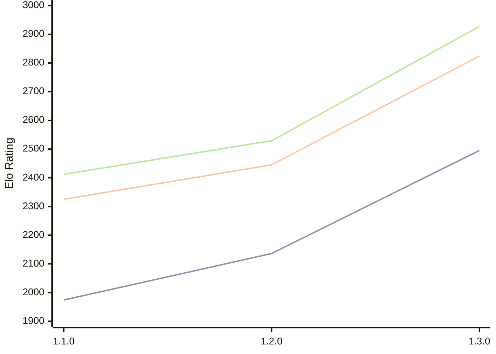

# Engine: Gyatso

Author: Gyatso Neesham

Home: https://github.com/GyatsoYT/GyatsoChess

## Elo Ratings

| Version | Published | STC 8.0+0.08s  | LTC 60.0+0.60s | VLTC 2m24s+1.12s | Comment |
| --- | --- | --- | --- | --- | --- |
| 1.3.0 | 2026-03-30 | 2495(+359) | 2824(+379) | 2927(+398) |  |
| 1.2.0 | 2026-01-24 | 2136(+162) | 2445(+120) | 2529(+117) |  |
| 1.1.0 | 2026-01-09 | 1974(+new) | 2325(+new) | 2412(+new) |  |
| 1.0.0 | 2025-12-10 |  |  |  |  |
 | | | cElo (∆ prev) | cElo (∆ prev) | cElo (∆ prev) | 

<a href="https://github.com/computer-chess-index/cci/issues/new?template=submit-version.yml&title=[VERSION]+Gyatso+<version>&body=###%20Engine%20name%0AGyatso%0A%0A###%20Version%0A1.3.0" target="_blank">Submit new version</a>

 Test Conditions:

GUI/CLI: <a href=https://github.com/cutechess/cutechess target="_blank">Cute-Chess</a> 
Elo Calculation: <a href=https://www.remi-coulom.fr/Bayesian-Elo/ target="_blank">Bayesian-Elo</a> 
CPU: Intel(R) Core(TM) i5-7500T 2.70GHz 
Opening book: 8_moves_v3 
\* STC: 8.0+0.08s, LTC: 60.0+0.60s, VLTC: 2m24s+1.12s

 Lists:
Ratings: <a href=https://github.com/computer-chess-index/cci/blob/main/lists/CCIRatings.csv target="_blank">Complete list</a>

Generated: 2026-05-19 06:25:15

## Ratings Verlauf

⬛ STC (8.0+0.08s) &nbsp;&nbsp; 🟧 LTC (60.0+0.60s) &nbsp;&nbsp; 🟩 VLTC (2m24s+1.12s)

dark mode: 🟩STC (8.0+0.08s) 🟧LTC (60.0+0.60s) ⬜VLTC (2m24s+1.12s)

## Detailed Evaluation Results

| Version | Time Control | Elo  | Range +/- | Matches | Score | Average Opponent Elo | Draws |
| --- | --- | --- | --- | --- | --- | --- | --- |
| 1.3.0 | VLTC (2m24s+1.12s) | 2927 | 25 | 484 | 47% | 2948 | 38% |
| 1.3.0 | LTC (60.0+0.60s) | 2824 | 30 | 354 | 50% | 2816 | 39% |
| 1.3.0 | STC (8.0+0.08s) | 2495 | 25 | 568 | 42% | 2561 | 28% |
| --- | --- | --- | --- | --- | --- | --- | --- |
| 1.2.0 | VLTC (2m24s+1.12s) | 2529 | 33 | 312 | 52% | 2508 | 24% |
| 1.2.0 | LTC (60.0+0.60s) | 2445 | 35 | 274 | 51% | 2433 | 27% |
| 1.2.0 | STC (8.0+0.08s) | 2136 | 33 | 328 | 52% | 2118 | 20% |
| --- | --- | --- | --- | --- | --- | --- | --- |
| 1.1.0 | VLTC (2m24s+1.12s) | 2412 | 45 | 172 | 49% | 2427 | 23% |
| 1.1.0 | LTC (60.0+0.60s) | 2325 | 43 | 208 | 50% | 2325 | 16% |
| 1.1.0 | STC (8.0+0.08s) | 1974 | 49 | 148 | 49% | 1989 | 20% |
| --- | --- | --- | --- | --- | --- | --- | --- |