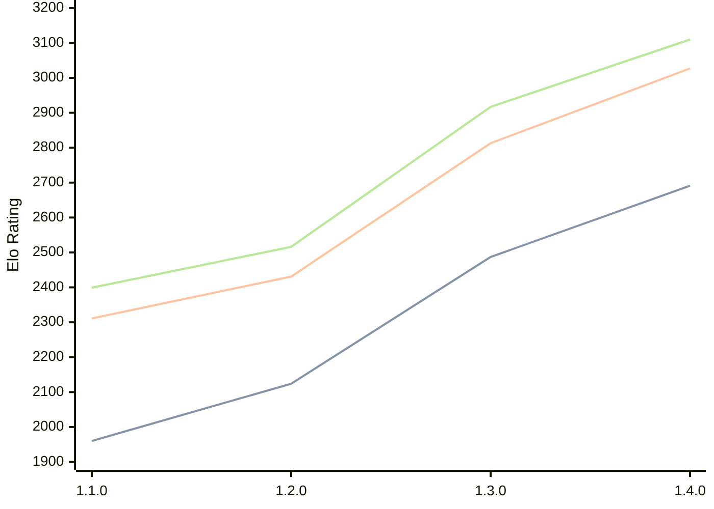

# Engine: Gyatso

Author: Gyatso Neesham

Home: https://github.com/GyatsoYT/GyatsoChess

## Elo Ratings

| Version | Published | STC 8.0+0.08s  | LTC 60.0+0.60s | VLTC 2m24s+1.12s | Comment |
| --- | --- | --- | --- | --- | --- |
| 1.5.0 | 2026-08-02 |  |  |  |  |
| 1.4.0 | 2026-06-05 | 2691(+204) | 3027(+214) | 3110(+193) |  |
| 1.3.0 | 2026-03-30 | 2487(+363) | 2813(+382) | 2917(+401) |  |
| 1.2.0 | 2026-01-24 | 2124(+164) | 2431(+120) | 2516(+117) |  |
| 1.1.0 | 2026-01-09 | 1960(+new) | 2311(+new) | 2399(+new) |  |
| 1.0.0 | 2025-12-10 |  |  |  |  |
 | | | cElo (∆ prev) | cElo (∆ prev) | cElo (∆ prev) | 

<a href="https://github.com/computer-chess-index/cci/issues/new?template=submit-version.yml&title=[VERSION]+Gyatso+<version>&body=###%20Engine%20name%0AGyatso%0A%0A###%20Version%0A1.5.0" target="_blank">Submit new version</a>

 Test Conditions:

GUI/CLI: <a href=https://github.com/cutechess/cutechess target="_blank">Cute-Chess</a> 
Elo Calculation: <a href=https://www.remi-coulom.fr/Bayesian-Elo/ target="_blank">Bayesian-Elo</a> 
CPU: Intel(R) Core(TM) i5-7500T 2.70GHz 
Opening book: 8_moves_v3 
\* STC: 8.0+0.08s, LTC: 60.0+0.60s, VLTC: 2m24s+1.12s

 Lists:
Ratings: <a href=https://github.com/computer-chess-index/cci/blob/main/lists/CCIRatings.csv target="_blank">Complete list</a>

Generated: 2026-08-24 06:25:17

## Ratings Verlauf

⬛ STC (8.0+0.08s) &nbsp;&nbsp; 🟧 LTC (60.0+0.60s) &nbsp;&nbsp; 🟩 VLTC (2m24s+1.12s)

dark mode: 🟩STC (8.0+0.08s) 🟧LTC (60.0+0.60s) ⬜VLTC (2m24s+1.12s)

## Detailed Evaluation Results

| Version | Time Control | Elo  | Range +/- | Matches | Score | Average Opponent Elo | Draws |
| --- | --- | --- | --- | --- | --- | --- | --- |
| 1.4.0 | VLTC (2m24s+1.12s) | 3110 | 29 | 356 | 50% | 3112 | 46% |
| 1.4.0 | LTC (60.0+0.60s) | 3027 | 30 | 334 | 51% | 3019 | 44% |
| 1.4.0 | STC (8.0+0.08s) | 2691 | 30 | 352 | 50% | 2695 | 32% |
| --- | --- | --- | --- | --- | --- | --- | --- |
| 1.3.0 | VLTC (2m24s+1.12s) | 2917 | 25 | 492 | 47% | 2940 | 39% |
| 1.3.0 | LTC (60.0+0.60s) | 2813 | 30 | 358 | 50% | 2808 | 39% |
| 1.3.0 | STC (8.0+0.08s) | 2487 | 25 | 576 | 43% | 2547 | 28% |
| --- | --- | --- | --- | --- | --- | --- | --- |
| 1.2.0 | VLTC (2m24s+1.12s) | 2516 | 33 | 312 | 52% | 2496 | 24% |
| 1.2.0 | LTC (60.0+0.60s) | 2431 | 35 | 274 | 51% | 2419 | 27% |
| 1.2.0 | STC (8.0+0.08s) | 2124 | 33 | 328 | 52% | 2105 | 20% |
| --- | --- | --- | --- | --- | --- | --- | --- |
| 1.1.0 | VLTC (2m24s+1.12s) | 2399 | 45 | 172 | 49% | 2414 | 23% |
| 1.1.0 | LTC (60.0+0.60s) | 2311 | 43 | 208 | 50% | 2311 | 16% |
| 1.1.0 | STC (8.0+0.08s) | 1960 | 49 | 148 | 49% | 1975 | 20% |
| --- | --- | --- | --- | --- | --- | --- | --- |